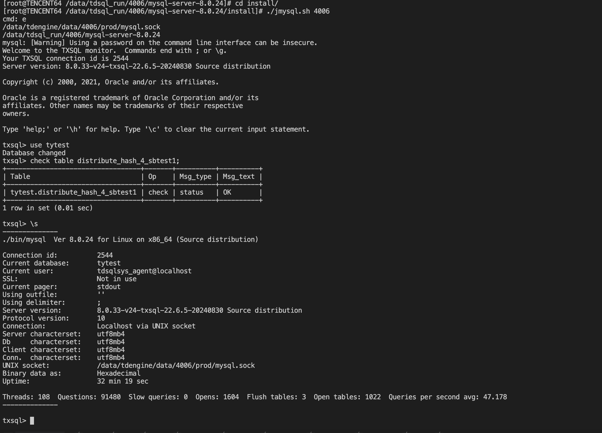
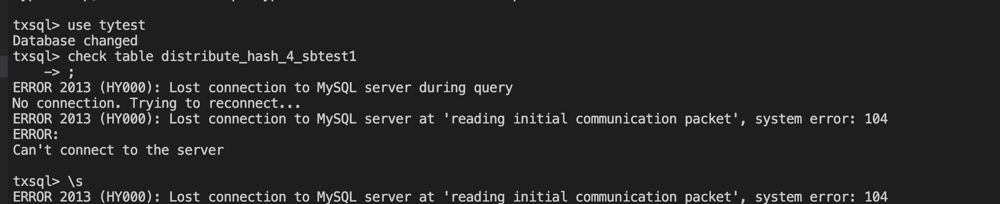
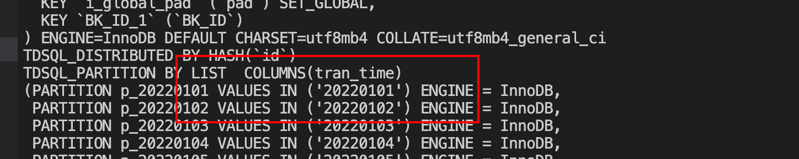

/root/lukatai/1010/mysql-8.0.24_22.4.1_46_tl2_x86_64.tgz

---

distribute_hash_4_sbtest1 在22.4.1上出错，报错，check table xxx显示为元数据损坏

不修改数据，升级到22.6.5就恢复正常

### 22.6.5

### 回退22.41 不兼容

结论：

distribute_hash_4_sbtest1包含COLUMNS语法，具体为

,该语法在22.5.0上才支持，回退到22.4.1上不兼容