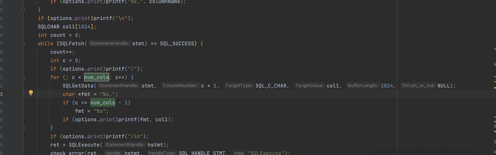

```
nohup ./cancel_stress2_river -s ccb_break_connection_groupby -S select txn_num, card_attr, scn_lrd, count(1), sum(cast(ifnull(PnAmt, Txn_Amt) as decimal(16, 2))), sum(cast(ifnull(Stlm_Amt, '0') as decimal(16, 2))),  sum(cast(ifnull(Mcht_Fee, '0') as decimal(16, 2))), sum(cast(ifnull(Ahn_TxnAmt, PnAmt) as decimal(16, 2))) from tbl_ot_jnl_c_202_20001_0 FORCE INDEX(IDX_OT_C_202_20001_0_7) where Mcht_No = '10000000000' and sys_date_time >= '20200702080000' and sys_date_time <= '20200710190000' and sys_date >= '20200702' and sys_date <= '20200710' and rev_flag <> '1' and 1=1 and Txn_Status='01' and Txn_Num in ('100112005' , '100110020' , '100110040' , '100110070' , '100110090' , '100110100' , '100110130' , '100110160', '100110170', '100110180', '100110190', '100110280', '100110710', '100110750', '100110800', '100110820') group by txn_num, card_attr, scn_lrd; -w 0 -t 12 &

nohup sh ccb_conn_break.sh &
```


ccb_conn_break.sh

```
#!/bin/bash
  
export MYSQL_DEBUG=d:t:O,/root/odbtest/mysql_client_debug.trace

while [ 1 ]
do
exec_sql="/*$(uuidgen)*/ select  TXN_SEQ  from  tbl_ot_jnl_c_202_20001_0 limit 1;"
echo "" >> ccb_conn_break.log
echo "Executing the sql: ${exec_sql}" >> ccb_conn_break.log
./sqlci  -d DSN=ccb_break_connection_groupby <<< "${exec_sql}" 2>&1 1>>ccb_conn_break.log
sleep 0.1
done
```


编译

```
gcc -o cancelt -g sql_cancel_core_read_write_stress_3055.c -I/opt/homebrew/Cellar/unixodbc/2.3.12/include -L/opt/homebrew/Cellar/unixodbc/2.3.12/lib   -lodbc
```


```
gcc -o ts -g ts.c -I/opt/homebrew/Cellar/unixodbc/2.3.12/include -L/opt/homebrew/Cellar/unixodbc/2.3.12/lib   -lodbc


gcc -o ts -g ts.c   -lodbc
gcc -o t -g t.c -lodbc -lpthread


```

```
rm -f t
gcc -o t -g t.c -lodbc -lpthread
./t -D rccn1db -s MYSQL_CON2 -w 1 -S ""

```


```
insert into bth_cny_ldgr_acc_tmp (Pos_Ref_No, Mcht_No, Txn_Ccy, Mcht_Blng_Dept, SYS_DATE, Txn_Seq, STLM_BRH_NO, BATCH_NUM, DEAL_FLAG) VALUES ("123", "1234","1", "1", "20240920", "1234",'1000000','1','1');


    const char *Pos_Ref_No = "123";
    const char *Mcht_No = "1234";
    const char *Txn_Ccy = "1";
    const char *Mcht_Blng_Dept = "1";
    const char *SYS_DATE = "20240920";
    const char *Txn_Seq = "1234";
```


## 安装odbc环境

```
[MYSQL_CON]
Driver=TDSQL_MySQL
#Driver=MySQL
Server=
Port=
User=lukatai
Password=Root@@@123
Database=rcce1db
CHARSET = GBK
CONNECT_TIMEOUT = 30
#READTIMEOUT = 29
load_balance=1
load_balance_method=sed
proxy_server=9.192.169.254:15003
proxy_weight=10000,1
OPT_TCP_KEEPALIVE=1
OPTION = 3145730
#OPTION = 19922946
AUTO_RECONNECT=1
kill_query_conn_num=1
no_ssps=1
##writetimeout=29 
```


cp ${mysql_path}/mysql-8.0.26-linux-glibc2.12-x86_64/lib/libmysqlclient.so*    /root/odbc/tdsql_odbc_172/
cp -rf ${mysql_path}/mysql-8.0.26-linux-glibc2.12-x86_64/lib/private    /root/odbc/tdsql_odbc_172/


### 问题1

**lb参数不生效**

lb=1，配置了load_balance_method，proxy_server，proxy_weight，但是连接显示

```
[root@localhost ~]# isql test_db -v
[S1000][unixODBC][MySQL][ODBC 1.0(w) Driver]Can't connect to MySQL server on 'localhost:3306' (111)
[ISQL]ERROR: Could not SQLConnect
```


**解决：文档已经更新了，需要使用Server和port占位,详细见下**

https://cloud.tencent.com/privatecloud/document/83877726473162752/83877726521397248

## ODBC驱动支持负载均衡

编辑`odbc.ini`中添加如下四个参数并配置proxy ip和port

```cpp
load_balance=1
load_balance_method=sed
proxy_server=proxy1:port1,proxy2:port2,proxy3:port3,proxy4:port4
proxy_weight=1,2,3,4
```

参数说明：

load_balance：lb开关，1为开，0为关,当load_balance状态为打开，原配置server,port将失效

load_balance_method：所选择的负载均衡算法，目前仅支持sed

proxy_server：proxy的IP和port

proxy_weight：proxy权重因子，根据后端主机的性能来设置权重，主机性能越好权重一般设置的就越大。如果设置为0，则代表与其对应的主机不会被调度，不会建立链接；如果不设置或者设置的个数少于主机数，则没有设置的会被默认设置为 1；

**注意：**

**使用load_balance功能时需要配置server和port占位，建议值为proxy_server第一个连接信息。**


## odbc应用到批处理

获取select的返回值

SQLGetData





计划使用函数

SQLFetch：检索结果集中的下一条数据。

SQLGetData：获取结果集中当前行莫一列的值。

SQLEndTran：提交或者回滚事务。


SQLDisconnect：断开指定连接。

SQLFreeHandle：释放环境、连接、语句或者描述符句柄。	
