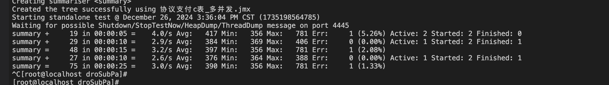

# drop数据方案

## 行方

数据量：目前C表按半年建一张表，数据只保留一个月，按分区名称匹配，匹配T-44日期的分区名称drop分区，原来的oracle保留了半年历史数据，切量后，当前月数据查C表，剩下5个月查历史表，所以每次切量历史库都会有读请求增长

## 模拟

C表每隔7天执行一次删除数据操作，每次删除一个分区，即7天的数据（drop分区）。C表存量数据保存天数为（7-13天）占据磁盘空间大小范围 800G-1.6T

### 语句

``` 
alter table tbl_wl_jnl_c_242_10001_0 drop  subpartition template WL_C_242_10001_0P20241216;

```


```

alter table tbl_wl_jnl_c_242_10001_00 drop  subpartition template WL_C_242_10001_0P20241209;
alter table dropt1 drop  subpartition  WL_C_242_10001_0P20240715;

```

增加分区

```
alter table tbl_wl_jnl_c_251_10001_00 add  subpartition template PARTITION WL_C_251_tmp VALUES IN (080110) ENGINE = InnoDB;
```


| drop 二级分区平均耗时 | 前后数据量变化     | db cpu | proxy cpu | db内存           | proxy内存        |
| --------------------- | ------------------ | ------ | --------- | ---------------- | ---------------- |
| 0.3s                  | 平均每张表减少600W | 5-10%  | 1%        | 正常，无明显变化 | 正常，无明显变化 |





批提交batchExec


连接串rewriteBatchedStatements参数


insert ignore into rcce1db.t1 select * from rcce1db.tbl_wl_jnl_b_10001_36 where sys_date_time >= '20241225045700' and sys_date_time < '20241225045706';


/Users/ty/Downloads/mysql-connector-j-9.0.0/mysql-connector-j-9.0.0.jar

com.tencentcloud.tdsql.mysql.cj.jdbc.Driver


```
/*sets:allsets*/ insert ignore into rcce1db.c2 select * from rcce1db.tbl_wl_jnl_b_10001_43 where sys_date_time >= '20241225050100' and sys_date_time < '20241225050107';


/*sets:allsets*/
```


无论参数mode.sub_partition.truncate'  是否为打开，这样子均fail

```
MySQL [rcce1db]>  alter table dropt1 drop  partition  WL_C_242_10001_0P20240715;
ERROR 637 (HY000): Proxy ERROR: hash paritition table can not alter partition level
```

需要下面这种方式删除，但是这个不受参数影响

```
alter table dropt1 drop  subpartition template WL_C_242_10001_0P20240715;
```

