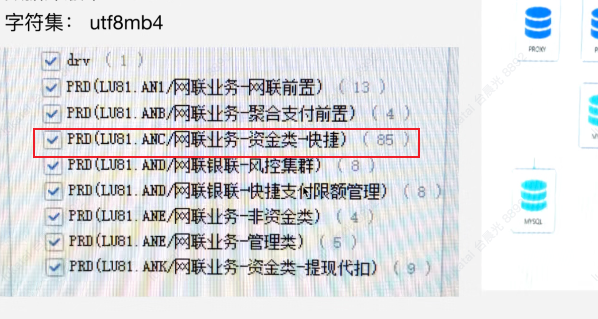

功能类场景

性能

FTC 什么含义？就是业务系统？

变更配置表

zhilian db

重要

0304会议

混沌开展

招行：先发制人，拉出自己目标，混沌测试

river哥：先表明理解行方目标，然后说明目标是很宏大，材料可能没有cover完

开讲

数据库参数的诉求--没有回答

招行想了解工具

招行也有真实的生产仿真环境，--river提出我们可以有更多的工具，更快速发现问题，

我们这边的优势：可以大压力测试，如有变更，可以提前验证，提供跟好的版本质量

招行能配合什么？

测试对系统的诉求？  怎么去解决混沌测试？性能容量场景？

