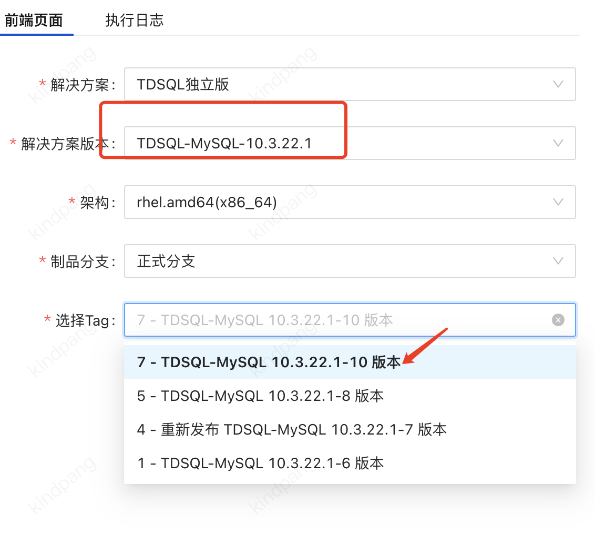

"nealding(丁健伟)：

@kindpang(庞阔)  @hunkjcliu(刘俊希)  拉下lina呢，描述下需求内容，lina统一来排期和安排人力"

需求内容：由于网审对相关版本漏洞的通报，建行目前确定要将19.2 和19.6的版本 升级到22.1.10 版本，并明确4月份要升级完成。
当前进展： 16.2升级22.1-10验证完成，19.2 和19.6的版本还没排期验证。
请求协助：辛苦lina统一排期和安排人力支持， 面客需要高优交付升级方案、工具和产品安装包。
@linaqu(瞿丽娜)  lina姐，请知悉。

22.1.10 极光

10.3.22.1最新的tag

## 疑问

filebeat ？

22.1-10 mc白屏升级可以在ops里打开，有个配置项，代码应该没有回合，需要替换下黑屏下的remote/mc_local_upgrade.py和module/mc_upgrade.py 

ops

@nathanqu(屈志强) 强哥，昨天客户提了下，在验证19.6 版本升级到22.1.10 版本时 帮看看升级组件后差异参数带来的影响

评估哪些影响？

19.2 和19.6 测一个还是两个 只看19.6

https://doc.weixin.qq.com/doc/w3_AW0AYAbPALY0LbaDH01Q9qU01Ekkb?scode=AJEAIQdfAAoI1OVSaCAYYAzAbYAF0

## 待办

实例方面的信息对齐，比如 set，分片信息，8024  8030 ，集中式，非集中式

业务上有无独特的分区表，表结构。

？

3.6 用升级工具可以一键升级，后面需要手动升级，手动升级需要备份配置文件

行里用的x86  19.6的包看着不是标准包，里面这些组件版本对不上
proxy:      1.19.21-M-V2.0R765D002
db-5717:    5.7.36-V2.0R705D001-v17-20220303-1620-log
chitu:      chitu-2.0.19-0-R207D001
keeper      1.19.0-TDSQL-KEEPER-V2.0R772D002MERGE19.0
collector   V1.0R027D001

gs global set，分布式实例

核心关注巡检可以正常加载报告

行方重点关注：升级流程没问题，升级后的功能回归，升级过程中要加负载

网审对相关版本漏洞的通报，建行目前确定要将19.2 和19.6的版本 升级到22.1.10 版本，并明确4月份要升级完成。

郭成真

0210 15:20

把管控参数变化列出来

变化的数据和这个一个个对

