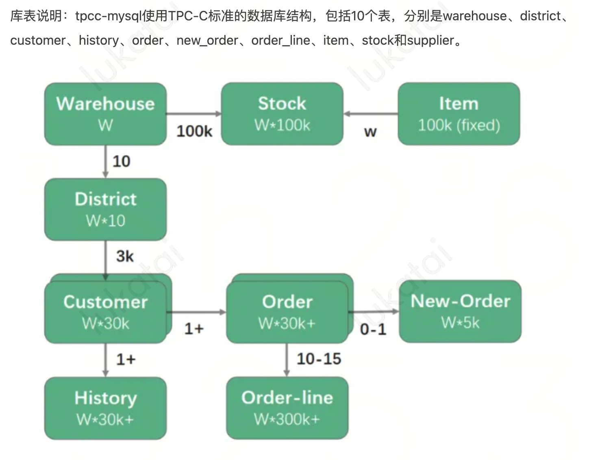

## TPC-C 和 TPC-DS 

TPC-C 和 TPC-DS 是由事务处理性能委员会（Transaction Processing Performance Council，简称 TPC）定义的基准测试，用于评估数据库系统的性能。

1. **TPC-C**：
   - **全称**：Transaction Processing Performance Council Benchmark C
   - **用途**：TPC-C 是一个用于评估在线事务处理（OLTP）系统性能的基准测试。它模拟了一个复杂的在线交易环境，包括订单创建、支付、订单状态查询、订单发货和库存管理等操作。
   - **特点**：TPC-C 测试的重点是系统在高并发环境下处理大量短事务的能力，主要关注事务处理的吞吐量和响应时间。
2. **TPC-DS**：
   - **全称**：Transaction Processing Performance Council Benchmark Data Schema
   - **用途**：TPC-DS 是一个用于评估决策支持系统（DSS）性能的基准测试。它模拟了一个复杂的决策支持环境，包括大量的查询和数据分析操作。
   - **特点**：TPC-DS 测试的重点是系统在处理复杂查询和大规模数据分析任务时的性能，主要关注查询的响应时间和系统的扩展能力。

这两个基准测试都是行业标准，用于比较不同数据库系统在特定工作负载下的性能表现。

## tmpC

在 TPC-C 基准测试中，"tpmC" 是 "Transactions Per Minute C" 的缩写。它是衡量数据库系统在 TPC-C 基准测试中性能的一个关键指标，具体表示每分钟处理的新订单事务数。

TPC-C 使用 tpmC 值（Transactions per Minute）来衡量系统最大有效吞吐量（Max Qualified Throughput，MQTh），其中 Transactions 以 NewOrder Transaction 为准，即最终衡量单位为每分钟处理的新订单数。

[原子性](https://zh.wikipedia.org/w/index.php?title=原子性&action=edit&redlink=1)（atomicity，或称不可分割性）、[一致性](https://zh.wikipedia.org/wiki/一致性_(数据库))（consistency）、[隔离性](https://zh.wikipedia.org/wiki/隔離性)（isolation，又称独立性）、[持久性](https://zh.wikipedia.org/wiki/持久性)（durability）

事务隔离分为不同级别，包括未提交读（Read uncommitted）、提交读（read committed）、可重复读（repeatable read）和串行化（Serializable）。

事务类型：tpcc-mysql模拟了5种事务类型，分别是新订单（New Order）、支付（Payment）、订单查询（Order Status）、交货（Delivery）和库存查询（Stock Level）。

| New-Order    | 客户输入一笔新的订货交易           |
| ------------ | ---------------------------------- |
| Payment      | 更新客户账户余额以反应其支付状况   |
| Delivery     | 发货（批处理交易）                 |
| Order-Status | 查询客户最近交易的状态             |
| Stock-Level  | 查询仓库库存状况，以便能够及时补货 |