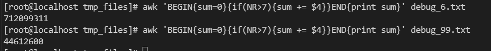

大文件

```
git lfs track "*.sql"

git lfs ls-files 


```


```
vim .gitattributes
```


```
 git push -u origin tdsql_perf_lukatai 
```


# py


```
mamba create -n myenv python=3.8
mamba create -n myenv
mamba remove -n sysbench --all
```


# Linux

查看机器型号

```
uname -a
cat /etc/os-release
hostnamectl

```


获取绝对路径

```
readlink -f yinhe_multiTbJoin.sql
realpath yinhe_multiTbJoin.sql
```

文件数量

```
是查看有多少个文件及文件夹

ls | wc -w

```


Debian 和 Ubuntu 以及基于它们的发行版（如 Linux Mint、Pop!_OS 等）使用 `apt` 或 `apt-get` 作为包管理器

Red Hat Enterprise Linux (RHEL)、CentOS 和 Fedora 使用 `dnf` 或 `yum` 作为包管理器。

openSUSE 使用 `zypper` 作为包管理器。


## 压缩解压

在 Linux 中，压缩文件夹有多种方法，常见的工具包括 `tar`、`zip` 和 `gzip`。以下是一些常用的压缩命令及其示例：

### 使用 `tar` 和 `gzip`

`tar` 是一个非常强大的工具，可以将多个文件和文件夹打包成一个归档文件。结合 `gzip`，可以对归档文件进行压缩。

#### 压缩文件夹

```bash
tar -czvf archive_name.tar.gz /path/to/directory
```

- `-c`：创建一个新的归档文件。
- `-z`：使用 gzip 压缩。
- `-v`：显示详细信息。
- `-f`：指定归档文件的名称。

示例：

```bash
tar -czvf my_folder.tar.gz /home/user/my_folder
```

#### 解压缩文件夹

```bash
tar -xzvf archive_name.tar.gz
```

- `-x`：解压归档文件。
- `-z`：使用 gzip 解压。
- `-v`：显示详细信息。
- `-f`：指定归档文件的名称。

示例：

```bash
tar -xzvf my_folder.tar.gz
```

### 使用 `zip`

`zip` 是另一个常用的压缩工具，特别是在需要与 Windows 系统兼容时。

#### 压缩文件夹

```bash
zip -r archive_name.zip /path/to/directory
```

- `-r`：递归地压缩文件夹及其子文件夹。

示例：

```bash
zip -r my_folder.zip /home/user/my_folder
```

#### 解压缩文件夹

```bash
unzip archive_name.zip
```

示例：

```bash
unzip my_folder.zip
```

### 使用 `gzip` 和 `tar`

`gzip` 只能压缩单个文件，因此通常与 `tar` 结合使用。

#### 压缩文件夹

首先使用 `tar` 创建一个归档文件，然后使用 `gzip` 进行压缩：

```bash
tar -cvf archive_name.tar /path/to/directory
gzip archive_name.tar
```

示例：

```bash
tar -cvf my_folder.tar /home/user/my_folder
gzip my_folder.tar
```

#### 解压缩文件夹

首先使用 `gunzip` 解压缩，然后使用 `tar` 解归档：

```bash
gunzip archive_name.tar.gz
tar -xvf archive_name.tar
```

示例：

```bash
gunzip my_folder.tar.gz
tar -xvf my_folder.tar
```

### 总结

- **`tar` 和 `gzip`**：适用于大多数情况，特别是需要高效压缩时。
- **`zip`**：适用于需要与 Windows 系统兼容时。
- **`gzip` 和 `tar`**：适用于需要分步骤进行压缩和解压缩时。

选择合适的工具和方法取决于你的具体需求和环境。

## cd

- **`cd -`**: 这个命令会将你切换到上一个工作目录，并且会在终端中显示切换后的目录路径。


## 查看文件大小

`du -sh *	` 查看文件大小

`cat nohup.out | wc -l ` 统计行数

`tail -f ` 持续查看末尾 `-n {number}` 行数  


`tail -f  sys_instance_15721.2024-08-13.0 | grep "timecost"`


## grep

grep -v

grep -A4


## 合并文件内容

按照列合并

`paste file1.txt file2.txt > merged.txt`

按照行合并

`cat file1.txt file2.txt > merged.txt`


## 挂载


### 查看cpu核数

```
grep -c ^processor /proc/cpuinfo
lscpu
```


### 替换文件中的字符

```
tr -d '"' < update.csv  > update1.csv
```


## crontab

>  crontab -e

>  crontab -l


*/10 * * * * /usr/local/bin/cleanup_coredump.sh

```
*/10 表示每隔10分钟执行一次任务。
具体来说，*/10 是一个步进值的表示法，等同于 0,10,20,30,40,50，即在每小时的第0、10、20、30、40、50分钟执行任务。

*：表示每个单位时间都执行一次。例如，* * * * * 表示每分钟执行一次。
0-59/10：表示从0到59分钟，每隔10分钟执行一次，等同于 */10。
1-5：表示从第1分钟到第5分钟执行一次。
0,15,30,45：表示在每小时的第0、15、30、45分钟执行一次。

* * * * * command_to_execute
- - - - -
| | | | |
| | | | +---- 星期几 (0 - 7) (Sunday=0 or 7)
| | | +------ 月份 (1 - 12)
| | +-------- 一个月中的第几天 (1 - 31)
| +---------- 小时 (0 - 23)
+------------ 分钟 (0 - 59)
```


## awk



```
awk 'BEGIN{sum=0} {if(NR>7){sum += $4}} END{print sum}' 1.txt

awk 'BEGIN{FS="[ ]+"} {print $1, $2, $3}' example.txt

```

$0是整行


### fuser

fuser -k -m /data/


### sed 替换字符


| 仅查看被修改的行 | `sed -n 's/\<id\>/ID/gp' 文件名` |
| ---------------- | -------------------------------- |
| 修改             | `sed -i 's/\<id\>/ID/g' 文件名`  |
| 验证             | grep -w “...” file               |


```

```

