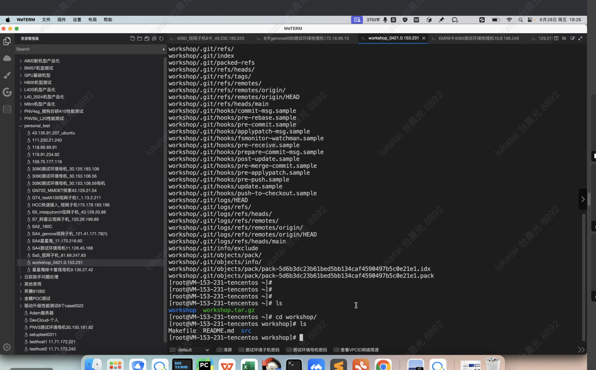

## 实验目标

- **目标 1**: 描述本次实验的主要目标（例如：了解 avx2 指令集，并掌握 avx2 指令集的优化方法）
- **目标 2**: 描述本次实验期望达成的具体成果（例如：使用 avx2 指令优化数组点积，性能提升 10% 以上）

## 准备工作

- **机器信息**: 描述是物理机还是 DevCloud；CPU 型号，是否支持 avx 等指令。
- **操作系统**: TecentOS Server 3.2, Ubuntu 20.04 等。
- **编译环境**: GCC 版本等。
- **雨滴平台**: 确认已安装雨滴 Agent，用于热点汇编分析。

## 实验步骤

**步骤 1**: 编译并执行包括优化前后逻辑的示例程序（例如 avx2 示例程序），同时创建雨滴 CPU 通用分析任务。

**步骤 2**: 分析优化前后对应函数的热点汇编，提供分析过程或结果的截图（例如：点积循环中指令 addss 占比 75%，可使用 avx2 指令优化等）。

**步骤 3**: xxx

## 实验结果

- **结果对比**: 描述实验结果的概况（例如：优化前后的执行耗时、热点函数比例变化等情况）。
- **数据分析**: 提供具体的数据、图表等以支持结果分析（例如：优化前后的总指令数、IPC、分支预测失败率等）。
- **证据截图**: 提供实验过程或结果的截图（包括雨滴热点汇编分析结果链接等）。

## 问题与解决方案

- **问题 1**: 描述遇到的问题。
- **解决方案**: 描述解决问题的方法或步骤。
- **问题 2**: xxx
- **解决方案**: xxx

## 实验总结

- **感悟和收获**: 描述通过本次实验过程的个人感悟以及最大收获。
- **待改进之处**: 指出实验过程中存在的不足及后续改进建议。

 

二进制 idc 

任务

采样 dwarf 进程名

热点汇编关联

内存预取？buildin_prefetch，改随机访问为指定访问