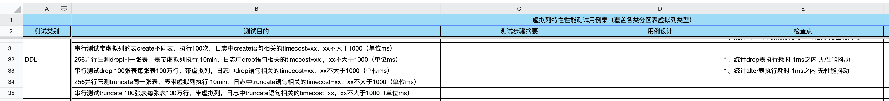

## 账号

您好！您的TDSQL已申请成功，感谢您对DevCloud的支持。

IP:9.134.254.214，端口：3306，用户名：tdsql_admin，密码：TYdXA*4679zYgn，如果忘记，可重置密码。

---


服务器操作系统为centos-7-9-x86，默认登录帐号：root，密码：DtmkQ*2593Fbxm，如果忘记密码，可前往 [云服务器管理页](http://devcloud.woa.com/#!/cvm/cvm_man?page=1&size=10) 重置密码

|  云主机IP   |  云主机固资号  |
| :---------: | :------------: |
| 9.134.60.93 | TC240624007719 |


谭总 workload 集群上的新增用户

用户：lukatai

密码：`Root@@@123`


http://11.65.145.108/tdsqlpcloud
赤兔账号/密码：admin/CSIGcsig_2023##
环境密码：root/CSIGcsig_2023##


 --mysql-user=test_tdsql --mysql-password=test_tdsql 


2.5的包如何自动获取升级？


numa ？


will哥，你好，我是专项性能中心一组的台晨光，在进行版本性能测试时候发现TPS下降问题。

测试版本：DB版本：8.0.33-v24-txsql-22.6.5-20240830 Proxy版本：proxy-22.3.13 20240620 86981a67a

测试基准 ：**DB版本： 8.0.33-v24-txsql-22.6.3-20240813 Proxy版本： proxy-22.3.13 20240620 86981a67a**

测试结果截图：


TDPS链接：[TDPS (woa.com)](https://tdps.woa.com/tdps/tdsqlv2/workload/724#/build/21365)
蓝盾链接：[#249 手动触发 | TDSQL业务workload (woa.com)](https://devops.woa.com/console/pipeline/zhiyan-kaynli/p-c20e7ec6f8e743408a5d9f52e7e65b76/detail/b-5bb859d3c7a3465cb34028eb830e1f32/executeDetail)
赤兔链接：[group_1705991217_44976 / 集群_x86_intel2 / 业务（workload分布式） / VHOST（:） / 独享标识（none）](http://9.29.187.69/tdsqlpcloud/index.php/instance/manage/detail?mid=/tdsqlzk/group_1705991217_44976&cluster=tdsql_s609xse2w)

后续定位问题如果需要借用环境辛苦提前告之，这边优先配合进行问题定位。


1. 测试计划要明确，然后暴露出来，让一线，文乐，river等同位置的人很快就能看出来我做了什么


2. 要做的事情--一个很简单的清单，把这个事情写清晰。

第一个逗号写出来的东西，就是这个用例最独特的东西

例子：


3. 多频率上review--2周一次，上review的时候，把所作尽可能清晰的呈现出来


已经升级成为2.5，回退2.0的时候，能否顺利回退 ？

关于确认proxy版本的命令，需要再次确认

```
INFO:
[2024-07-19 14:29:10]
查看 9.40.33.197:15018 升级后 proxy 版本:
INFO:
[2024-07-19 14:29:10]
cd /data/tdsql_run/15018/gateway/bin && ./mysql-proxy -v
INFO:
[2024-07-19 14:29:10]
########cd /data/tdsql_run/15018/gateway/bin && ./mysql-proxy -v######
proxy version:"proxy-22.4.2 "20240719" a81a19de4"
```


## 问题


进行tpcc测试，数据存储在单一set问题


## spilder  什么玩意


## epoll

[Linux下的I/O复用技术 — epoll如何使用（epoll_create、epoll_ctl、epoll_wait） 以及 LT/ET 使用过程解析_主动去触发epoll事件-CSDN博客](https://blog.csdn.net/JMW1407/article/details/107963618)


## **select output**


## 未归档

### 2>&1

假设你有一个脚本 `example.sh`，其内容如下：

```
sh复制#!/bin/bash
echo "This is standard output"
ls non_existent_file
```

运行这个脚本会产生标准输出和标准错误：

```
sh复制$ ./example.sh
This is standard output
ls: cannot access 'non_existent_file': No such file or directory
```

如果你想将标准输出和标准错误都重定向到同一个文件 `output.log`，你可以使用以下命令：

```
sh复制./example.sh > output.log 2>&1
```

这会将标准输出和标准错误都写入 `output.log` 文件中。

#### 分步解释

1. `> output.log`：将标准输出（stdout）重定向到 `output.log` 文件。
2. `2>&1`：将标准错误（stderr）重定向到标准输出（stdout），此时标准输出已经被重定向到 `output.log`，所以标准错误也会被重定向到 `output.log`。

#### 总结

`2>&1` 是一个重定向操作符，用于将标准错误（stderr）重定向到标准输出（stdout）。这在需要将所有输出（包括错误信息）写入同一个文件时非常有用。


[详解Linux的nohup和&用法和区别 - 逐梦~前行 - 博客园 (cnblogs.com)](https://www.cnblogs.com/du-jun/p/11906587.html)


### 验证后台进程

你可以使用 `jobs` 命令查看当前终端会话中的后台作业：看&任务

```
jobs
```

```
kill %1
kill -9 %1
```


## Docker

```#镜像命令
docker images：列出所有镜像
docker search [image]：搜索 Docker 镜像
docker pull [image]：拉取指定镜像
docker rmi [image]：删除指定镜像
#容器命令
docker ps：列出当前所有正在运行的容器
docker ps -a：列出所有容器，包括已经停止的容器
docker create [image]：创建一个新的容器，但不启动它
docker start [container]：启动一个容器
docker stop [container]：停止一个容器
docker rm [container]：删除一个容器
docker exec -it [container] [command]：在运行中的容器中执行命令
#其他命令
docker info：显示 Docker 系统信息
docker version：显示 Docker 版本信息
docker logs [container]：查看容器的日志
docker network ls：列出 Docker 网络
docker network create [network]：创建一个新的 Docker 网络
docker network connect [network] [container]：将容器连接到指定的 Docker 网络
docker network disconnect [network] [container]：将容器从指定的 Docker 网络中断开连接 
```


### 启动新的容器

如果你想启动一个新的容器，可以使用 `docker run` 命令。根据你提供的信息，镜像的 `IMAGE ID` 是 `fb26120b9a38`，你可以使用这个 `IMAGE ID` 或者镜像的 `REPOSITORY:TAG` 来启动新的容器。

1. **使用 `IMAGE ID` 启动新的容器**：

   ```
   docker run -it fb26120b9a38 /bin/bash
   ```

2. **使用 `REPOSITORY:TAG` 启动新的容器**（假设镜像的 `REPOSITORY:TAG` 是 `myimage:latest`）：

   docker run -it myimage:latest /bin/bash


## linux镜像与对应的安装管理软件

centos tum


## 查看linux的镜像型号

hostnamectl

cat /etc/*-release


### 1. 安装 Python 版本

使用 `pyenv install` 命令可以安装不同版本的 Python。例如，安装 Python 3.9.7：

```
pyenv install 3.9.7
```

你可以使用 `pyenv install --list` 来查看所有可用的 Python 版本：

```
pyenv install --list
```

### 使用 `pyenv-virtualenv` 创建虚拟环境

`pyenv-virtualenv` 是一个 `pyenv` 的插件，用于创建和管理虚拟环境。你可以使用 `pyenv virtualenv` 命令来创建虚拟环境。例如，创建一个基于 Python 3.9.7 的虚拟环境：

```
sh复制pyenv virtualenv 3.9.7 myenv
```

激活虚拟环境：

```
sh复制pyenv activate myenv
```

停用虚拟环境：

```
sh复制pyenv deactivate
```


## 7.1沟通

1. 通过QA展现自己的学习情况，不仅仅是文档总结--抄送k工和文乐

2. 最终目的：根据功能细节和使用场景，针对TDSQL2.5设计用例，发现问题

3. 学习：TDSQL2.5 使用场景进梳理---表结构分类，索引，数据类型，内置函数，**oracle兼容性**；懂得实现逻辑，比如SQL下推，执行计划，存储计划以及连接器，优化器，执行器的结构，以及复制表，广播表，思考问题单场景是发生在什么阶段的。

4. TDSQL2.5的语法表格--找sliver

   ---

5. 业务上：业务workload学习与接手workload任务


