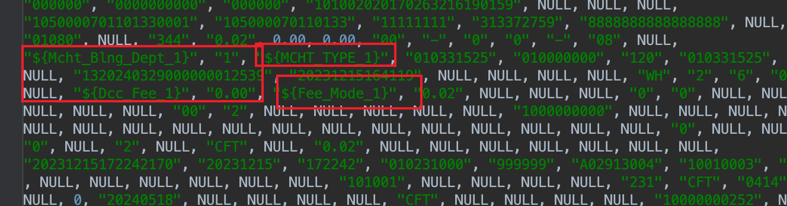

## 建表合并

```
MySQL [rcc_hunpao]> show tables;
+----------------------------+
| Tables_in_rcc_hunpao       |
+----------------------------+
| hw_bth_cny_ar_acc          |
| tbl_adjprice_inf           |
| tbl_as_jnl_a_da003         |
| tbl_cny_ar_inf             |
| tbl_coplf_mcht             |
| tbl_long_txn_jnl           |
| tbl_mcht_inf               |
| tbl_mcht_term_inf          |
| tbl_onl_txn_jnl_0_1        |
| tbl_onl_txn_jnl_60_4       |
| tbl_onl_txn_jnl_65_4       |
| tbl_ot_jnl_a_20001_0       |
| tbl_ot_jnl_b_24401_0       |
| tbl_ot_jnl_b_34401_0       |
| tbl_ot_jnl_b_36301_0       |
| tbl_ot_jnl_c_241_36301_0   |
| tbl_ot_jnl_c_242_34401_0   |
| tbl_ot_jnl_c_242_36301_0   |
| tbl_term_dsc               |
| tbl_term_txn_sum_1_110_0   |
| tbl_term_txn_sum_1_440_4   |
| tbl_term_txn_sum_1_630_2   |
| tbl_term_txn_sum_2_440_3   |
| tbl_term_txn_sum_2_da003_0 |
| tbl_txn_jnl_79_4           |
| tbl_txn_tpc                |
| tbl_wl_jnl_a_10001_0       |
| tbl_wl_jnl_b_10999_3       |
| tbl_wl_jnl_s_242_10999_3   |
+----------------------------+
29 rows in set (0.01 sec)
```

#### 以上表进行合并，使用每组的*表


```
| tbl_onl_txn_jnl_0_1        |  *
| tbl_onl_txn_jnl_60_4       | 
| tbl_onl_txn_jnl_65_4 
```

```
| tbl_ot_jnl_b_24401_0       |
| tbl_ot_jnl_b_34401_0       |
| tbl_ot_jnl_b_36301_0         *
```

```
| tbl_ot_jnl_c_242_34401_0   |
| tbl_ot_jnl_c_242_36301_0       *
```

```
| tbl_term_txn_sum_1_110_0   |  *
| tbl_term_txn_sum_1_440_4   |
| tbl_term_txn_sum_1_630_2 
```


#### 强制使用索引业务sql更改

```

 Proxy ERROR: Join internal error: Key 'IDX_OT_C_242_36301_0_1' doesn't exist in table 'tbl_ot_jnl_c_242_34401_0'
```

IDX_OT_C_242_36301_0_1 替换为  IDX_OT_C_242_34401_0_1

#### 插入参数全局化


Duplicate entry '160000000033-160000000033-50' for key 'tbl_term_txn_sum_2_da003_0.PRIMARY'


### 二级分区日期

月选择202410

半年选择 2024 下半年


造数注意事项

### FPS商户验证

需要注意select中可以获取到数值，不然会插入错误，变量无法替换



### FPS 入商户账

需要注意select中可以获取到数值


### 


