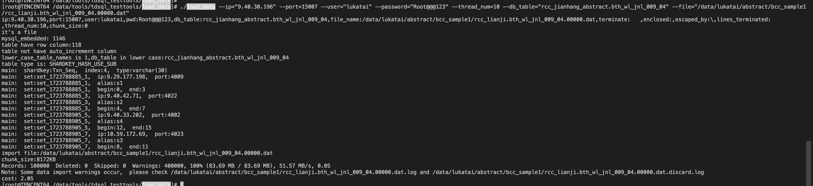

https://iwiki.woa.com/p/4012859320#%E5%88%9D%E5%A7%8B%E5%8C%96%E6%95%B0%E6%8D%AE

load_data导数




```
./load_data --ip="9.40.30.196" --port=15007 --user="lukatai" --password="Root@@@123" --thread_num=10 --db_table="rcc_jianhang_abstract.bth_wl_jnl_009_04" --file="/data/lukatai/abstract/bcc_sample1/rcc_lianji.bth_wl_jnl_009_04.00000.dat"


mysql -h9.40.30.196 -P15007 -ulukatai -pRoot@@@123 rcc_jianhang_abstract < /data/lukatai/abstract/bcc_sample1/rcc_lianji.bth_wl_jnl_009_04-schema.sql

```


DSN 配置

```
[ccb_sql_intel]
Driver=TDSQL_MySQL_OLD
#Driver=MySQL
Server=
Port=
User=lukatai
Password=Root@@@123
Database=rcc_river
CHARSET = GBK
CONNECT_TIMEOUT = 30
#READTIMEOUT = 29
load_balance=1
load_balance_method=sed
proxy_server=9.40.30.196:15007
proxy_weight=10000,1
OPT_TCP_KEEPALIVE=1
OPTION = 3145730
#OPTION = 19922946
AUTO_RECONNECT=1
kill_query_conn_num=1
no_ssps=1
##writetimeout=29 
```

