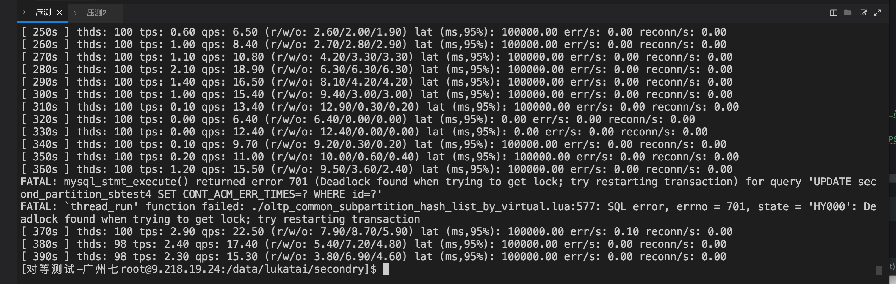

```
sysbench --threads=10  --time=300 --report-interval=1 /data/lukatai/secondry/oltp_common_subpartition_hash_list_by_virtual.lua  --mysql-host=9.240.53.37 --mysql-port=15196 --tables=10 --table_size=100000 --mysql-user=lukatai --mysql-password=Root@@@123 --mysql-db=lukatai3p  prepare


```


```
sysbench --threads=100  --time=300 --report-interval=10 /data/lukatai/secondry/oltp_subpartition_hash_list_testsuite.lua  --mysql-host=9.240.53.37 --mysql-port=15196 --tables=10 --table_size=100000 --mysql-user=lukatai --mysql-password=Root@@@123 --mysql-db=lukatai3p --oltp_type=oltp_read_write  run
```


死锁




```
sysbench --threads=1000  --time=600 --report-interval=10 /data/lukatai/secondry/oltp_subpartition_hash_list_testsuite.lua  --mysql-host=9.240.53.37 --mysql-port=15196 --tables=10 --table_size=100000 --mysql-user=lukatai --mysql-password=Root@@@123 --mysql-db=lukatai3p --oltp_type=oltp_read_write  run

SQL statistics:
    queries performed:
        read:                            10030
        write:                           3007
        other:                           3011
        total:                           16048
    transactions:                        1003   (0.91 per sec.)
    queries:                             16048  (14.63 per sec.)
    ignored errors:                      0      (0.00 per sec.)
    reconnects:                          0      (0.00 per sec.)

Throughput:
    events/s (eps):                      0.9144
    time elapsed:                        1096.9339s
    total number of events:              1003

Latency (ms):
         min:                               392583.40
         avg:                              1022056.04
         max:                              1096569.30
         95th percentile:                   100000.00
         sum:                           1025122211.51

Threads fairness:
    events (avg/stddev):           1.0030/0.05
    execution time (avg/stddev):   1025.1222/82.01
```

