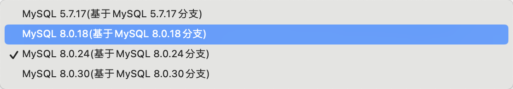

1.设置log 过期时间（session和conf）

2.切换bin relay log路径

3.修改proxy和db的版本。


```
cd /data/tdsql_run/4002/mysql-server-8.0.24/install/
./jmysql.sh 4002
set global binlog_expire_logs_seconds = 7200;
show variables like "%exp%";
exit
vim /data/tdsql_run/4002/mysql-server-8.0.24/etc/my_4002.cnf
```


## 早会

workload 向启明和谭总取经，明确workload的测试脚本要写什么东西，今天尝试在基线上搭建环境，

明确了2.5新特性的学习方向


调试是否回上报tdps


## db换包的手动操作


``` 
 cd /data/tdsql_run/4001/
  mv mysql-server-8.0.24/ mysql-server-8.0.24.bak
  tar xf mysql-8.0.24_22.6.5_260_tl2_x86_64.tgz
  cp ./mysql-server-8.0.24.bak/etc/my_4001.cnf  ./mysql-server-8.0.24/etc/  
  cd ./mysql-server-8.0.24/install/
  ./restartmysql_cgroup.sh 4001
```


## 待办


SQL文档学习

原生分布式命令

MYSQL版本迭代新增的特性 



![[/Users/lukatai/Library/Application Support/typora-user-images/image-20240701111119469.png]]

![[Clipboard_Screenshot_1741665149.png]]

zk，keeper，manager，proxy等组件等学习

docker 学习


增加py用例

银河证券使用建表，运行，cleanup模式


待办--性能季报

[2024Q3性能季报_数据库（9月中发） - 腾讯iWiki (woa.com)](https://iwiki.woa.com/p/4011939411)

