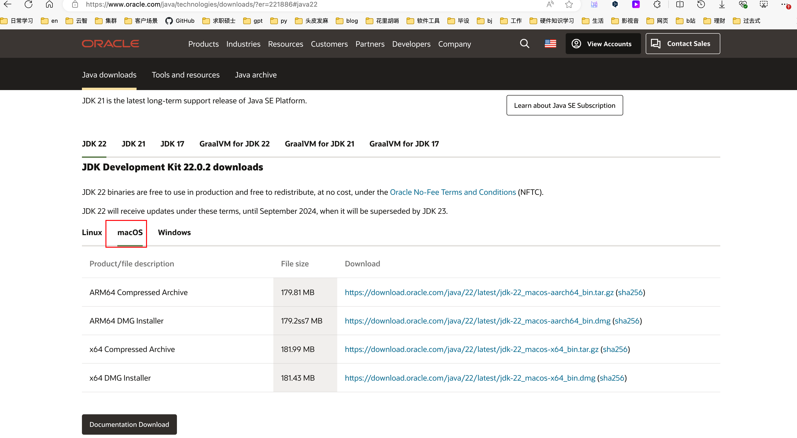
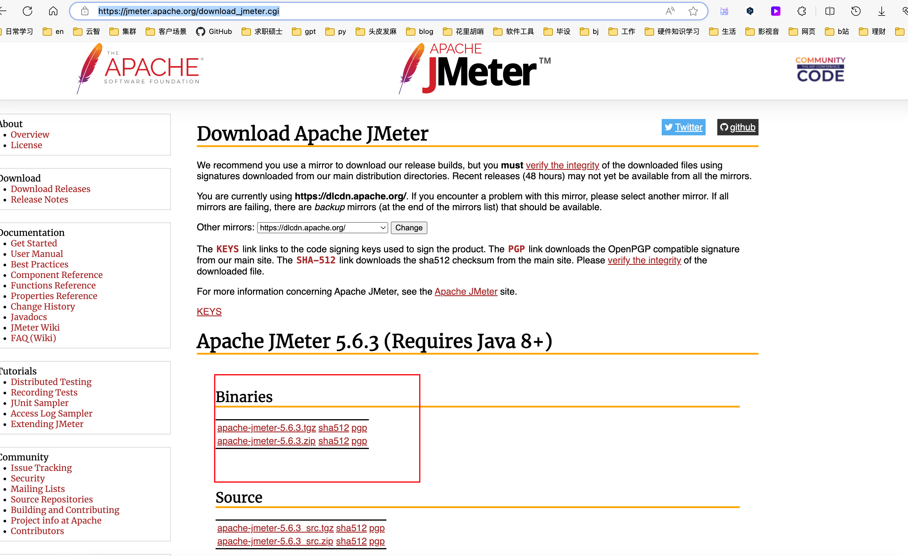
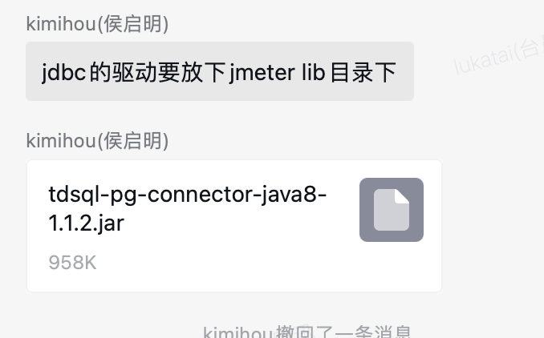

## JDK安装

[Java Downloads | Oracle](https://www.oracle.com/java/technologies/downloads/?er=221886#java22)




1. dmg文件直接安装，然后配置全局变量

2. 输入命令vim ~/.bash_profile打开.bash_profile进行编辑。

3. 在文件末尾追加jdk真实目录的位置，设置系统环境变量：
       export JAVA_HOME=/Library/Java/JavaVirtualMachines/jdk1.8.0_251.jdk/Contents/Home 
       输入source ~/.bash_profile,刷新环境变量。

   > /Library/Java/JavaVirtualMachines/jdk1.8.0_251.jdk/Contents/Home  根据自己实际的来

4. 在终端输入java -version命令验证jdk是否安装成功，安装成功可以看到自己安装的jdk版本。


## jmeter安装

[Apache JMeter - Download Apache JMeter](https://jmeter.apache.org/download_jmeter.cgi)




[Mac下载并安装Jmeter测压工具（详细教程）_mac jmeter-CSDN博客](https://blog.csdn.net/weixin_44485316/article/details/131989119)


. 启动方式1【推荐】
可以终端直接输入jmeter启动，需先进行配置，配置步骤如下：

1.1 配置环境
终端输入vim ~/.bash_profile进入到vim编辑器，输入i进入编辑模式，以下命令：

```
=export JMETER_HOME==/Library/Environment/apache-jmeter-5.2.1 #注意这个需要换成自己的安装地址
export PATH=$JAVA_HOME/bin:$PATH:.:$JMETER_HOME/bin:$PATH
export CLASSPATH=.:$JAVA_HOME/lib/dt.jar:$JAVA_HOME/lib/tools.jar:$JMETER_HOME/lib/ext/ApacheJMeter_core.jar:$JMETER_HOME/lib/jorphan.jar:$JMETER_HOME/lib/logkit-2.0.jar
```

按下esc退出编辑模式，输入:wq保存并退出
继续在终端中输入source ~/.bash_profile，使配置文件在修改后立即生效
终端输入jmeter即可启动


## 安装JDBC




## 初次使用

[JMeter性能测试，完整入门篇教程-CSDN博客](https://blog.csdn.net/weixin_40943297/article/details/96480607)


使用


```
jmeter -n -t tuikuan_jieji.jmx  -l tuikuan_jieji.jtl -e -o ./tuikuan_jieji


```


```
jmeter -n -t hangyePay.jmx  -l hangyePay.jtl

```


```
/data/apache-jmeter-5.6/bin/jmeter -n -t mchtUpdate_all_use_hai.jmx  -l mchtUpdate_all_use_hai.jtl -e -o ./pay_ruzhang


```


```
/data/apache-jmeter-5.6/bin/jmeter -n -t 透明压缩验证业务.jmx  -l 透明压缩验证业务.jtl


```


