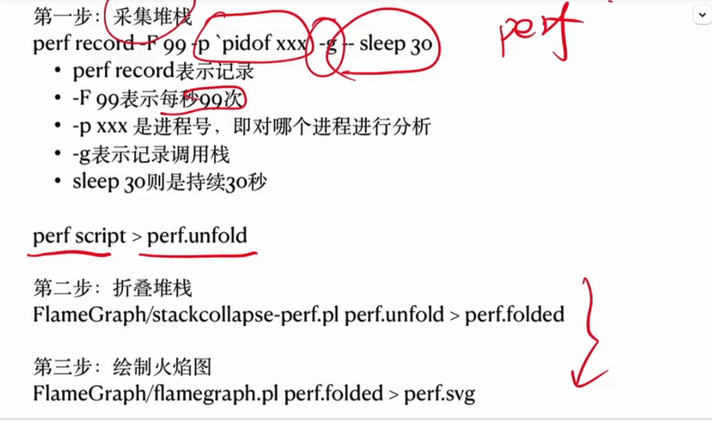

## 苗哥火焰图脚本


```
[root@TENCENT64 /data1/FlameGraph]# cat run.sh 
##/bin/bash

pid=$1
now=$(date +%Y_%m_%d_%H_%M_%S)


test -d ./perf_${now}/svg | mkdir -p ./perf_${now}/svg

echo $pid
echo "perf record -g -F 99 -o ./perf_${now}/perf_test.data -p $pid -- sleep 30"
perf record -g -F 99 -o ./perf_${now}/perf_test.data -e cpu-clock --call-graph dwarf -p $pid -- sleep 30
#perf record -g -F 99 -o ./perf_${now}/perf_test.data -p $pid -- sleep 30


perf script -f -i ./perf_${now}/perf_test.data | ./stackcollapse-perf.pl > ./perf_${now}/perf_test.folded

./flamegraph.pl ./perf_${now}/perf_test.folded > ./perf_${now}/svg/perf_test.svg
```


## Xxmin采集一次，每次10s

```
[root@localhost perf]# cat perf.sh 
#!/bin/bash
counter = 1 

while [ 1 ] 
do

current_time=$(date)
echo "Current time: $current_time"

counter=$((counter + 1))

sudo perf record -a -g -p 52954 -o dd$counter.data -- sleep 10
sleep 300
done
```

```
sudo perf record -a -g -p 52954 -o t.data -- sleep 30
```


## 解perf.data

```
perf report -i perf.data
```




