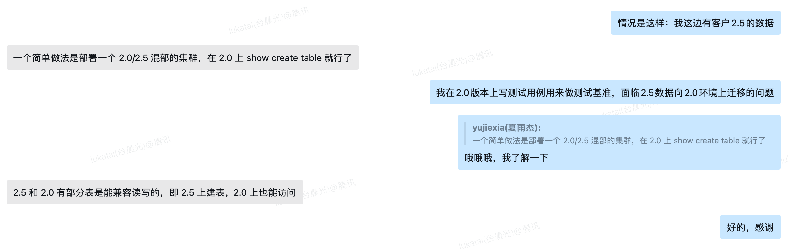
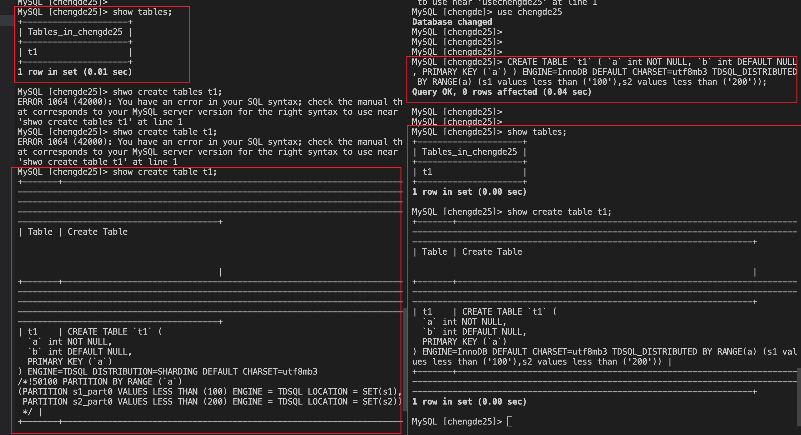
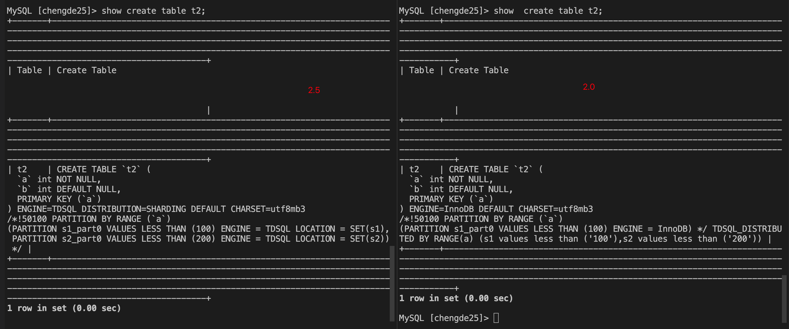
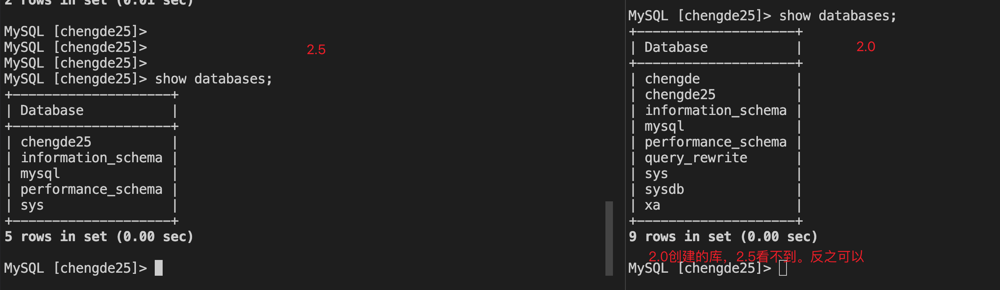
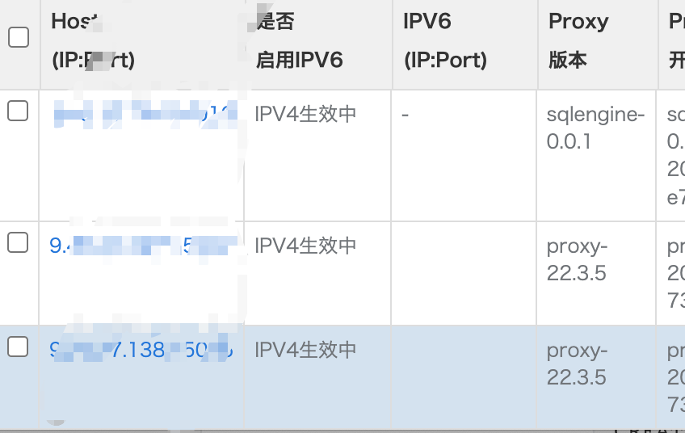

[2.0 mtr 迁移常见问题解决 - 腾讯iWiki (woa.com)](https://iwiki.woa.com/p/4010728898#3.2-2.0-和-2.5-语法自动转换规则)

[TDSQL2.5分布式表方案设计 - 腾讯iWiki (woa.com)](https://iwiki.woa.com/p/4008870749)


## 2.0与2.5的语法转换问题





**混部proxy，然后2.5上创建，2.0上查询**

### 2.0上创建，2.5上可以查到



```
CREATE TABLE `t1` ( `a` int NOT NULL, `b` int DEFAULT NULL, PRIMARY KEY (`a`) ) ENGINE=InnoDB DEFAULT CHARSET=utf8mb3 TDSQL_DISTRIBUTED BY RANGE(a) (s1 values less than ('100'),s2 values less than ('200'));
```


### 2.5上创建，2.0上查




```
CREATE TABLE `t2` (
  `a` int NOT NULL,
  `b` int DEFAULT NULL,
  PRIMARY KEY (`a`)
) ENGINE=TDSQL DISTRIBUTION=SHARDING DEFAULT CHARSET=utf8mb3
/*!50100 PARTITION BY RANGE (`a`)
(PARTITION s1_part0 VALUES LESS THAN (100) ENGINE = TDSQL LOCATION = SET(s1),
 PARTITION s2_part0 VALUES LESS THAN (200) ENGINE = TDSQL LOCATION = SET(s2)) */ 
```


### 注意事项



chengde是在2.0上创建的，2.5不可见

## 创建环境

1. 构建3proxy的实例，proxy版本为2.0

2. 将其中一个proxy的版本更换为2.5

   更换方法：https://iwiki.woa.com/p/4010697647

   2.5 proxy路径：https://devops.woa.com/console/pipeline/zhiyan-tdsqlv2/p-855b1b68bb42406ba9dec202ab077349/detail/b-6590c1e3737c444cbad580eda1198515/outputs

​	/data/tdsql_run/portNumber 下面进行替换




3. 使用指定porxy登录数据库

## 大批量实践环节


### 问题1:

2.5语法中的

```
... `last_update_time` timestamp NULL DEFAULT CURRENT_TIMESTAMP ON UPDATE CURRENT_TIMESTAMP COMMENT '最后更新时间',
  PRIMARY KEY (`id`),
  KEY `idx_cust_num` (`cust_num`),
  KEY `idx_business_date` (`business_date`)
) ENGINE=TDSQL DISTRIBUTION=SET(s1) DEFAULT CHARSET=utf8mb4 COLLATE=utf8mb4_bin COMMENT='[中]客户清退全量表' |

```


DISTRIBUTION=SET(s1) 在2.5上创建后，在2.0仅显示表明，但是无法无法查询

和s1的分片名称有关？


