# 承德workload专项 工作记录

## 工作内容的理解

输入：在客户方测试出来的性能问题与数据，其中包括数据表结构和部分数据，以及前方发现的问题

[承德银行POC - 腾讯iWiki (woa.com)](https://iwiki.woa.com/p/4010902367)

[承德转为like的sql (qq.com)](https://doc.weixin.qq.com/doc/w3_AaAAHwaQAGkCIZhrSZZQo62qbrFbL?scode=AJEAIQdfAAowDWnwEJAaAAHwaQAGk)

[TDSQL私有化POC数据集汇总 - 腾讯iWiki (woa.com)](https://iwiki.woa.com/p/4009010974)

处理：

1. 在我们的worklaod实例上重建数据库（其中有差异，需要处理）
2. 根据前方发现的问题，在我们的环境中浮复现出性能问题，并构建出一个复现该问题的流水线
3. 我们的目的是，搭建一个常态化测试环境，测试问题sql，用测试结果来评价迭代的数据库产品

输出：针对客户问题，一个稳定且具有针对性的测试环境。


## ref

[workload@金证POC - 腾讯iWiki (woa.com)](https://iwiki.woa.com/p/4009443392)

[workload@农业银行 - 腾讯iWiki (woa.com)](https://iwiki.woa.com/p/4009192720)


## 登录集群上的数据库

使用跳板机器登录压测机（具体哪个是压测机，看下机器用途文档）

```
ssh root@9.40.35.132
CSIGcsig_2023##
```

在赤兔上新增用户并授权


使用压测机器登录

`mysql -h9.40.30.196 -P15012 -ulukatai -pRoot@@@123 -c`


## sysbench Demo

目的：改写自己的lua脚本，用于重建数据库

```
sysbench --mysql-host=proxy_ip1,proxy_ip2,proxy_ip3 --mysql-port=xxx --mysql-user=xxx --mysql-password=xxx --mysql-db=db_name --thread-init-timeout=300 --tables=1 --table_size=10000000 --threads=1000 --report_interval=1 --time=600 create_table.lua prepare
```

- --mysql-host：MySQL 服务器的 IP 地址或主机名，可以指定多个服务器，以逗号分隔
- --mysql-port：MySQL 服务器的端口号
- --mysql-user：连接 MySQL 服务器时使用的用户名
- --mysql-password：连接 MySQL 服务器时使用的密码
- --mysql-db：要使用的数据库名称
- --thread-init-timeout：在创建新线程时，等待线程初始化的最长时间（以秒为单位）
- --tables：创建的表的数量（业务workload的场景，tables设置为1即可）
- --table-size：每个表的行数
- --threads：并发线程数
- --report_interval：测试执行期间报告进度的时间间隔（以秒为单位）
- --time：测试执行的时间（以秒为单位）
- create_table.lua prepare：要执行的 Lua 脚本和脚本参数。在这个例子中，执行的是 create_table.lua 脚本，并传入 prepare 参数

PS：执行时，需要进入lua脚本的文件夹中，不然你可以尝试一下写lua文件的相对路径


## 可行的sysbench命令

```
sysbench --threads=1 --time=60 --report-interval=1 ./create_table.lua  --mysql-host=9.40.30.196,9.40.33.197,9.40.37.138 --mysql-port=15012 --mysql-user=lukatai --mysql-password=Root@@@123 --mysql-db=chengde prepare
```


## 承德银行worklaod 第一个用例记录

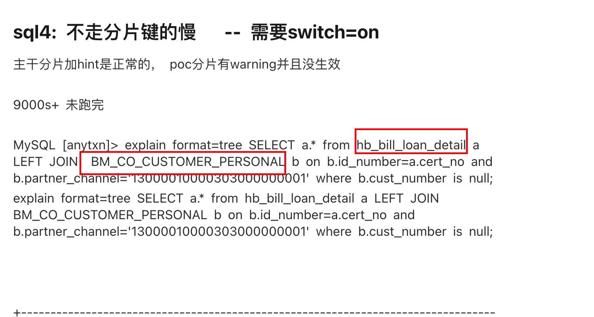


1. 这个问题涉及hb表和BM表，我根据给的sql文件，在workload实例上建立了这两个表的结构和数据

2. 因为涉及的查询为`SELECT a.* from hb_bill_loan_detail a LEFT JOIN  BM_CO_CUSTOMER_PERSONAL b on b.id_number=a.cert_no and b.partner_channel='13000010000303000000001' where b.cust_number is null;`把这个查询语句写到`qctest/testcases/perf_cases/utils/scripts/sysbench_lua/workload/oltp_select_chengde_hb.lua`中；

   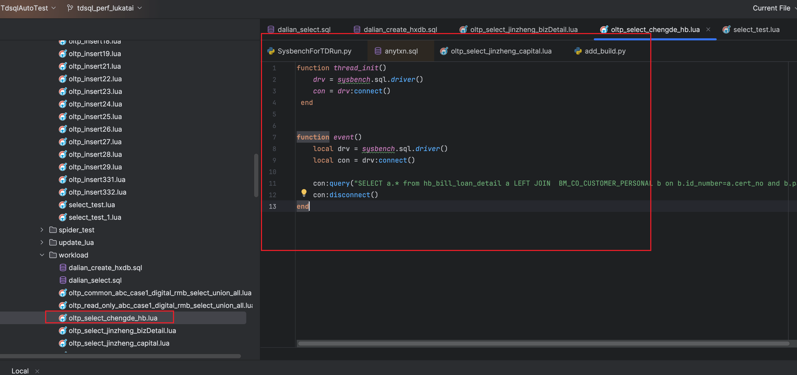

3. cte中需要关联自己的代码仓库和分支，设置全局参数和用例参数

   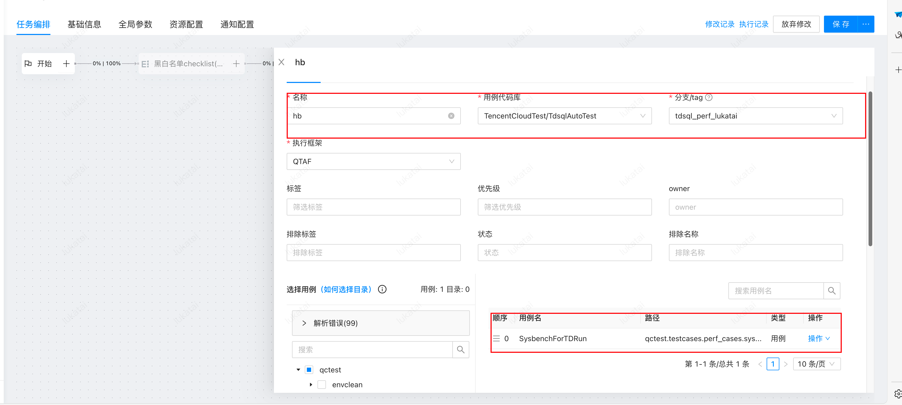

   在cte中关联这个lua；

   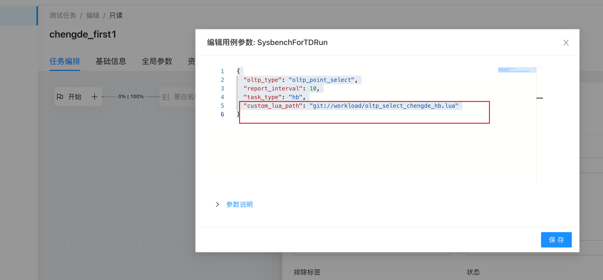

CTE中，记得把db name修改为自己再实例上重建的数据库

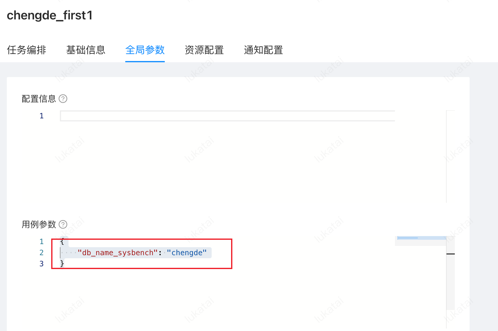


目前只用使用这个来执行来单行语句

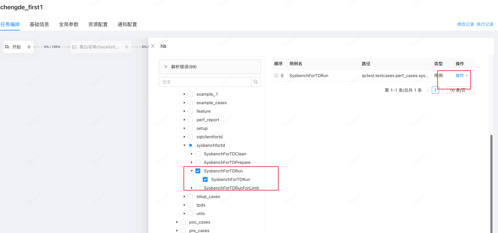


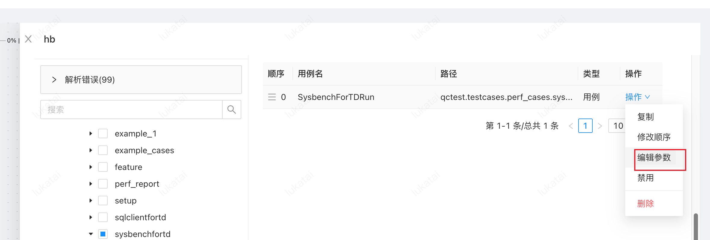


下面前两个不用改，第三个参数用于数据展示，custom_lua_path写 自己新建的查询lua，相对路径的目录为sysbench_lua

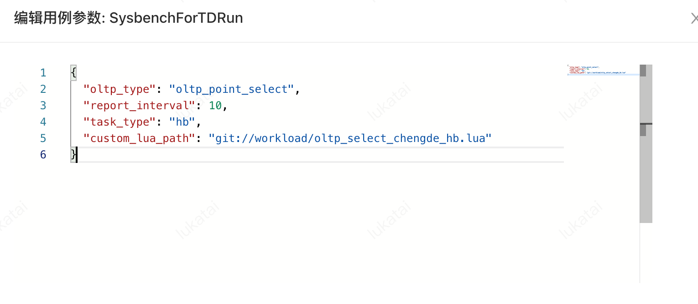


4. 再根据cte的id，加入到流水线中

   点击流水线编辑后，可以看到流水线中的参数，其中有关联机器的参数，还有运行参数，e.g. PARAMS；还有关联TDPS的TAG参数

   

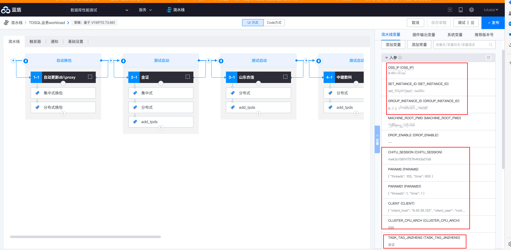


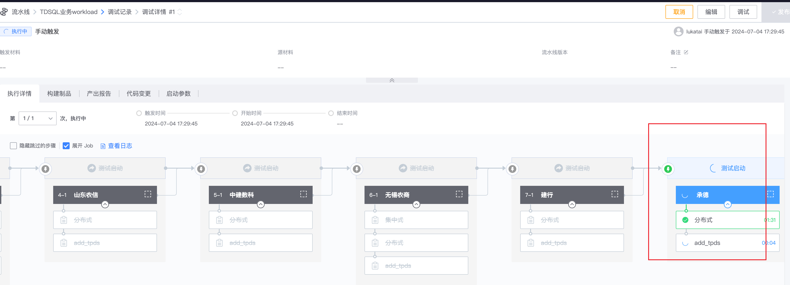

执行界面，可以仅选择自己的模块执行

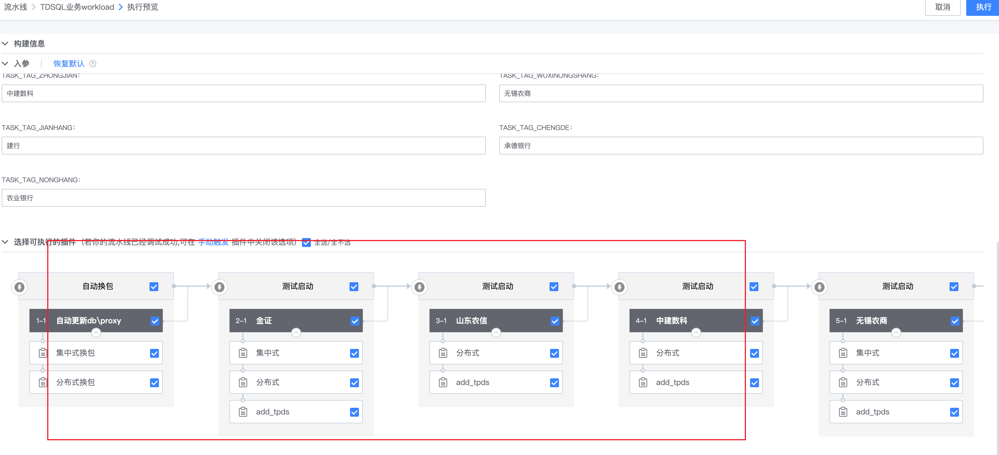


如果一切关联正确，则可以在TDPS上你看到自己的结果

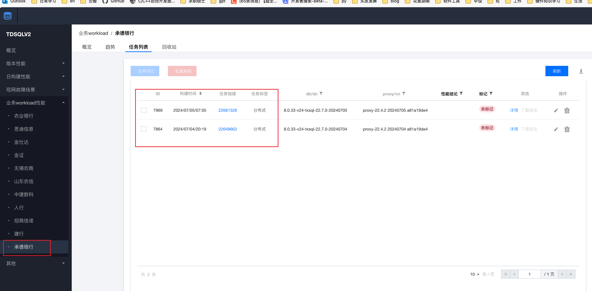

构建结论怎么出？


5. TDPS需要自己新建workload页面

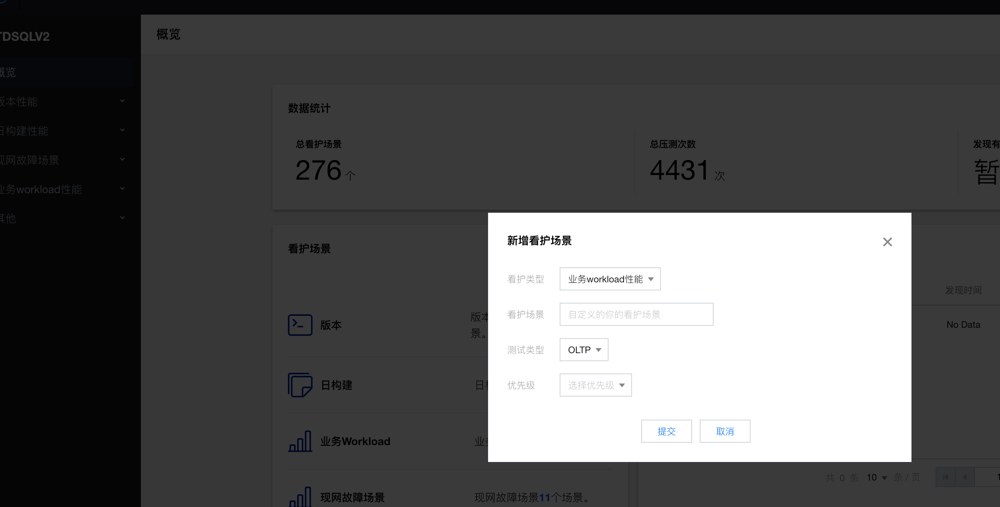

两者通过看护场景的名称关联，比如均叫做承德银行，和下方的TASK_TAG_CHENGDE的str属性相同


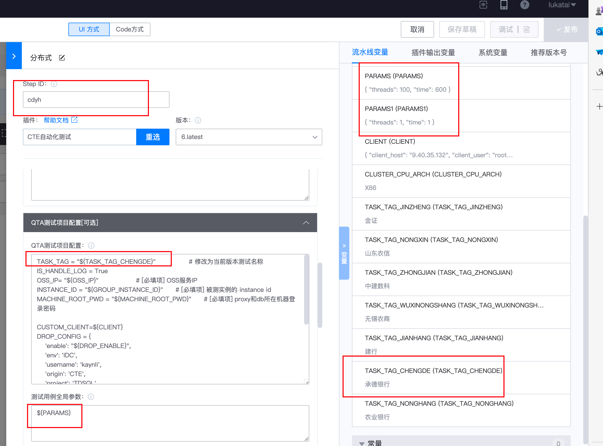


上图中的Step ID要和add_tdps（用于TDPS收集数据的用例）里面的参数对应

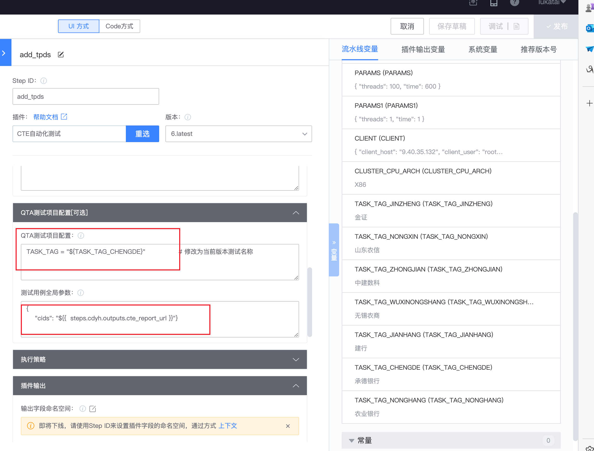


## 问题：流水线结束，TDPS上没有显示对应数据排查

流水线编辑发布好之后，在这里的名字未与变量TASK_TAG_CHENGDE相匹配，应该写为“承德银行”

出现这个问题的原因，应该是我的 TASK_TAG_CHENGDE 改了一下名称导致的

支援大佬：cailynyu

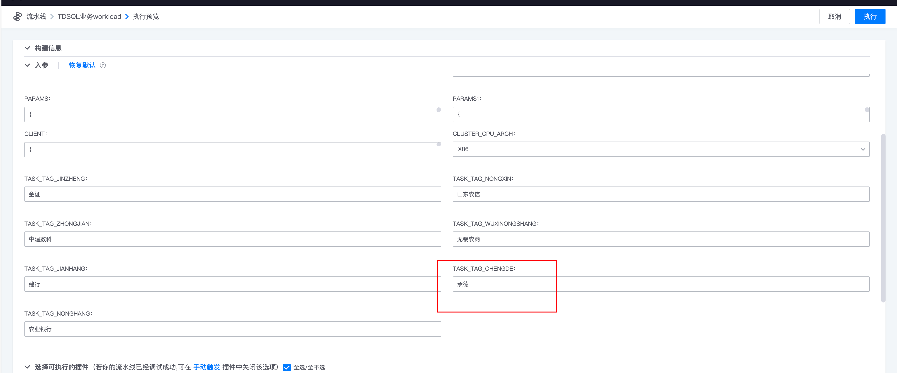


