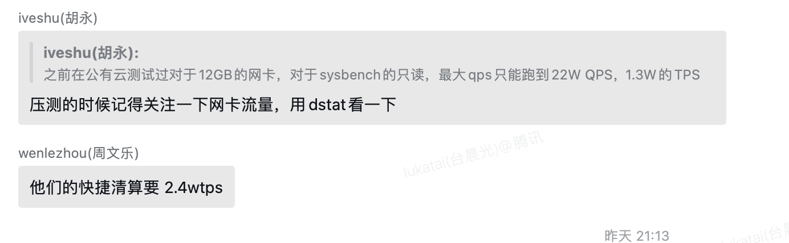

赤兔：http://9.29.187.69/tdsqlpcloud/index.php
admin/CSIGcsig_2023##

实例地址：[group_1723788706_45028 / 集群_x86_intel2 / 业务（建行workload专项） / VHOST（:） / 独享标识（none）「新实例，告警屏蔽期内」](http://9.29.187.69/tdsqlpcloud/index.php/instance/manage/detail?mid=/tdsqlzk/group_1723788706_45028&cluster=tdsql_s609xse2w)

数据库用户(如需可自行增加)：mysql -h9.40.30.196 -P15007 -ujianhang -pJianHang@@@123 -c

压测设备：

9.40.35.132

proxy设备

9.40.30.196
9.40.33.197
9.40.37.138

db设备

9.40.42.71
10.59.172.69
9.29.177.198
9.40.33.202

机器密码 root/CSIGcsig_2023##

## 注意事项

