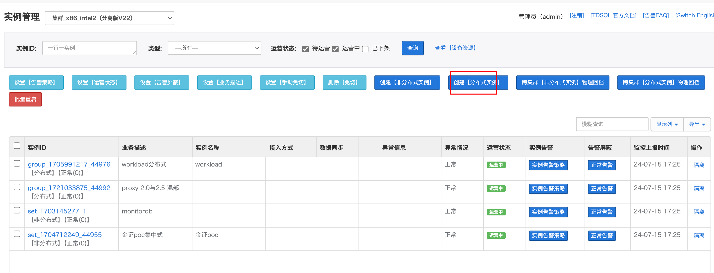
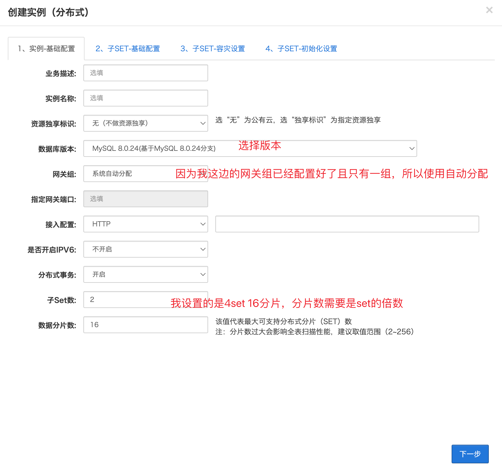
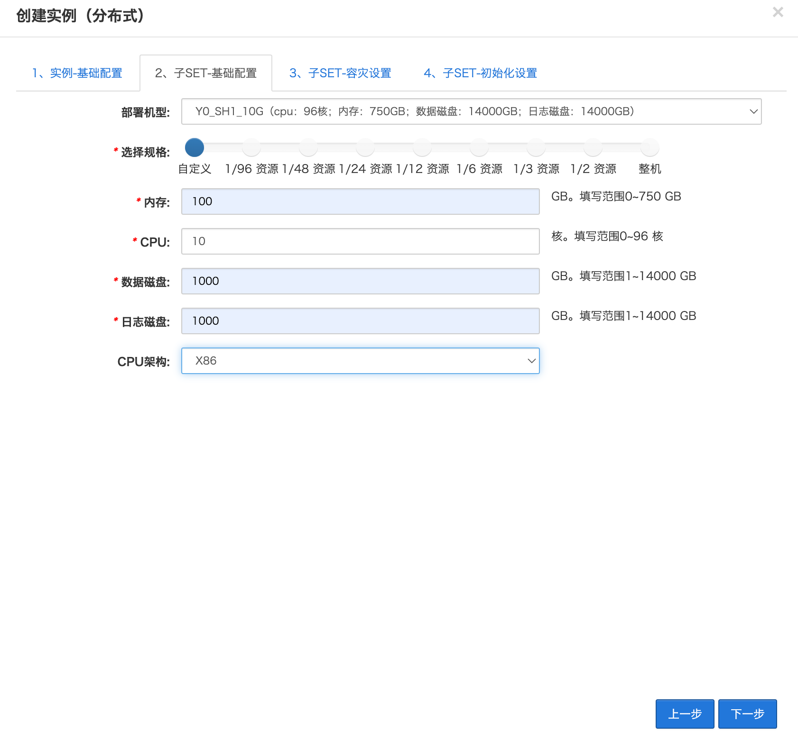
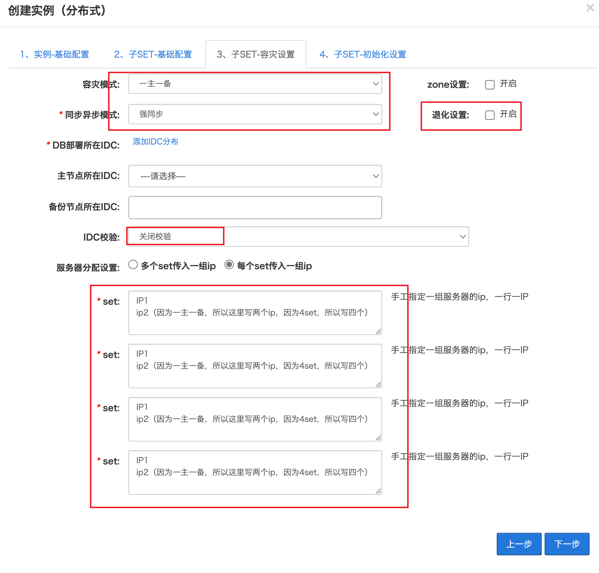
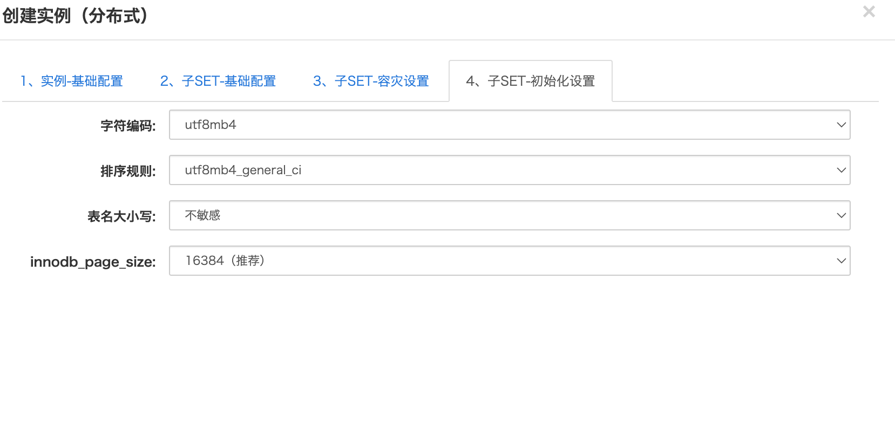
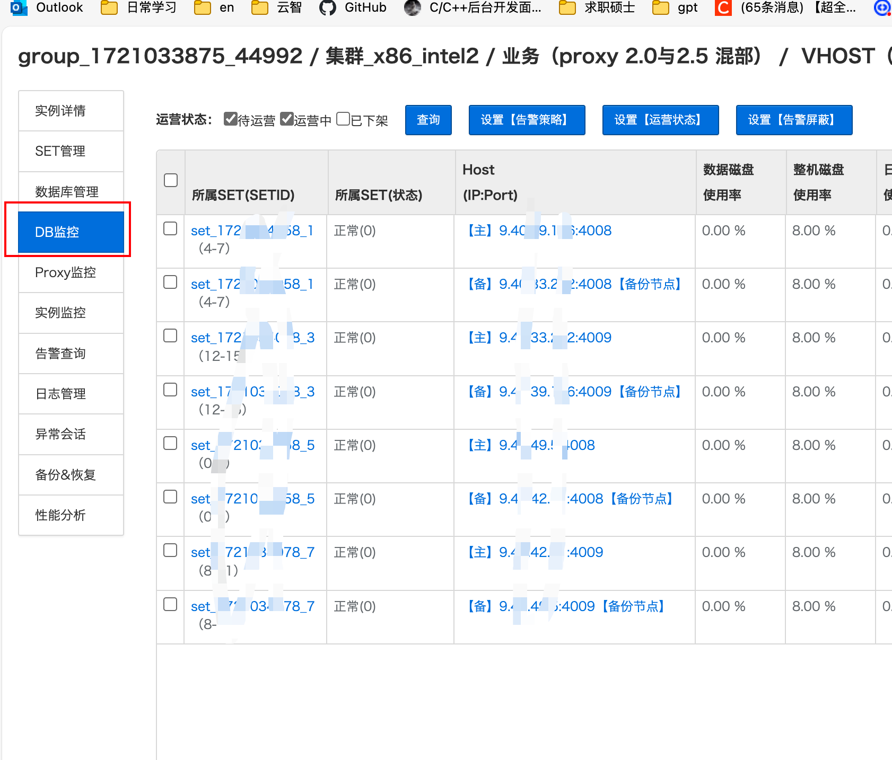
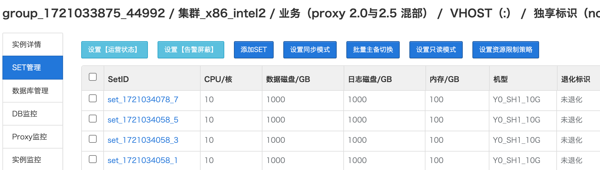
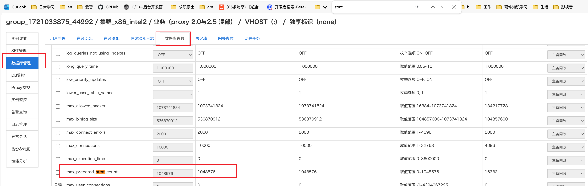
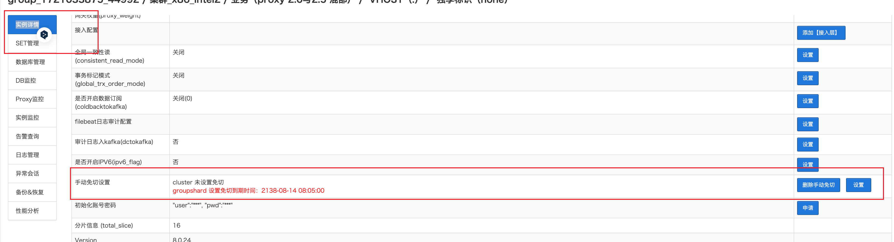
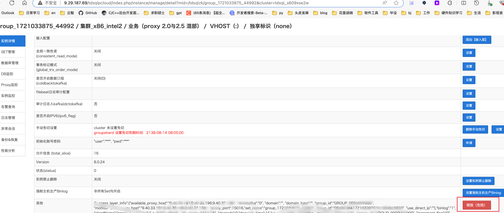

## 在集群中新增分布式实例

我的参数是依据worklaod实例配置的

| 9.29.177.198 |
| ------------ |
| 9.40.33.202  |
| 9.40.42.71   |
| 10.59.172.69 |
| 9.40.39.196  |
| 9.40.49.5    |

直接下一步开始创建

调整每个set的主备节点ip，达到主备分离，即每个服务器上仅有一个主set

在这里切换主备节点

 修改max_prepared_stmt_count为最大数值

`max_prepared_stmt_count` 是 MySQL 数据库中的一个系统变量，用于控制服务器允许的最大预处理语句（prepared statements）数量。预处理语句是一种在数据库中执行 SQL 查询的方式，先将 SQL 语句发送到服务器进行预编译，然后在需要时执行。这种方式可以提高性能，特别是在重复执行相同查询的情况下。

设置手动免切

完成

## 安全销毁实例

1. 隔离实例，即关闭实例的相关服务
2. 进入实例内部，选择 “销毁“，选择安全销毁

