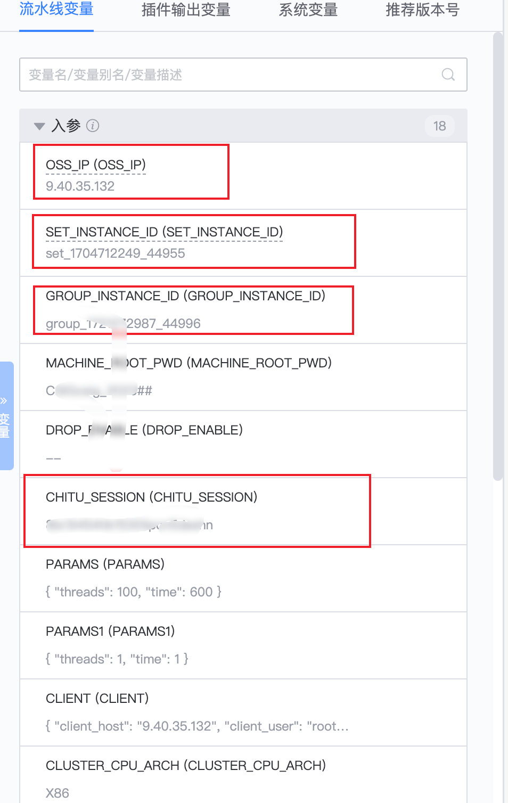
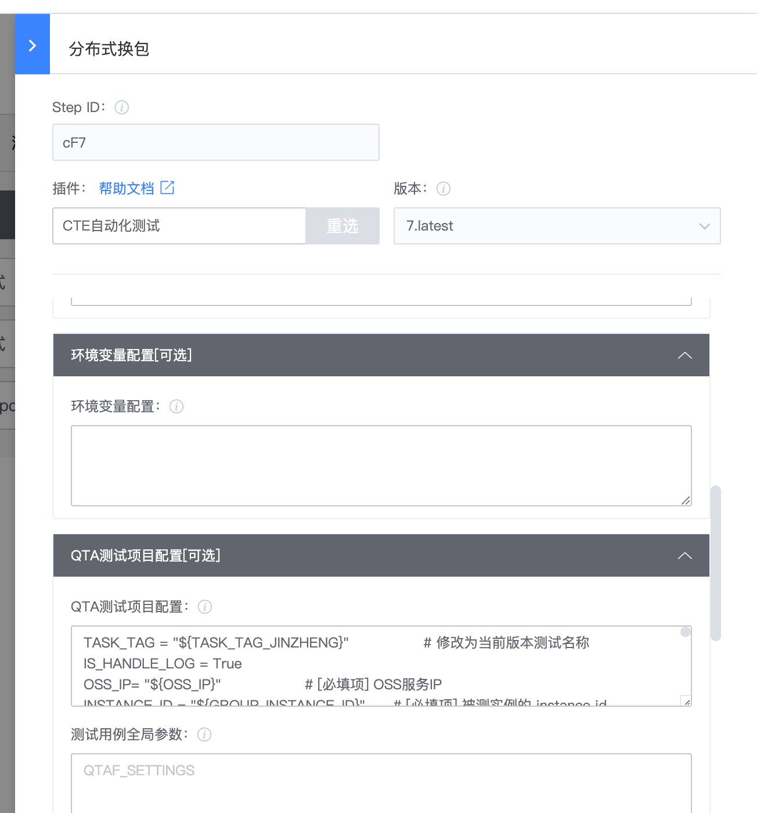
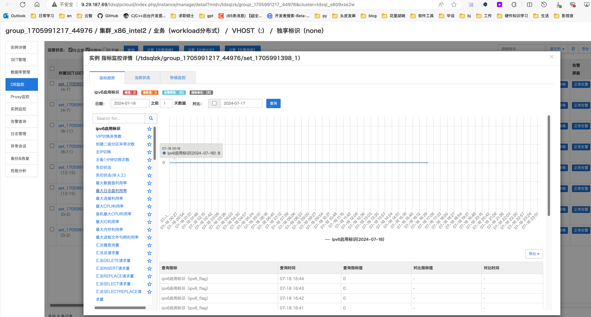
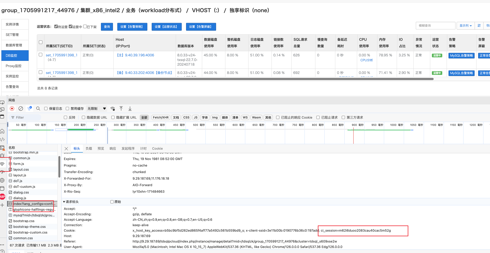

目的：执行TDSQL2.5workload测试

参照流水线：[TDSQL业务workload | 流水线 (woa.com)](https://devops.woa.com/console/pipeline/zhiyan-kaynli/p-c20e7ec6f8e743408a5d9f52e7e65b76/history/history/76?page=1&pageSize=20)

1. 修改蓝盾参数

这些参数会在下面使用

其中CHITU_SESSION (CHITU_SESSION)获取：

进入该界面，F12，进入控制台，然后点击网络，刷新寻找ci_session字段

2. 编排流水线

   