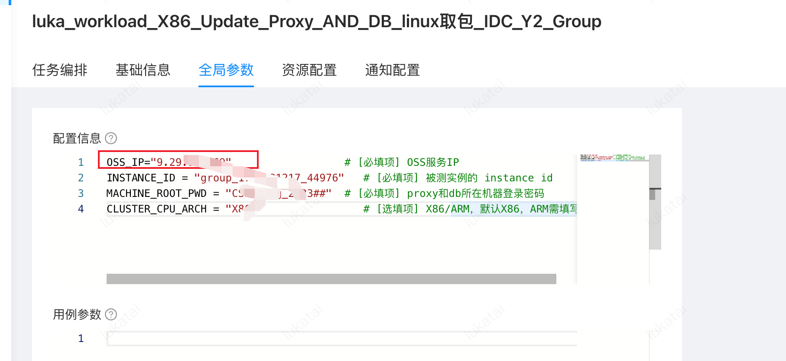
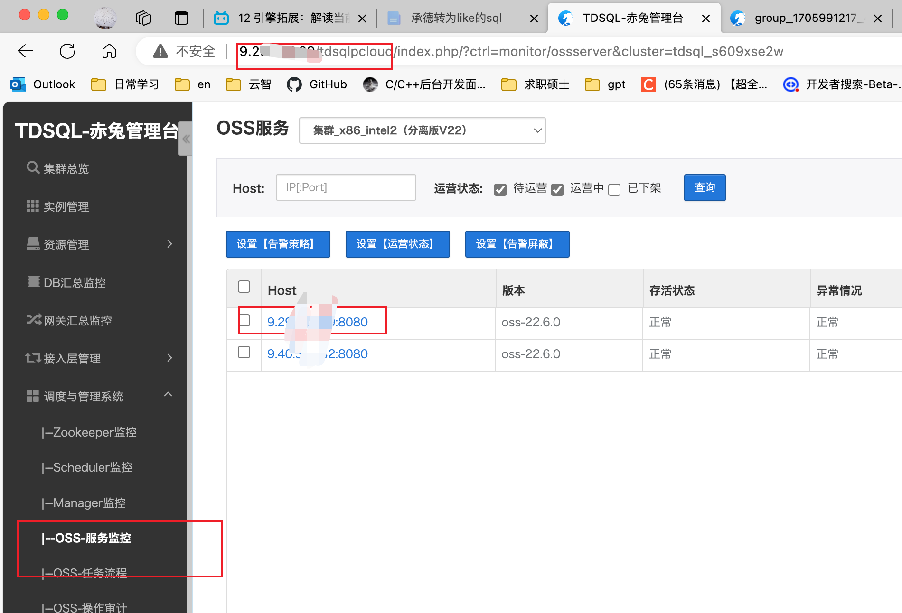
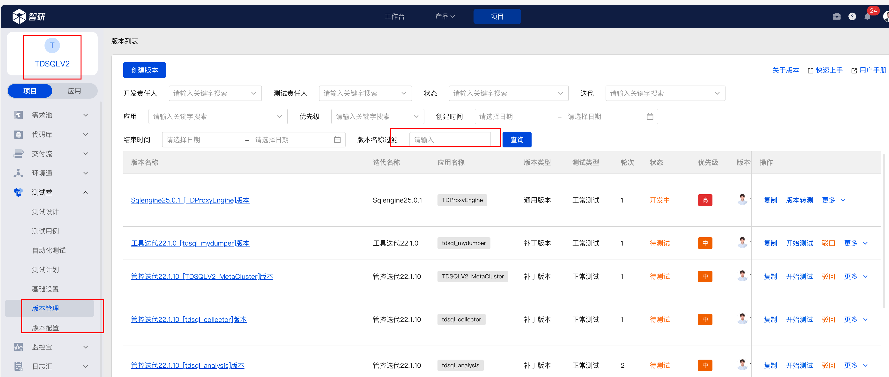

# 流水线更新

1. 注意，工具是部署在工具服务器上，且用例取包是从工具服务器上取得


## 使用的cte用例以及参数


Cte ID :543047




OSS_IP 选择下图中的ip（好像OSS-服务监控中的任意IP都行，哪个ip其实都可以访问的）




升级包放在工具服务器上，具体工具服务器，在《国产数据库跟踪表上找》


升级包在智研上找




# 手动更新proxy2.5

登录proxy机器，将2.5的proxy包放在/data/tdsql_run/{端口号} ，按照网址的介绍走

[升级替换2.5 流程 - 腾讯iWiki (woa.com)](https://iwiki.woa.com/p/4010697647)

https://iwiki.woa.com/p/4008018952

```
有proxy的目录的替换流程
调用install/stopsqlengine.sh ${port} 停掉2.5

调用sudo install/uninstall_sqlengine.sh ${port} 卸载2.5 

调用sudo rm sqlengine 目录

解压新的sqlengine.tgz 文件

调用install/replace_proxy.sh -p ${port} 安装新的2.5 


查询是否启动成功：


./jsqlengine.sh  10086  "select version()" |grep sqlengine
 

```


```
cd /data/tdsql_run/15018/sqlengine/install
./stopsqlengine.sh 15012
./uninstall_sqlengine.sh 15012
./replace_proxy.sh -p 15012
./jsqlengine.sh  10086  "select version()" |grep sqlengine


```

```
cd /data/tdsql_run/15018/sqlengine/install
./stopsqlengine.sh 15018
./uninstall_sqlengine.sh 15018


```


# 手动更新proxy2.0

登录到proxy机器上，上传更新包，比如我这里把它放到/data/hanlon下解压包

```
tar xf tdsql_pack_tdsqlinstall_Tlinux64_tdsqlinstall.tgz

chmod 777 -R gateway

# 备份并替换bin包
cp -a /data/tdsql_run/15014/gateway/bin /data/tdsql_run/15014/gateway/bin_bak0524
rm -rf /data/tdsql_run/15014/gateway/bin
cp -a /data/hanlon/gateway/bin /data/tdsql_run/15014/gateway/
 
 
 
# 重启网关的两个进程
cd /data/tdsql_run/15014/gateway/bin
./restart_cgroup.sh instance_15014

 
# 后台检查进程的启动时间是否更改
ps -ef |grep 15014
tdsql     1487     1  0 21:36 ?        00:00:00 ./mysql-proxy /data/tdsql_run/15007/gateway/conf/instance_15007.cnf
tdsql     1488  1487  0 21:36 ?        00:00:00 ./mysql-proxy /data/tdsql_run/15007/gateway/conf/instance_15007.cnf
tdsql    20751     1  0 21:37 ?        00:00:00 ./router_update /data/tdsql_run/15007/gateway/conf/instance_15007.cnf
tdsql    20752 20751  0 21:37 ?        00:00:00 ./router_update /data/tdsql_run/15007/gateway/conf/instance_15007.cnf

# 赤兔前台检查网关版本号是否更改
```


## 手动更新db

```
cd /data/tdsql_run/端口
Rz 安装包
mv mysql-server-8.0.24 mysql-server-8.0.24.bak
tar -xf mysql-8.0.24_22.6.3_229_tl2_x86_64.tgz
cp -a /data/tdsql_run/4001/mysql-server-8.0.24.bak/etc/*  /data/tdsql_run/4001/mysql-server-8.0.24/etc/
chown -R tdsql:users /data/tdsql_run/4001/mysql-server-8.0.24
chmod +x -R /data/tdsql_run/4001
su tdsql
cd /data/tdsql_run/4001/mysql-server-8.0.24/install/
./restartmysql_cgroup.sh 4001
```


```
cp -a /data/tdsql_run/4004/mysql-server-8.0.24.bak/etc/*  /data/tdsql_run/4004/mysql-server-8.0.24/etc/
chown -R tdsql:users /data/tdsql_run/4004/mysql-server-8.0.24
chmod +x -R /data/tdsql_run/4004
su tdsql
cd /data/tdsql_run/4004/mysql-server-8.0.24/install/
./restartmysql_cgroup.sh 4004
```
