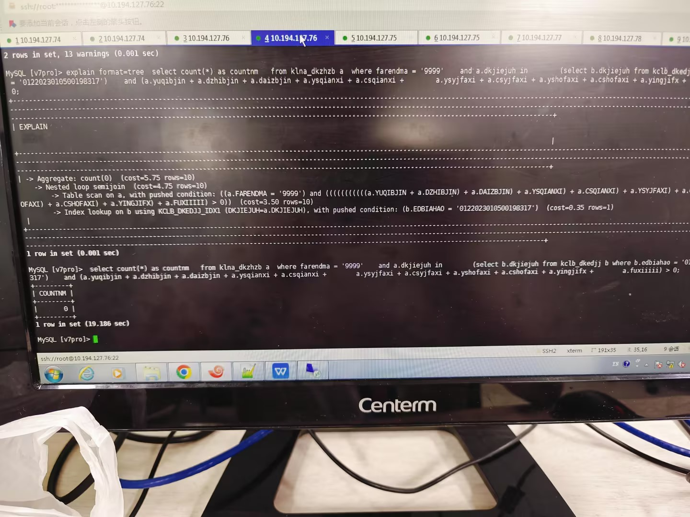
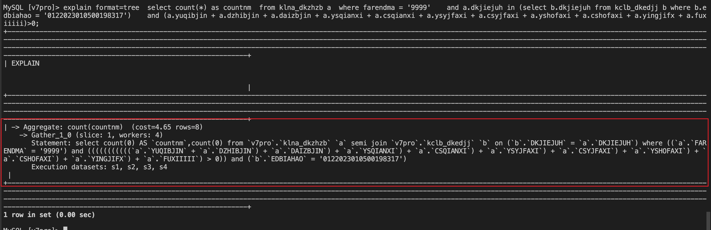
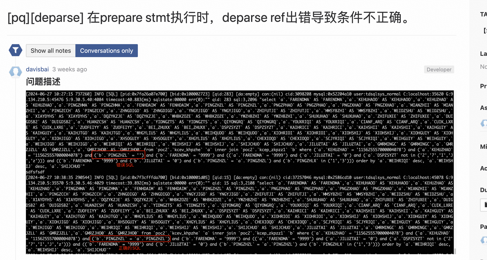

## 1、 semijoin







我这个是下推到哪种程度了？


##   **2、**     **FQS选错了节点**


```
 CREATE TABLE `pub_menu` (
  `MENUID` varchar(40) COLLATE utf8_bin DEFAULT NULL,
  `MENUNA` varchar(100) COLLATE utf8_bin DEFAULT NULL,
  `NODEBR` varchar(20) COLLATE utf8_bin DEFAULT NULL,
  `MENUTX` varchar(500) COLLATE utf8_bin DEFAULT NULL,
  `MENUAD` varchar(200) COLLATE utf8_bin DEFAULT NULL,
  `VIEWID` varchar(40) COLLATE utf8_bin DEFAULT NULL,
  `STATUS` varchar(20) COLLATE utf8_bin DEFAULT NULL
) ENGINE=TDSQL DISTRIBUTION=SET(s1) DEFAULT CHARSET=utf8mb3 COLLATE=utf8_bin;

 CREATE TABLE `pub_user` (
  `USERID` varchar(40) COLLATE utf8_bin NOT NULL,
  `USERNA` varchar(40) COLLATE utf8_bin DEFAULT NULL,
  `PASSND` varchar(40) COLLATE utf8_bin DEFAULT NULL,
  `STATUS` varchar(20) COLLATE utf8_bin DEFAULT NULL,
  `IPADDRESS` varchar(15) COLLATE utf8_bin DEFAULT NULL,
  `LOGINSTAT` varchar(1) COLLATE utf8_bin DEFAULT NULL,
  PRIMARY KEY (`USERID`),
  UNIQUE KEY `PK_USER` (`USERID`)
) ENGINE=TDSQL DISTRIBUTION=SET(ALL) DEFAULT CHARSET=utf8mb3 COLLATE=utf8_bin ;

CREATE TABLE `pub_usgp_relation` (
  `USGPID` varchar(40) COLLATE utf8_bin NOT NULL,
  `USERID` varchar(40) COLLATE utf8_bin NOT NULL
) ENGINE=TDSQL DISTRIBUTION=SET(s1) DEFAULT CHARSET=utf8mb3 COLLATE=utf8_bin;

CREATE TABLE `pub_usmn_relation` (
  `USGPID` varchar(40) COLLATE utf8_bin DEFAULT NULL,
  `MENUID` varchar(40) COLLATE utf8_bin DEFAULT NULL
) ENGINE=TDSQL DISTRIBUTION=SET(s1) DEFAULT CHARSET=utf8mb3 COLLATE=utf8_bin ;

explain format=tree select  b.status from (select distinct pu.menuid from pub_user ur,pub_usgp_relation gr, pub_usmn_relation pu where ur.userid= gr.userid and gr.usgpid=pu.usgpid and ur.userid ='1212'  and pu.menuid like ifnull(NuLL, '%') || '%') a left join pub_menu b on a.menuid=b.menuid order by a.menuid asc;

调换表顺序后
explain format=tree select  b.status from (select distinct pu.menuid from pub_usgp_relation gr, pub_user ur, pub_usmn_relation pu where ur.userid= gr.userid and gr.usgpid=pu.usgpid and ur.userid ='1212'  and pu.menuid like ifnull(NuLL, '%') || '%') a left join pub_menu b on a.menuid=b.menuid order by a.menuid asc;

```


```

drop table pub_menu        ;  
drop table  pub_user       ;   
drop table pub_usgp_relation ;
drop table  pub_usmn_relation;
```


```
select * from pub_user ur,pub_usgp_relation gr where ur.userid= gr.userid;


select * from pub_usgp_relation gr,pub_user ur where ur.userid= gr.userid;
```


##  **prepare 语句后结果集不对****--deparse有个bug导致的**


```
CREATE TABLE `kcep_zkpzz1` (
  `KCEP_ZKPZZL` varchar(4) CHARACTER SET utf8mb4 COLLATE utf8mb4_bin NOT NULL,
  `FARENDMA` varchar(3) CHARACTER SET utf8mb4 COLLATE utf8mb4_bin NOT NULL,
  `PINGZHZL` varchar(500) CHARACTER SET utf8mb4 COLLATE utf8mb4_bin NOT NULL,
  `PNGZMINC` varchar(500) CHARACTER SET utf8mb4 COLLATE utf8mb4_bin NOT NULL,
  `PNGZBIEM` varchar(4) CHARACTER SET utf8mb4 COLLATE utf8mb4_bin NOT NULL,
  `FENHDAIM` varchar(1) CHARACTER SET utf8mb4 COLLATE utf8mb4_bin DEFAULT NULL,
  `PZGLFWEI` varchar(1) CHARACTER SET utf8mb4 COLLATE utf8mb4_bin DEFAULT NULL,
  `PZSYFWEI` varchar(1) CHARACTER SET utf8mb4 COLLATE utf8mb4_bin DEFAULT NULL,
  `HUOBDAIH` varchar(3) CHARACTER SET utf8mb4 COLLATE utf8mb4_bin NOT NULL,
  `PZZHLBIE` varchar(6) CHARACTER SET utf8mb4 COLLATE utf8mb4_bin NOT NULL,
  `PZDXZHLB` varchar(30) CHARACTER SET utf8mb4 COLLATE utf8mb4_bin DEFAULT NULL,
  `PINGZHLX` varchar(4) CHARACTER SET utf8mb4 COLLATE utf8mb4_bin DEFAULT NULL,
  `PINGZCCH` varchar(1) CHARACTER SET utf8mb4 COLLATE utf8mb4_bin DEFAULT NULL,
  `ZKPZBZHI` varchar(1) CHARACTER SET utf8mb4 COLLATE utf8mb4_bin DEFAULT NULL,
  `YOUJIADZ` varchar(1) CHARACTER SET utf8mb4 COLLATE utf8mb4_bin DEFAULT NULL,
  `NBKHSYON` varchar(1) CHARACTER SET utf8mb4 COLLATE utf8mb4_bin DEFAULT NULL,
  `WBKHSYON` varchar(1) CHARACTER SET utf8mb4 COLLATE utf8mb4_bin DEFAULT NULL,
  `LUNGZBZH` varchar(1) CHARACTER SET utf8mb4 COLLATE utf8mb4_bin DEFAULT NULL,
  `KFCSDUIG` varchar(1) CHARACTER SET utf8mb4 COLLATE utf8mb4_bin DEFAULT NULL,
  `KFCSDUIS` varchar(1) CHARACTER SET utf8mb4 COLLATE utf8mb4_bin DEFAULT NULL,
  `KEFOGUAS` varchar(1) CHARACTER SET utf8mb4 COLLATE utf8mb4_bin DEFAULT NULL,
  `KFZYPZZZ` varchar(1) CHARACTER SET utf8mb4 COLLATE utf8mb4_bin DEFAULT NULL,
  `KFZFMIMA` varchar(1) CHARACTER SET utf8mb4 COLLATE utf8mb4_bin DEFAULT NULL,
  `SFQFDWEI` varchar(1) CHARACTER SET utf8mb4 COLLATE utf8mb4_bin DEFAULT NULL,
  `JCDANWZH` varchar(1) CHARACTER SET utf8mb4 COLLATE utf8mb4_bin DEFAULT NULL,
  `KEHUIFBZ` varchar(1) CHARACTER SET utf8mb4 COLLATE utf8mb4_bin NOT NULL,
  `SFXZPZ5L` varchar(1) CHARACTER SET utf8mb4 COLLATE utf8mb4_bin DEFAULT NULL,
  `PINGZHSL` decimal(22,0) DEFAULT NULL,
  `KEZPZSYN` varchar(1) CHARACTER SET utf8mb4 COLLATE utf8mb4_bin NOT NULL,
  `SFLXZPIA` varchar(1) CHARACTER SET utf8mb4 COLLATE utf8mb4_bin DEFAULT NULL,
  `SF2PZHHU` varchar(1) CHARACTER SET utf8mb4 COLLATE utf8mb4_bin DEFAULT NULL,
  `PINZGLFS` varchar(1) CHARACTER SET utf8mb4 COLLATE utf8mb4_bin DEFAULT NULL,
  `YOUXHSHU` decimal(22,0) DEFAULT '8',
  `YOUXAOYS` decimal(22,0) DEFAULT '0',
  `YESHOUHS` decimal(22,0) DEFAULT '0',
  `SHBYHSHU` decimal(22,0) DEFAULT '0',
  `ZHONGFHS` decimal(22,0) DEFAULT '0',
  `XIABYHSH` decimal(22,0) DEFAULT '0',
  `ZUIDWDZS` varchar(1) CHARACTER SET utf8mb4 COLLATE utf8mb4_bin DEFAULT NULL,
  `KAZHBZHI` varchar(30) CHARACTER SET utf8mb4 COLLATE utf8mb4_bin DEFAULT NULL,
  `FEIYGSDM` varchar(10) CHARACTER SET utf8mb4 COLLATE utf8mb4_bin DEFAULT NULL,
  `NEIYGSDM` varchar(10) CHARACTER SET utf8mb4 COLLATE utf8mb4_bin DEFAULT NULL,
  `ZIDGESHI` varchar(200) CHARACTER SET utf8mb4 COLLATE utf8mb4_bin DEFAULT NULL,
  `SHUOMING` varchar(200) CHARACTER SET utf8mb4 COLLATE utf8mb4_bin DEFAULT NULL,
  `BEIYNGZD` varchar(200) CHARACTER SET utf8mb4 COLLATE utf8mb4_bin DEFAULT NULL,
  `BEIYNGDA` varchar(200) CHARACTER SET utf8mb4 COLLATE utf8mb4_bin DEFAULT NULL,
  `BEIYNGDB` varchar(30) CHARACTER SET utf8mb4 COLLATE utf8mb4_bin DEFAULT NULL,
  `ROWIDDDD` varchar(8) CHARACTER SET utf8mb4 COLLATE utf8mb4_bin NOT NULL,
  `WEIHGUIY` varchar(12) CHARACTER SET utf8mb4 COLLATE utf8mb4_bin NOT NULL,
  `WEIHJIGO` varchar(8) CHARACTER SET utf8mb4 COLLATE utf8mb4_bin NOT NULL,
  `WEIHRIQI` varchar(8) CHARACTER SET utf8mb4 COLLATE utf8mb4_bin NOT NULL,
  `WEIHSHIJ` varchar(9) CHARACTER SET utf8mb4 COLLATE utf8mb4_bin DEFAULT NULL,
  `SHIJCHUO` decimal(22,0) NOT NULL DEFAULT '0',
  `JILUZTAI` varchar(1) CHARACTER SET utf8mb4 COLLATE utf8mb4_bin NOT NULL,
  UNIQUE KEY `KCEP_ZKPZZL_IDX1` (`PINGZHZL`,`FARENDMA`),
  UNIQUE KEY `KCEP_ZKPZZL_IDX3` (`PNGZBIEM`,`FARENDMA`,`PINGZHZL`),
  KEY `KCEP_ZKPZZL_IDX2` (`ZKPZBZHI`,`FARENDMA`)
) ENGINE=TDSQL DISTRIBUTION=SET(ALL) DEFAULT CHARSET=utf8mb4 COLLATE=utf8mb4_bin;
CREATE TABLE `kcev_khpzhe` (
  `FARENDMA` varchar(4) CHARACTER SET utf8mb4 COLLATE utf8mb4_bin NOT NULL,
  `KEHUHAOO` varchar(16) CHARACTER SET utf8mb4 COLLATE utf8mb4_bin DEFAULT NULL,
  `KEHUZHAO` varchar(35) CHARACTER SET utf8mb4 COLLATE utf8mb4_bin NOT NULL,
  `PINGZHMA` varchar(25) CHARACTER SET utf8mb4 COLLATE utf8mb4_bin NOT NULL,
  `FENHDAIM` varchar(4) CHARACTER SET utf8mb4 COLLATE utf8mb4_bin NOT NULL,
  `PINGZHZL` varchar(3) CHARACTER SET utf8mb4 COLLATE utf8mb4_bin NOT NULL,
  `PNGZPHAO` varchar(10) CHARACTER SET utf8mb4 COLLATE utf8mb4_bin NOT NULL,
  `PNGZXHAO` varchar(8) CHARACTER SET utf8mb4 COLLATE utf8mb4_bin NOT NULL,
  `MIANZHII` decimal(17,2) NOT NULL DEFAULT '0.00',
  `PINGZCCH` varchar(1) CHARACTER SET utf8mb4 COLLATE utf8mb4_bin DEFAULT NULL,
  `ZHNGDIGO` varchar(12) CHARACTER SET utf8mb4 COLLATE utf8mb4_bin DEFAULT NULL,
  `YNGYJIGO` varchar(12) CHARACTER SET utf8mb4 COLLATE utf8mb4_bin NOT NULL,
  `ZHIFUTJI` varchar(1) CHARACTER SET utf8mb4 COLLATE utf8mb4_bin DEFAULT NULL,
  `MMSYBZHI` varchar(1) CHARACTER SET utf8mb4 COLLATE utf8mb4_bin DEFAULT NULL,
  `WEIDZSHU` decimal(22,0) DEFAULT '0',
  `XIAYDYHS` decimal(22,0) DEFAULT '0',
  `DQZYKZJE` decimal(21,2) DEFAULT '0.00',
  `WHBKZOZE` decimal(21,2) DEFAULT '0.00',
  `YWZHBZHI` varchar(1) CHARACTER SET utf8mb4 COLLATE utf8mb4_bin DEFAULT NULL,
  `SHUXUHAO` varchar(8) CHARACTER SET utf8mb4 COLLATE utf8mb4_bin DEFAULT NULL,
  `ZHIFUXEE` decimal(17,2) DEFAULT '0.00',
  `DUIGDSB2` varchar(1) CHARACTER SET utf8mb4 COLLATE utf8mb4_bin DEFAULT NULL,
  `HUANZCSH` decimal(22,0) DEFAULT '0',
  `YIDNGZTS` decimal(22,0) DEFAULT '0',
  `QIYONGRQ` varchar(8) CHARACTER SET utf8mb4 COLLATE utf8mb4_bin DEFAULT NULL,
  `YOUXRIQI` varchar(8) CHARACTER SET utf8mb4 COLLATE utf8mb4_bin DEFAULT NULL,
  `CIANF_ARQ` varchar(8) CHARACTER SET utf8mb4 COLLATE utf8mb4_bin DEFAULT NULL,
  `CUIK_LXRE` varchar(500) CHARACTER SET utf8mb4 COLLATE utf8mb4_bin DEFAULT NULL,
  `ZUOFEIYY` varchar(200) CHARACTER SET utf8mb4 COLLATE utf8mb4_bin DEFAULT NULL,
  `BEI_ZHUXX` varchar(200) CHARACTER SET utf8mb4 COLLATE utf8mb4_bin DEFAULT NULL,
  `DSPZSYZT` varchar(1) CHARACTER SET utf8mb4 COLLATE utf8mb4_bin NOT NULL,
  `KAIHRICI` varchar(8) CHARACTER SET utf8mb4 COLLATE utf8mb4_bin DEFAULT NULL,
  `KAIHSHII` varchar(16) CHARACTER SET utf8mb4 COLLATE utf8mb4_bin DEFAULT NULL,
  `KAIHGUIY` varchar(8) CHARACTER SET utf8mb4 COLLATE utf8mb4_bin DEFAULT NULL,
  `KAIHJTGO` varchar(12) CHARACTER SET utf8mb4 COLLATE utf8mb4_bin DEFAULT NULL,
  `WHGYLIUS` varchar(32) CHARACTER SET utf8mb4 COLLATE utf8mb4_bin DEFAULT NULL,
  `WEIHQUDO` varchar(7) CHARACTER SET utf8mb4 COLLATE utf8mb4_bin DEFAULT NULL,
  `XIOHRIOI` varchar(8) CHARACTER SET utf8mb4 COLLATE utf8mb4_bin DEFAULT NULL,
  `XIOHSHIJ` decimal(22,0) DEFAULT '0',
  `XIOHGUIY` varchar(8) CHARACTER SET utf8mb4 COLLATE utf8mb4_bin DEFAULT NULL,
  `XIOHJIGO` varchar(12) CHARACTER SET utf8mb4 COLLATE utf8mb4_bin DEFAULT NULL,
  `XHSOGUIY` varchar(8) CHARACTER SET utf8mb4 COLLATE utf8mb4_bin DEFAULT NULL,
  `XHGYLIUS` varchar(32) CHARACTER SET utf8mb4 COLLATE utf8mb4_bin DEFAULT NULL,
  `CHEXIOQD` varchar(1) CHARACTER SET utf8mb4 COLLATE utf8mb4_bin DEFAULT NULL,
  `SCJYRIQI` varchar(8) CHARACTER SET utf8mb4 COLLATE utf8mb4_bin DEFAULT NULL,
  `WEIHGUIY` varchar(8) CHARACTER SET utf8mb4 COLLATE utf8mb4_bin NOT NULL,
  `WEIHJIGO` varchar(12) CHARACTER SET utf8mb4 COLLATE utf8mb4_bin NOT NULL,
  `WEIHRIQI` varchar(8) CHARACTER SET utf8mb4 COLLATE utf8mb4_bin NOT NULL,
  `WEIHSHIJ` varchar(9) CHARACTER SET utf8mb4 COLLATE utf8mb4_bin DEFAULT NULL,
  `SHIJCHUO` decimal(22,0) NOT NULL DEFAULT '0',
  `JILUZTAI` varchar(1) CHARACTER SET utf8mb4 COLLATE utf8mb4_bin NOT NULL,
  `GMRMINGC` varchar(500) CHARACTER SET utf8mb4 COLLATE utf8mb4_bin DEFAULT NULL,
  `GMRZJZLL` varchar(3) CHARACTER SET utf8mb4 COLLATE utf8mb4_bin DEFAULT NULL,
  `GMRZJHO0` varchar(80) CHARACTER SET utf8mb4 COLLATE utf8mb4_bin DEFAULT NULL,
  UNIQUE KEY `KCEV_KHPZHE_IDX4` (`PINGZHMA`,`MIANZHII`,`JILUZTAI`,`FARENDMA`,`PINGZHZL`,`FENHDAIM`,`PNGZPHAO`,`PNGZXHAO`),
  KEY `KCEV_KHPZHE_IDX5` (`PINGZHZL`,`FARENDMA`),
  KEY `KCEV_KHPZHE_IDX6` (`SCJYRIQI`,`FARENDMA`),
  KEY `KCEV_KHPZHE_IDX11` (`KEHUZHAO`,`PINGZHZL`,`PNGZPHAO`,`DSPZSYZT`,`FARENDMA`),
  KEY `KCEV_KHPZHE_IDX3` (`KEHUZHAO`,`FARENDMA`),
  KEY `KCEV_KHPZHE_IDX2` (`KEHUHAOO`,`FARENDMA`,`PINGZHZL`)
) ENGINE=TDSQL DISTRIBUTION=SHARDING DEFAULT CHARSET=utf8mb4 COLLATE=utf8mb4_bin
/*!50100 PARTITION BY HASH (`PINGZHMA`) */;

PREPARE stmt FROM '
SELECT a.*
FROM kcev_khpzhe a, kcep_zkpzz1 b
WHERE a.kehuzhao = ?
AND a.pingzhzl = b.pingzhzl
AND b.pingzhlx IN (?, ?)
AND a.jiluztai = ?
AND b.jiluztai = ?
AND a.farendma = ?
AND b.farendma = ?
AND a.dspzsyzt NOT IN (?, ?, ?, ?, ?)
ORDER BY a.weihriqi DESC, a.weihshij DESC, a.SHIJCHUO';

EXECUTE stmt using '115625557000004078', '1','3','0','0','9999','9999','2','7','I','J','z';
```


这个log是？？





##             **14、**     **connect by在db功能失效**


功能上的问题，该怎么验证呢？


```
CREATE TABLE employees (     id int key,     name VARCHAR(100),     manager_id int )shardkey=id; 
INSERT INTO employees VALUES (1, 'CEO', NULL);
INSERT INTO employees VALUES (2, 'Manager 1', 1);
INSERT INTO employees VALUES (3, 'Manager 2', 1);
INSERT INTO employees VALUES (4, 'Employee 1', 2);
INSERT INTO employees VALUES (5, 'Employee 2', 2);
INSERT INTO employees VALUES (6, 'Employee 3', 3); 
SELECT name
FROM employees
WHERE id IN (
    SELECT id
    FROM employees
    START WITH name = 'Manager 1'
    CONNECT BY PRIOR id = manager_id
); 

```


