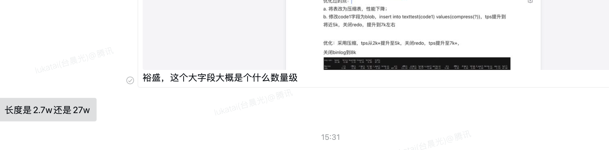
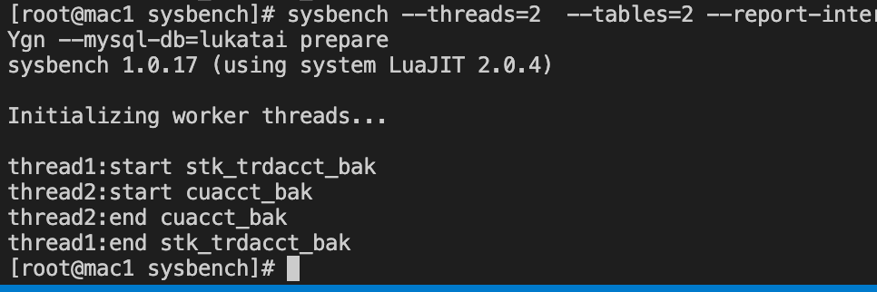

目前银河的poc的已经结束了，能取出来的东西，只有银河问题里面的三个问题。

1、大字段插入的问题。

2、多表join。

3、cte的窗口函数的问题。 


由于目前没有数据，只有表结构,看看本地是否可以造一些数据之类的，进行沉淀。

表结构见附件：银河问题.docs


**1）当前 Libra 这里只支持 Hash Join ，所以这个 Case 类似于笛卡尔积的情况下，需要大量走外存，就会比较慢，而且多一层 Join，就有一个放大； 2）咱们在 td 侧走 NLJ 的话，会好一些，这里 OB 之前探听到大概是小时级别的结果，应该也是走的 NLJ ； 3） 这里 Join 的场景，如果 Join 的表在 Join Key 上面，都有索引，可以走 Stream Join, 这里的Join 执行就快一些了，主要时间在输出最终结果上面。按照这个查询的数据量级，推测如果分钟级别的话， 应该就是走的 Stream Join .**


## 1、大字段插入的问题。




```
create table texttest(id bigint auto_increment,code1 text, primary key(id))DISTRIBUTION=SHARDING PARTITION BY HASH(id);
insert into texttest(code1) values(?);


```

2.0 

```

CREATE TABLE `texttest2w` ( `id` bigint NOT NULL AUTO_INCREMENT, `code1` text COLLATE utf8mb4_general_ci, PRIMARY KEY (`id`) ) ENGINE=InnoDB DEFAULT CHARSET=utf8mb4 COLLATE=utf8mb4_general_ci TDSQL_DISTRIBUTED BY HASH(`id`)


CREATE TABLE `texttest27w` ( `id` bigint NOT NULL AUTO_INCREMENT, `code1` mediumtext COLLATE utf8mb4_general_ci, PRIMARY KEY (`id`) ) ENGINE=InnoDB DEFAULT CHARSET=utf8mb4 COLLATE=utf8mb4_general_ci TDSQL_DISTRIBUTED BY HASH(`id`)


```


2.5

```
  con:query("create table if not exists texttest2w(id bigint auto_increment,code1 text, primary key(id))DISTRIBUTION=SHARDING PARTITION BY HASH(id);")

-- 创建表数据时候，是不是不能用  create table if not exists---

create table if not exists texttest27w(id bigint auto_increment,code1 MEDIUMTEXT, primary key(id))DISTRIBUTION=SHARDING PARTITION BY HASH(id);

```


## 2、多表join。


```
sysbench --threads=1 --events=1 --report-interval=1 /home/sysbench-master/src/lua/oltp_common_yinheSecurity.lua  --mysql-host=9.40.30.196,9.40.33.197,9.40.37.138 --mysql-port=15012 --mysql-user=lukatai --mysql-password=Root@@@123 --mysql-db=yinhe prepare
```


```
sysbench --threads=1 --events=1 --report-interval=1 ./oltp_common_tdsql_distribute_hash_list_wide_4_160.lua  --mysql-host=9.40.30.196 --mysql-port=15012 --mysql-user=lukatai --mysql-password=Root@@@123 --mysql-db=lukatest   prepare
```


## 多线程造数


devcloud

```
sysbench  --threads=3  --tables=5 --report-interval=1 /usr/share/sysbench/oltp_common_yinhe.lua  --mysql-host=9.134.254.214 --mysql-port=3306 --mysql-user=tdsql_admin --mysql-password=TYdXA*4679zYgn --mysql-db=lukatai prepare
```

```
sysbench --threads=3  --tables=5 --report-interval=1 /usr/share/sysbench/oltp_common.lua  --mysql-host=9.134.254.214 --mysql-port=3306 --mysql-user=tdsql_admin --mysql-password=TYdXA*4679zYgn --mysql-db=lukatai prepare
```




