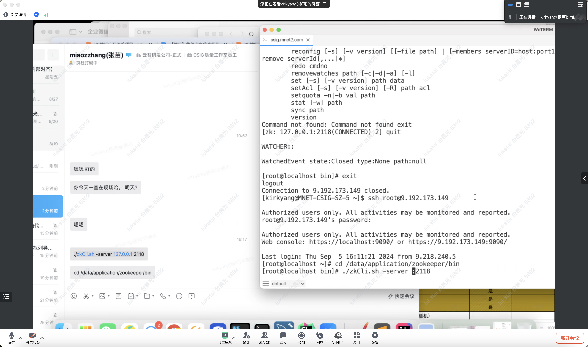
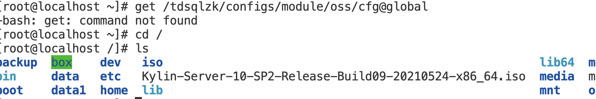
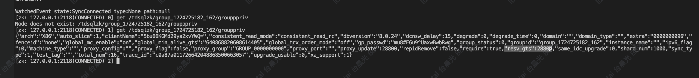

```
cd /data/application/zookeeper/bin/  
./zkCli.sh -server 9.30.4.49:2118

get /tdsqlzk/filebeat/9.30.4.49@filebeathelper 
get /tdsqlzk/filebeat/9.30.4.49@filebeathelper 
```





get 命令后的路径不存在





## gts_check_interval,resv_gts_gap修改

```
resv_gts_gap修改
1、cd /data/application/zookeeper/bin
2、 ./zkCli.sh -server 127.0.0.1:2118
3、查看参数：
get /tdsqlzk/xxx/grouppriv
（xxx是实例id）
4、set /tdsqlzk/xxx/grouppriv '查到的内容'

gts_check_interval修改
1、zk机器cd /data/application/scheduler/conf
2、修改scheduler.xml文件中的gts_check_interval参数
```


```
get /tdsqlzk/group_1724725182_162/grouppriv
```



