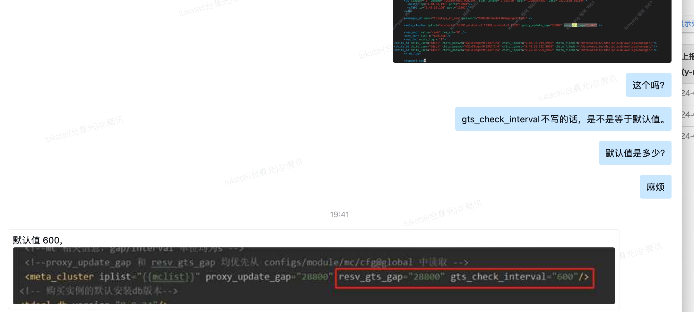
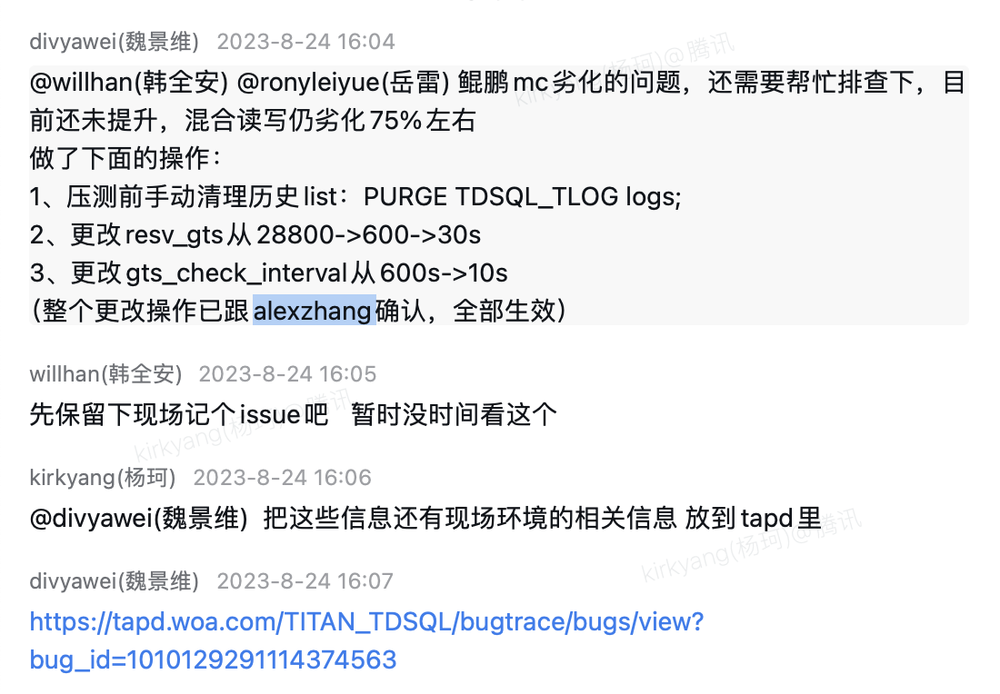
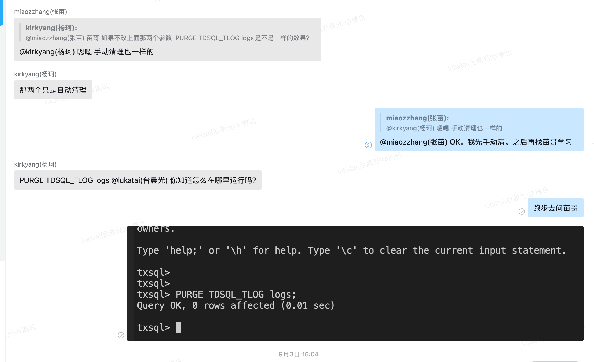
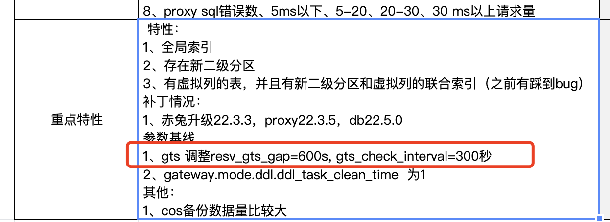

https://tapd.woa.com/tapd_fe/10129291/bug/detail/1010129291114374563

重启zk

su - tdsql    cd /data/application/scheduler/bin     ./restart.sh

手动清理：

## 查看参数

在管控机器， 进入/data/application/scheduler/conf目录下，修改scheduler.xml文件中的gts_check_interval，resv_gts_gap

"gts_check _interval"默认值=600

所有管控机器都得改

重启生效
