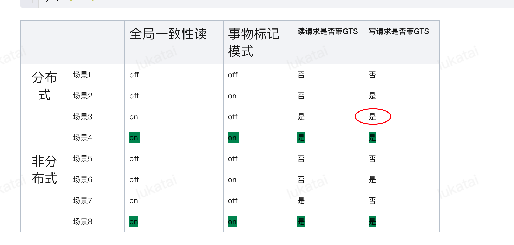

prepare状态是是本地维护的gts节点

prepare状态是加锁状态的，在这个状态上加上锁，如果还是prepare状态，则将会进入锁队列。当这个锁能够加上，则表示我这个数据解除prepare状态了；即立刻释放锁，读取commit状态的GTS

一致性读？

--快照稳定性问题？--在转账过程中，一直重复查询，保证稳定性

proxy可能将一个查询分成多个子查询下发，子查询回带有不同的gts，

*既然开启了global_mc_enable，不建议再使用RC*

建行问题其实也是 对同一个快照的稳定性，拉取互斥数据写入tmp表的时候，因为快照稳定性问题导致主键冲突

**后续测试的时候，注意可以用主键冲突凸显问题**

银行真正需要的隔离级别是？

在传统的集中式情况下，RC还是用的多

## MC

[MC一致性读测试 - 腾讯iWiki (woa.com)](https://iwiki.woa.com/p/4008378163)

分布式情况下，为了实现全局一致性读，无论事务标记模式是什么，写请求都会带GTS。

但是集中式，因为在用一个set，所以写请求不用带GTS

