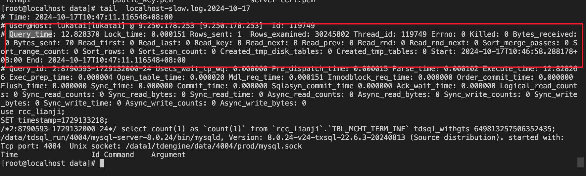
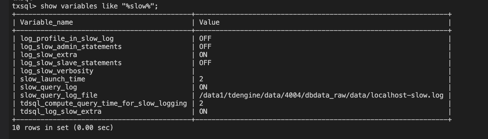
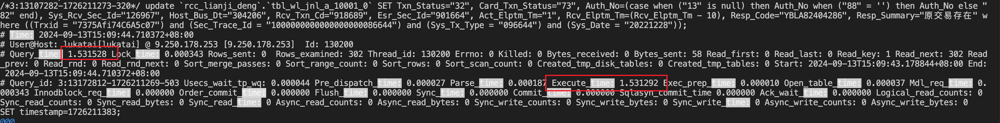

## tdsql_log_slow_extra

作用：深入慢sql慢在了什么地方，开启后db的慢日志中有更佳详细的log展示


详细时间信息介绍

https://git.woa.com/TXSQL/MySQL-8.0/issues/792


### 慢的可能性原因：

1. 行锁冲突
2. binlog 切换锁冲突
3. 是否有全局事务检测、全局锁冲突


### 开启后，db慢日志中会显示更加详细的log信息





### db log位置

在db上搜索

```
show variables like "%slow%";
```




### 建行仿真用例采用此参数分析耗时

问题转折点：执行时间过长---考虑事务中存在insert，insert数据多后，数据重复，update更新行数增加导致（update的where条件只是部分主键）



详细：海光上建行联机交易tps下降排查

https://doc.weixin.qq.com/doc/w3_AYYAzAbYAF0tmyT71ObSVarGfRR7t?scode=AJEAIQdfAAoD5uXv9JAYYAzAbYAF0

