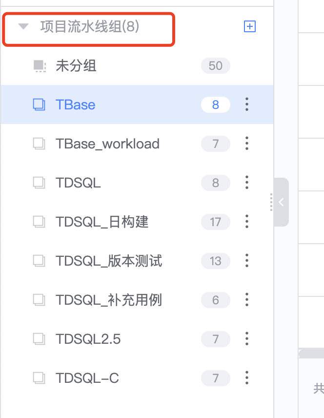
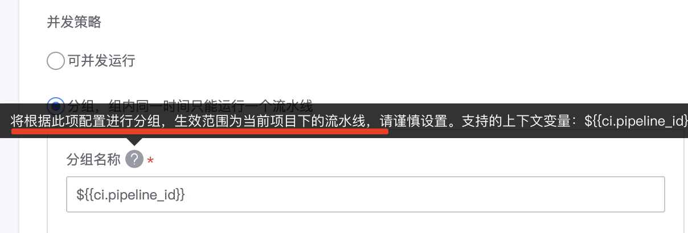

## 多流水线排队

第一步，把待串行执行的流水线分到同一个分组里面：

第二步，对于分组里的流水线，分别设置并发策略为“分组”

第三步，按照期望的执行顺序手动触发流水线，蓝盾会按照触发顺序，顺序执行同一个分组下的流水线。

还有另一个方法，可能涉及到修改流水线，你们也可以参考下：
当前流水线执行完后如何调用其他流水线：https://iwiki.woa.com/p/1835122334

选择适合的方法