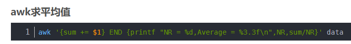

```
grep -i tbl_mcht_inf interf_instance_15006.2024-09-03.1036|awk -F '&' '{print $NF}'|awk -F '=' '{print $NF}'|sort -nr|head -10
grep -i tbl_mcht_term_inf interf_instance_15006.2024-09-03.1036|awk -F '&' '{print $NF}'|awk -F '=' '{print $NF}'|sort -nr|head -10
grep -i tbl_wl_jnl_a_10001_0 interf_instance_15006.2024-09-03.983|awk -F '&' '{print $NF}'|awk -F '=' '{print $NF}'|sort -nr|head -10


```


两种都可以

```

grep -i "%0Aupdate %0A  tbl_wl_jnl_a_10001_0%0Aset %0A  Txn_Status" interf_instance_15006.2024-09-13.8 | \
awk -F '&' '{print $NF,$14}' | \
awk -F '=' '{print $NF}' | \
sort -nr | head -10

grep -i tbl_mcht_term_inf interf_instance_15006.2024-09-03.19 | \
awk -F '&' '{print $NF}' | \
awk -F '=' '{print $NF}' | \
sort -nr | head -10

grep -i tbl_mcht_inf  interf_instance_15006.2024-09-03.15 | \
awk -F '&' '{print $NF}' | \
awk -F '=' '{print $NF}' | \
sort -nr | \
awk '{sum += $1} END {printf "NR = %d,Average = %3.3f\n",NR,sum/NR}'data

grep -i tbl_mcht_term_inf  interf_instance_15006.2024-09-03.15 | \
awk -F '&' '{print $NF}' | \
awk -F '=' '{print $NF}' | \
sort -nr | \
awk '{sum += $1} END {printf "NR = %d,Average = %3.3f\n",NR,sum/NR}'data


```


```
grep -i tbl_mcht_inf interf_instance_15006.2024-09-03.1048 | \
awk -F '&' '{print $NF}' | \
awk -F '=' '{print $NF}' | \
sort -nr | \
awk '{sum += $1; count += 1} END {if (count > 0) print sum / count; else print "No data"}'
```


```
grep -i tbl_mcht_inf 20:21 interf_instance_15006.2024-09-03.15 | \
awk -F '&' '{print $NF}' | \
awk -F '=' '{print $NF}' | \
sort -nr | \
awk '{sum += $1} END {printf "NR = %d,Average = %3.3f\n",NR,sum/NR}'data

grep -i tbl_mcht_term_inf 20:21 interf_instance_15006.2024-09-03.15 | \
awk -F '&' '{print $NF}' | \
awk -F '=' '{print $NF}' | \
sort -nr | \
awk '{sum += $1} END {printf "NR = %d,Average = %3.3f\n",NR,sum/NR}'data

```





平均值和前100耗时

```
grep -i "INSERT INTO `tbl_wl_jnl_a_10001_0`" interf_instance_15006.2024-09-11.80 | \
awk -F '&' '{print $NF}' | \
awk -F '=' '{print $NF}' | \
sort -nr | \
awk '{sum += $1} END {printf "NR = %d,Average = %3.3f\n",NR,sum/NR}'data

grep -i "INSERT INTO `tbl_wl_jnl_a_10001_0`" interf_instance_15006.2024-09-11.80 | \
awk -F '&' '{print $NF}' | \
awk -F '=' '{print $NF}' | \
sort -nr| head -100
```


```
grep -i "INSERT INTO `tbl_wl_jnl_a_10001_0`" interf_instance_15006.2024-09-11.82 | \
awk -F '&' '{print $NF}' | \
awk -F '=' '{print $NF}' | \
sort -nr | \
awk '{sum += $1} END {printf "NR = %d,Average = %3.3f\n",NR,sum/NR}'data


grep -i "INSERT INTO `tbl_wl_jnl_a_10001_0`" interf_instance_15006.2024-09-11.88 | \
awk -F '&' '{print $NF}' | \
awk -F '=' '{print $NF}' | \
sort -nr | \
awk '{sum += $1} END {printf "NR = %d,Average = %3.3f\n",NR,sum/NR}'data


grep -i "INSERT INTO `tbl_wl_jnl_a_10001_0`" interf_instance_15006.2024-09-11.98 | \
awk -F '&' '{print $NF}' | \
awk -F '=' '{print $NF}' | \
sort -nr | \
awk '{sum += $1} END {printf "NR = %d,Average = %3.3f\n",NR,sum/NR}'data


grep -i "update %0A  tbl_wl_jnl_a_10001_0%0Aset %0A  Txn_Status" interf_instance_15006.2024-09-11.82 | \
awk -F '&' '{print $NF}' | \
awk -F '=' '{print $NF}' | \
sort -nr | \
awk '{sum += $1} END {printf "NR = %d,Average = %3.3f\n",NR,sum/NR}'data


grep -i "update %0A  tbl_wl_jnl_a_10001_0%0Aset %0A  Txn_Status" interf_instance_15006.2024-09-11.88 | \
awk -F '&' '{print $NF}' | \
awk -F '=' '{print $NF}' | \
sort -nr | \
awk '{sum += $1} END {printf "NR = %d,Average = %3.3f\n",NR,sum/NR}'data


grep -i "update %0A  tbl_wl_jnl_a_10001_0%0Aset %0A  Txn_Status" interf_instance_15006.2024-09-11.98 | \
awk -F '&' '{print $NF}' | \
awk -F '=' '{print $NF}' | \
sort -nr | \
awk '{sum += $1} END {printf "NR = %d,Average = %3.3f\n",NR,sum/NR}'data


```


FORCE INDEX (`IDX_OT_C_242_34401_0_1`)

---

```
grep -i "IDX_OT_C_242_34401_0_1" interf_instance_15006.2024-10-14.104 | \
awk -F '&' '{print $NF}' | \
awk -F '=' '{print $NF}' | \
sort -nr | head -10
```

