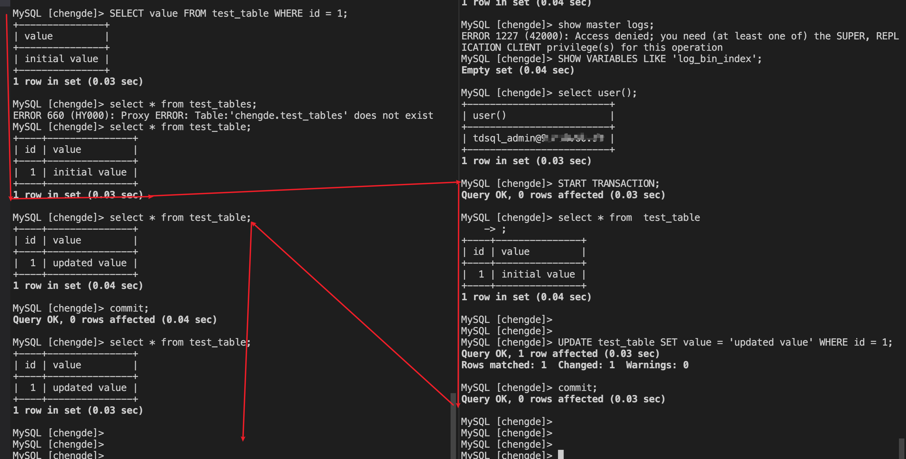

## ref

【24讲吃透分布式数据库【2022】】 https://www.bilibili.com/video/BV17a411C7Kv/?p=3&share_source=copy_web&vd_source=62b75770d8ab2256fd655298a56bb533

 


SQL

NoSQL

NewSQL


Distributed SQL 


## 数据分片：如何储存超大规模数据


## 数据复制


## 一致性与CAP模型

一致性解决数据库中的复制延迟问题


### 严格一致性


 

### 线性一致性


1. 需要全局时钟，来实现所谓的“最近”
2. 任何一次读取都能读到最近的数值


> 线性一致性的代价是很高昂的，甚至 CPU 都不会使用线性一致性


上述仅仅是保证复制log本身的线性一致性


### 顺序一致性

放弃了全局时钟的约束，改为分布式逻辑时钟实现

指所有的进程以相同的顺序看到所有的修改

> 其实就是放弃了时间及时性


### 因果一致性


## CAP模型与事务的ACID

- CAP模型关注的是整个分布式系统在面对网络分区时的设计选择，而ACID关注的是单个事务在单节点或分布式环境中的行为。
- CAP模型强调的是在一致性和可用性之间的权衡，而ACID则要求同时满足四个属性。


CAP模型提供了分布式系统设计的一个高层次框架，而ACID属性则为单个事务的执行提供了严格的一致性保证。


## 存储引擎


 


分布式索引


### 传说中的跳表


## 事务管理器


其实，两阶段提交是分布式事务管理器执行事务的方法 


日志小，写入内存后，批量刷入磁盘。


## 物理-redo log与逻辑-undo log


Steal： 未提交--能否写入数据库

Force：提交后--是否刷盘


大部分数据库时steal，no-force策略，执行该策略，是为了效率

**steal模式，需要写入undolog，以方便在系统故障时，数据从后镜像恢复到前镜像，即恢复到未提交的状态**

**no-force ，需要写入redolog，以方便在系统出现故障的时候，系统可以恢复出缓存中的数据**


只要未写入磁盘，就需要记录log，缓存中包括commit后未刷盘的数据和未提交但是缓存了的数据

所以，所以数据恢复的流程一般如下


### 如何查看redo log？

redolog 为物理变更，可读性比较差


### 那么如何读undo log？


### 查看binlog

ref：[mysql查看binlog日志 - 沧海一滴 - 博客园 (cnblogs.com)](https://www.cnblogs.com/softidea/p/12624778.html)

1. 确认我们的日志是否打开与日志的记录模式--关乎我们的查看参数

```
MySQL [lukatai_jinzheng]> show variables like 'log_bin'; 
+---------------+-------+
| Variable_name | Value |
+---------------+-------+
| log_bin       | ON    |
+---------------+-------+
1 row in set (0.00 sec)

MySQL [lukatai_jinzheng]> SHOW VARIABLES LIKE 'binlog_format';
+---------------+-------+
| Variable_name | Value |
+---------------+-------+
| binlog_format | ROW   |
+---------------+-------+
1 row in set (0.00 sec)
```

2. 查看log日志文件

```
mysql> show binlog events;   #只查看第一个binlog文件的内容
mysql> show binlog events in 'mysql-bin.000002';#查看指定binlog文件的内容
mysql> show binary logs;  #获取binlog文件列表
mysql> show master status； #查看当前正在写入的binlog文件
```


```
MySQL [lukatai_jinzheng]> show master status\G
*************************** 1. row ***************************
             File: binlog.002091
         Position: 120774562
     Binlog_Do_DB: 
 Binlog_Ignore_DB: 
Executed_Gtid_Set: b0d143f0-b9b8-11ee-ac25-30b037f922f2:1-287,
c2dbb2fd-b9b8-11ee-a9da-30b037f92376:1-36424288
1 row in set (0.00 sec)
```


binlog.002091为文件名


3. 因为我们是分布式系统，存在db机器与proxy机器，binlog是存在db机器上的。登录到db机器上


4. 通过mysqlbinlog查看binlog

`binlog`本身是一类二进制文件。二进制文件更省空间，写入速度更快，是无法直接打开来查看的。
因此mysql提供了命令`mysqlbinlog`进行查看。
一般的`statement`格式的二进制文件，用下面命令就可以

```
mysqlbinlog mysql-bin.000001
```

如果是`row`格式，加上`-v`或者`-vv`参数就行，如

```
mysqlbinlog -vv mysql-bin.000001 
```

亲测vv有效，v还会有二进制乱码

> 只连接了一个db，不是正在读写的binlog，凑合读一下

5. binlog解释

```
###   @1=836 /* LONGINT meta=0 nullable=0 is_null=0 */
###   @2=12 /* INT meta=0 nullable=0 is_null=0 */
###   @3='9.40.49.5' /* VARSTRING(240) meta=240 nullable=0 is_null=0 */
###   @4='' /* VARSTRING(240) meta=240 nullable=0 is_null=0 */
###   @5='isolate_port' /* VARSTRING(240) meta=240 nullable=0 is_null=0 */
###   @6='' /* VARSTRING(768) meta=768 nullable=0 is_null=0 */
###   @7=1703145440 /* TIMESTAMP(0) meta=0 nullable=0 is_null=0 */
###   @8=1720773727 /* TIMESTAMP(0) meta=0 nullable=0 is_null=0 */
### UPDATE `tdsqlpcloud_monitor`.`m_data_cur`
### WHERE
###   @1=837 /* LONGINT meta=0 nullable=0 is_null=0 */
###   @2=12 /* INT meta=0 nullable=0 is_null=0 */
###   @3='9.40.42.71' /* VARSTRING(240) meta=240 nullable=0 is_null=0 */
###   @4='' /* VARSTRING(240) meta=240 nullable=0 is_null=0 */
###   @5='reserve_log_disk' /* VARSTRING(240) meta=240 nullable=0 is_null=0 */
###   @6='140000' /* VARSTRING(768) meta=768 nullable=0 is_null=0 */
###   @7=1703145440 /* TIMESTAMP(0) meta=0 nullable=0 is_null=0 */
###   @8=1720773667 /* TIMESTAMP(0) meta=0 nullable=0 is_null=0 */
```


```
@<index>=<value>：表示列的索引和值。
/* <type> meta=<meta> nullable=<nullable> is_null=<is_null> */：注释部分，描述了列的数据类型、元数据、是否可为空等信息。

这个binlog片段记录了一次对表tdsqlpcloud_monitor.m_data_cur的UPDATE操作：

更新后的新值由SET部分描述。
更新条件由WHERE部分描述。

具体来说，这次UPDATE操作将表中满足以下条件的行：

id（第1列）为837
type（第2列）为12
ip（第3列）为'9.40.42.71'
port（第4列）为空字符串
name（第5列）为'reserve_log_disk'
value（第6列）为'140000'
created_at（第7列）为1703145440
updated_at（第8列）为1720773667
更新为：

id（第1列）为836
type（第2列）为12
ip（第3列）为'9.40.49.5'
port（第4列）为空字符串
name（第5列）为'isolate_port'
value（第6列）为空字符串
created_at（第7列）为1703145440
updated_at（第8列）为1720773727
```


## 如何控制并发事务之隔离级别


#### 幻读：

幻读是指在一个事务内，相同的查询条件返回了不同的行集合，即在事务处理的过程中，有新的行插入到数据库中，导致在事务的不同阶段执行相同的查询时，返回的结果集不一致。

假设有一个银行转账的场景，两个账户A和B，初始余额分别为1000和2000。现在有两个事务T1和T2，分别执行以下操作：

- 事务T1：读取账户A的余额。
- 事务T2：向账户A转账100元。
- 事务T1：再次读取账户A的余额。

如果事务T1和T2并发执行，且事务隔离级别为可重复读，那么事务T1在第二次读取账户A的余额时可能会读到**事务T2新插入的记录**（即转账后的余额），从而产生幻读现象。

#### 不可重读：

不可重复读是指在一个事务内，多次读取同一数据时，得到的结果不一致。


不可重复读和幻读的主要区别在于，不可重复读关注的是同一数据行的内容变化，而幻读关注的是数据行数量的变化，为什么这两者进行隔离级别的划分？因为**“保证同一条数据不变的难度远远低于多条”**

#### 脏读：

可以读到其他事务未提交的数据


#### 新增：快照隔离：

可以理解为可重读级别，但是不允许不可重读，可以解决丢失更新问题

其实就是遇到不可重读的情况，会立即中止当前事务，也就是在多并发场景下，只会有一个成立


## 如何复现一个幻读，不可重读，脏读场景？

### 幻读--未能复现？方法问题吗？


```
-- 准备数据
CREATE TABLE test_table2 (
    id INT PRIMARY KEY,
    value VARCHAR(100)
);

INSERT INTO test_table2 (id, value) VALUES (1, 'initial value');

-- 会话1
SET SESSION TRANSACTION ISOLATION LEVEL REPEATABLE READ;
START TRANSACTION;
SELECT * FROM test_table2;

-- 会话2
SET SESSION TRANSACTION ISOLATION LEVEL REPEATABLE READ;
START TRANSACTION;
INSERT INTO test_table2 (id, value) VALUES (2, 'new value');
COMMIT;

-- 会话1
SELECT * FROM test_table2;
COMMIT;
```


### 不可重读

已经设置  SET SESSION TRANSACTION ISOLATION LEVEL READ COMMITTED;



```
-- 准备数据
CREATE TABLE test_table (
    id INT PRIMARY KEY,
    value VARCHAR(100)
);

INSERT INTO test_table (id, value) VALUES (1, 'initial value');

-- 会话1
SET SESSION TRANSACTION ISOLATION LEVEL READ COMMITTED;
START TRANSACTION;
SELECT value FROM test_table WHERE id = 1;

-- 会话2
SET SESSION TRANSACTION ISOLATION LEVEL READ COMMITTED;
START TRANSACTION;
UPDATE test_table SET value = 'updated value' WHERE id = 1;
COMMIT;

-- 会话1
SELECT value FROM test_table WHERE id = 1;
COMMIT;
```


### 脏读


```
-- 准备数据
CREATE TABLE test_table1 (
    id INT PRIMARY KEY,
    value VARCHAR(100)
);

INSERT INTO test_table1 (id, value) VALUES (1, 'initial value');

-- 会话1
SET SESSION TRANSACTION ISOLATION LEVEL READ UNCOMMITTED;
START TRANSACTION;
UPDATE test_table1 SET value = 'updated value' WHERE id = 1;

-- 会话2
SET SESSION TRANSACTION ISOLATION LEVEL READ UNCOMMITTED;
START TRANSACTION;
SELECT value FROM test_table1 WHERE id = 1;

-- 会话1
ROLLBACK;
```


## 如何实现以上隔离级别


当事务提交时，数据其实已经写入完成了


B树类别：innodb ，B+，


