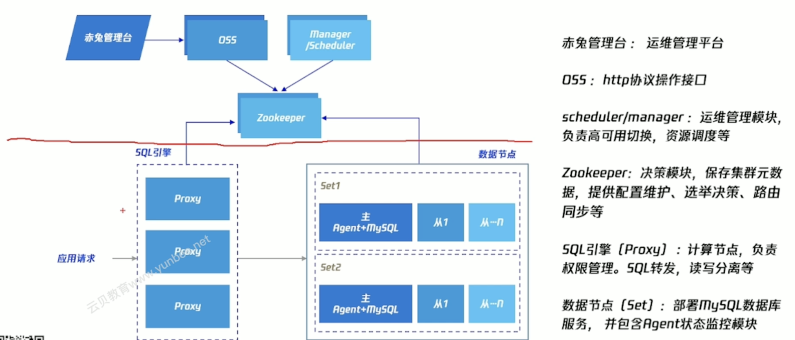
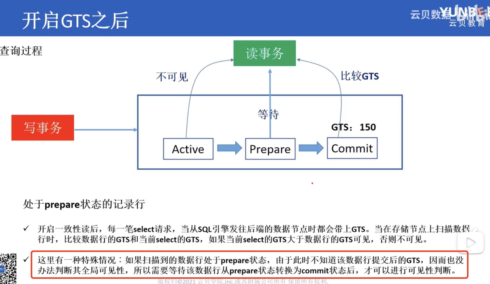
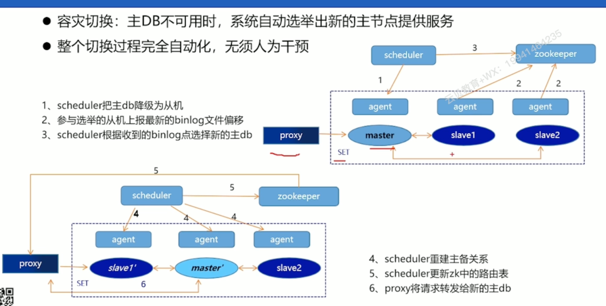
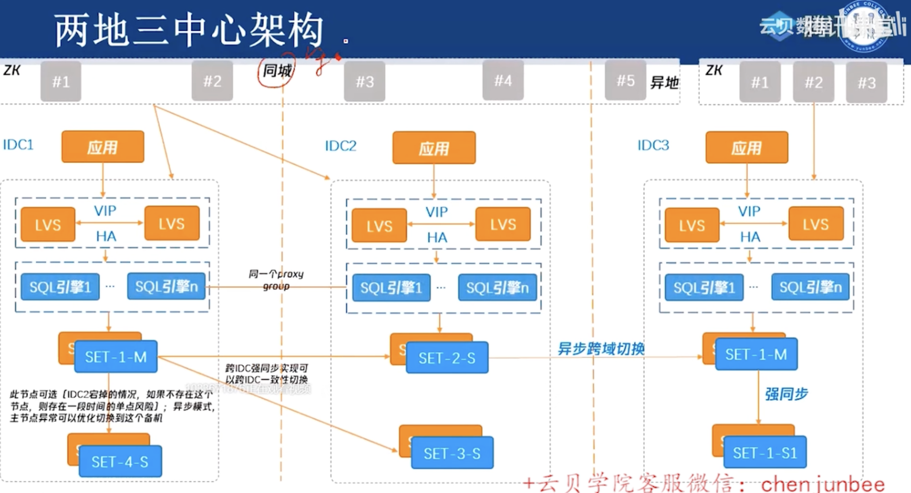

## 0.TDSQl中各个组件的作用

### zookeeper功能的通俗化理解（源于GPT）--就是metacluster

存储当前集群中所有的数据源信息，包含用户的原息表的原信息。监控数据当前的一个路由都在ZK里面存储。

Apache ZooKeeper 是一个分布式协调服务，主要用于管理和协调分布式系统中的各种服务和组件。为了更通俗地理解ZooKeeper的功能，可以将其比作一个“分布式系统的管理员”或“协调者”。以下是一些关键功能和对应的通俗解释：

### 1. **分布式配置管理**

**通俗解释**：想象你在一个大型公司工作，公司有很多分支机构，每个分支都有自己的配置文件。ZooKeeper就像一个中央配置管理员，确保所有分支机构都能访问到最新的配置文件。如果配置文件有更新，ZooKeeper会通知所有分支机构。

**实际功能**：ZooKeeper可以存储和管理分布式系统的配置信息，确保所有节点都能访问到一致的配置数据。

### 2. **命名服务**

**通俗解释**：在一个大城市中，有很多街道和建筑物，每个建筑物都有一个唯一的地址。ZooKeeper就像城市的地址管理系统，确保每个服务或资源都有一个唯一的名字，方便其他服务找到它们。

**实际功能**：ZooKeeper提供命名服务，允许分布式系统中的组件通过唯一的路径来标识和访问资源。

### 3. **分布式锁**

**通俗解释**：想象你和你的朋友们在一个图书馆里，每个人都想借同一本书。为了避免冲突，图书馆管理员会给每个人发一个号码，按顺序借书。ZooKeeper就像这个管理员，确保每个请求都能按顺序处理，避免资源冲突。

**实际功能**：ZooKeeper提供分布式锁机制，确保多个客户端在访问共享资源时不会发生冲突。

### 4. **领导选举**

**通俗解释**：在一个团队中，需要选出一个队长来带领大家完成任务。ZooKeeper就像一个公平的选举委员会，确保在团队中选出一个领导者，并在领导者失效时重新选举。

**实际功能**：ZooKeeper可以帮助分布式系统进行领导选举，确保在集群中有一个节点作为领导者来协调工作。

### 5. **集群管理**

**通俗解释**：想象你在一个大型活动中，活动组织者需要知道每个参与者的状态（比如是否到场、是否需要帮助等）。ZooKeeper就像这个组织者，实时监控每个参与者的状态，并在状态变化时通知相关人员。

**实际功能**：ZooKeeper可以监控分布式系统中各个节点的状态，并在节点状态变化时通知其他节点。

### 6. **分布式队列**

**通俗解释**：在一个餐厅里，顾客按顺序排队点餐。ZooKeeper就像餐厅的排队系统，确保每个顾客都能按顺序得到服务。

**实际功能**：ZooKeeper可以实现分布式队列，确保多个客户端按顺序处理任务。

### 总结

ZooKeeper的主要功能是帮助分布式系统中的各个组件进行协调和管理，确保系统的一致性、可靠性和高可用性。通过提供配置管理、命名服务、分布式锁、领导选举、集群管理和分布式队列等功能，ZooKeeper使得分布式系统的开发和运维变得更加简单和高效。

## 1. TDSQL 是如何解决分布式事务读一致性

简要总结：使用GLobal Timestamp，

select操作的时间戳要大于当前行的时间戳，才能进行读取，如果小于，则不可见

特殊情况：如果被读取数据的状态为prepare，则等待数据commit，再进行可见性判断。

## 2. 容灾切换

主节点发生宕机，重新选举出新的主节点并提供服务，同时保证数据的一致性。

特点：

主机可读可写，备机只读，**任何时候只有一个主机提供服务**
宁愿拒绝服务，不提供错误的服务特点
整个切换过程完全**自动化**，无须人为干预
严格的切换流程，确保切换前后数据的**强一致性**

举例：

当master失效，会把失效信息上报给zookeeper，而scheduler会监控zookeepr的信息，如果确认master生效，则会进行主备切换；备节点通过agent上报binlog，选取binlog偏移量小（即备和主binlog差距较小）的备为后续的主节点。后续scheduler重建主备关系，scheduler更新zk中的路由表，proxy将请求转发给新的主db

## 3. 读写分离的实现方法

支持以下3种模式的读写分离操作。

●  创建只读账号：您仅需要在创建帐号时，标记为只读帐号，系统将根据只读策略向将读请求发往从机；只读策略可以根据主从延迟等维度进行灵活配置

●  slave注释：在编程过程中，通过增加Slave注释模式标记，将指定的SQL指令发往备机。即在SQL中添加/slave/标记，该SQL会发送给备机，常用于编程阶段将特殊的读逻辑嵌入代码

●  全局自动读写分离：该配置会自动将 SQL 中的所有读请求发向从机，且能识别事务、存储过程中的读语法并灵活处理。当然如果从机延迟较大，全局自动读写分离并不具备应对策略，读到的数据可能会有延迟，若使用该功能，性能有大约50%的下降。该功能默认未开启。

## 4. 数据库分表方案哪些，有什么特点，TDSQL是怎么设置的

垂直切分（即“分业务”）
水平切分（分数据量）
使用分片字段（shardkey）进行切分

>  其实是 tdsql_distributed by 字段

TDSQL的`DISTRIBUTION` 字段用于指定数据的分布策略,以下为一些分布策略

#### 1. `REPLICATION`

`REPLICATION` 是将数据复制到多个节点上，以提高数据的可用性和容错性。每个节点都有完整的数据副本，写操作需要同步到所有副本，读操作可以从任意副本读取。

#### 2. `HASH`

`HASH` 是基于哈希函数将数据分布到不同的节点上。通常使用主键或其他唯一标识符作为哈希键，以确保数据均匀分布。

#### 3. `RANGE`

`RANGE` 是基于数据的范围将数据分布到不同的节点上。适用于数据有明显范围划分的场景，如时间序列数据。

#### 4. `LIST`

`LIST` 是基于预定义的列表将数据分布到不同的节点上。适用于数据有明确分类的场景。

#### 5.`SHARDING` 

`SHARDING` 是一种将数据水平分片的技术。它将数据分散到多个物理节点上，以提高数据库的可扩展性和性能。每个分片（shard）包含数据的一个子集，查询时可以并行处理多个分片，从而提高查询效率。

> TDSQL支持LIST、RANGE、HASH三种类型的一级分区，同时支持支持RANGE、LIST两种格式的二级分区。

## 5. Redo Log 与 Binlog 的区别

1. **目的不同**：
   - `Redo Log` 主要用于数据恢复和持久性保证。
   - `Binlog` 主要用于数据复制、恢复和审计。
2. **记录内容不同**：
   - `Redo Log` 记录的是物理级别的页面修改。
   - `Binlog` 记录的是逻辑级别的SQL语句或行级别的修改。
3. **写入时机不同**：
   - `Redo Log` 在事务执行过程中不断写入，确保在事务提交前所有修改都已记录。
   - `Binlog` 在事务提交时一次性写入，记录整个事务的操作。
4. **作用范围不同**：
   - `Redo Log` 主要用于单个数据库实例的崩溃恢复。
   - `Binlog` 主要用于跨数据库实例的数据复制和恢复。

### 总结

- **Redo Log**：用于记录数据库的物理修改，主要用于数据恢复和持久性保证。
- **Binlog**：用于记录数据库的逻辑操作，主要用于数据复制、恢复和审计。

## 6. TDSQL是怎么进行水平扩容的

水平扩容的限制：配置SQL引擎的时候，便会设置最大分片数

具体扩容：zookeeper控制sql路由信息，增加set后，会先进行数据复制，然后zookeeper开始调整sql路由信息，后续set缓慢删除重复数据，避免快速删除造成性能波动。

## 7. Proxy（SQL引擎）在TDSQL架构中发挥的作用

任务TDSQL中位于接入层的位置，属于cpu密集型服务

SQL引擎没有主备之分，本身无状态，多节点部署

权限校验，读写分离，词法分析，语法分析，路由选择（决定储存set位置），分布式任务，全局自增(每个proxy会分配自己的自增数据范围)，统计信息，聚合函数

## 8. 高可用架构的了解

## 9.分布式数据库的表类型

### 单表

普通表:又名单表(Noshard表)，无需拆分且没有做任何特殊处理的表。所有该类型表的全量数据默认存放在第一个物理节点组(Set)中。

### 广播表(和复制表是一个东西吗？)

广播表，创建广播表后，每个节点都有该表的全量数据，且该表的所有操作都将广播到所有物理分片(set)中。
广播表主要用于提升跨节点组(Set)的Join 操作的性能，保证修改操作的原子性，以确保所有set数据完全一致，常用于配置表等。

