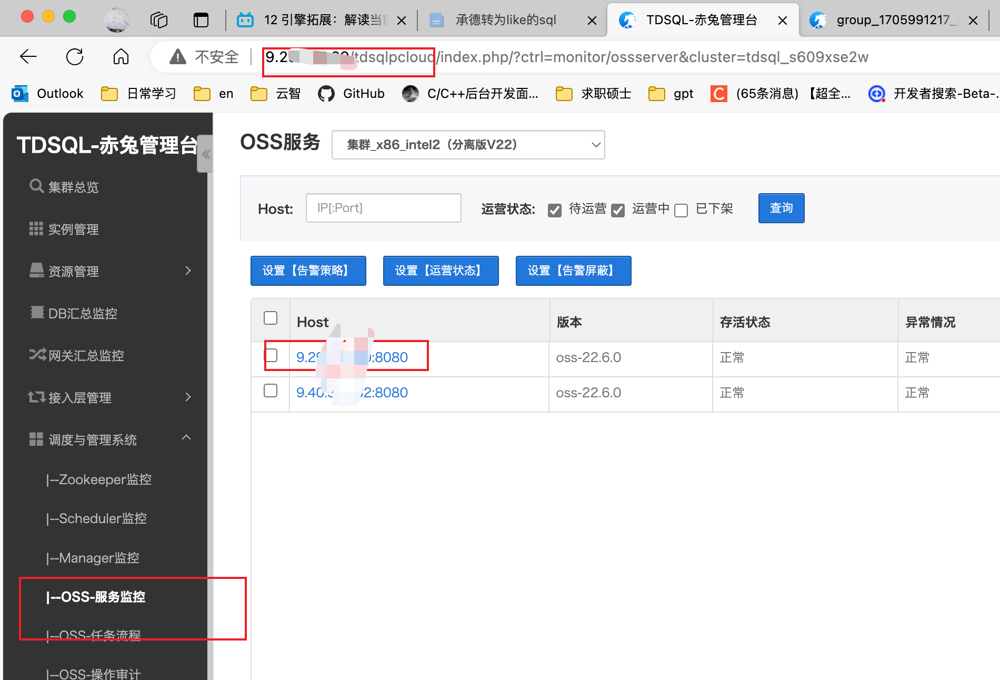

## 1. 关于下推

ref：[TDSQL 2.0 proxy查询计划 - 腾讯iWiki (woa.com)](https://iwiki.woa.com/p/4008764353)


查询下推是指将查询的一部分逻辑下推到存储层执行，而不是在上层（如协调节点或代理层）执行整个查询。这样可以利用存储层的计算能力，减少数据在网络中的传输量，从而提高查询性能。


### 查询下推的实现

#### 1. 解析和优化

在查询解析和优化阶段，代理层（Proxy）或协调节点（Coordinator Node）会识别可以下推的查询部分。例如，过滤条件、聚合操作、连接操作等。

#### 2. 下推查询生成

将识别出的查询部分转换为独立的查询，并将其下推到存储层执行。存储层会执行这些下推的查询，并返回结果。

#### 3. 主查询执行

主查询会使用下推查询的结果进行进一步的计算和处理。这样可以减少数据传输量，提高查询效率。


### TDSQL的下推

TDSQL 2.0 proxy可以通过`explain statement`的方式查看sql的查询计划，从而帮助sql优化、执行方式分析。在2.0的架构中，proxy和存储层都具有计算能力，具体的执行方式可以分为以下四种(以下内容适用于22.3.4及以上):

- 直接下推: proxy通过逻辑判断的方式，直接将sql下发到存储层进行计算，proxy最终汇总计算结果甚至直接将sql结果返回给客户端。
- 优化下推: proxy对sql进行一定的逻辑优化(派生表合并、left join转inner join等等)后反写sql，将proxy需要的计算结果下发到存储层进行计算，最后在proxy最终汇总计算。
- 部分下推: 对于一些更为复杂的sql，proxy目前可以对满足一定条件的部分查询进行下推，将存储层的计算结果带入到整体的sql执行中，目前主要支持子查询物化功能。
- 表数据加载: proxy对于完全无法下推到存储层执行的sql，会将参与计算的数据**带上过滤条件**通过反写select的方式从存储层中加载到proxy进行最终计算。


## 2. TDSQL 2.0与2.5 计算引擎

ref：[录制文件 (tencent.com)](https://meeting.tencent.com/user-center/shared-record-info?id=8433af19-a553-4a99-9ecb-131334e9a933&from=3)

https://iwiki.woa.com/p/4011939483


2.0在AP上没有优势，


### 2.0的执行器


复杂sql--拉取数据到计算层，利用mysql5.6的嵌入式执行器在计算层处理sql


‘


### spider  mysql 开源的功能底座


MySQL Spider（蜘蛛）是一种MySQL插件，它允许用户在单个查询中跨多个服务器（包括分布式数据库和复制环境）分散读取数据

Spider的主要特点如下：

1. **透明性**：Spider插件对用户来说几乎是透明的。用户只需编写普通的SQL查询语句，Spider会自动处理跨服务器的数据检索和合并。
2. **负载均衡**：Spider可以在多个服务器之间分配查询负载，从而提高查询性能。这对于处理大量数据或高并发查询的场景非常有用。
3. **高可用性**：Spider支持在多个服务器之间进行故障转移，从而提高系统的可用性。如果某个服务器出现故障，Spider可以自动将查询重定向到其他可用服务器。
4. **分布式数据库支持**：Spider插件支持在分布式数据库环境中使用，允许用户在一个查询中访问多个数据库实例的数据。
5. **复制环境支持**：Spider插件支持在MySQL复制环境中使用，允许用户在一个查询中访问多个从服务器的数据。这有助于提高查询性能和系统可用性。


### 2.5


消除handler串行执行


关于新手指引建设


tpch


## 3. 数据库导出数据，其中insert语句带有完整的字段

要导出 MySQL 数据库的结构和数据，并且希望生成的 `INSERT` 语句包含具体的数据库字段，可以使用 `mysqldump` 工具。`mysqldump` 是 MySQL 提供的一个命令行工具，用于导出数据库的结构和数据。

以下是具体的步骤和命令：

### 1. 使用 `mysqldump` 导出数据库结构和数据

你可以使用以下命令导出数据库的结构和数据，并确保 `INSERT` 语句包含具体的字段名：

```sh
mysqldump -u username -p --complete-insert --databases dbname > output.sql
 mysqldump -h9.192.169.254 -P15003 -ulukatai -pRoot@@@123 --complete-insert rcce_mem  > jianhang_oom.sql
```

- `-u username`：指定 MySQL 用户名。
- `-p`：提示输入密码。
- `--complete-insert`：生成的 `INSERT` 语句将包含列名。
- `--databases dbname`：指定要导出的数据库名称。
- `> output.sql`：将输出重定向到 `output.sql` 文件。

### 2. 示例

假设你要导出名为 `mydatabase` 的数据库，并且希望生成的 `INSERT` 语句包含具体的字段名，可以使用以下命令：

```sh
mysqldump -u root -p --complete-insert --databases mydatabase > mydatabase_dump.sql
```

执行该命令后，系统会提示你输入 MySQL 用户 `root` 的密码。输入密码后，`mysqldump` 将生成一个名为 `mydatabase_dump.sql` 的文件，其中包含数据库的结构和数据，且 `INSERT` 语句包含具体的字段名。

### 3. 其他常用选项

- `--no-data`：仅导出数据库结构，不导出数据。
- `--no-create-info`：仅导出数据，不导出数据库结构。
- `--single-transaction`：在一个事务中导出数据，适用于 InnoDB 表，可以避免锁定表。
- `--routines`：导出存储过程和函数。
- `--triggers`：导出触发器。

### 4. 完整示例

如果你希望导出数据库结构、数据、存储过程、函数和触发器，并且 `INSERT` 语句包含具体的字段名，可以使用以下命令：

```sh
mysqldump -u root -p --complete-insert --routines --triggers --single-transaction --databases mydatabase > mydatabase_full_dump.sql
```


## 4. semi join 

`Semi-Join`（半连接）是一种优化技术，主要用于分布式数据库系统中，以减少数据传输量和提高查询性能。半连接的基本思想是通过只传输需要的数据子集来减少网络流量。

### 什么是 Semi-Join

在传统的 SQL 连接操作中，两个表的所有匹配行都会被传输和处理。而在半连接中，只传输需要的部分数据，从而减少了数据传输量。

#### 半连接的步骤

1. **初步过滤**：首先在一个表上执行初步过滤，获取需要的键值。
2. **传输键值**：将这些键值传输到另一个表所在的节点。
3. **过滤数据**：在另一个表上使用这些键值进行过滤，获取匹配的数据。
4. **传输结果**：将过滤后的结果传输回原始节点。

### 示例

假设有两个表 `A` 和 `B`，它们分别存储在不同的节点上。我们需要在这两个表上执行一个连接操作。

#### 表结构

```sql
-- 表 A
CREATE TABLE A (
    id INT PRIMARY KEY,
    value VARCHAR(100)
);

-- 表 B
CREATE TABLE B (
    id INT PRIMARY KEY,
    description VARCHAR(100)
);
```

#### 传统连接

在传统的连接操作中，两个表的所有匹配行都会被传输和处理：

```sql
SELECT A.id, A.value, B.description
FROM A
JOIN B ON A.id = B.id;
```

#### 半连接

在半连接中，首先在表 `A` 上执行初步过滤，获取需要的键值：

```sql
SELECT id
FROM A
WHERE value = 'some_value';
```

将这些键值传输到表 `B` 所在的节点，然后在表 `B` 上使用这些键值进行过滤：

```sql
SELECT B.id, B.description
FROM B
WHERE B.id IN (list_of_ids_from_A);
```

最后，将过滤后的结果传输回原始节点，并进行最终的连接操作：

```sql
SELECT A.id, A.value, B.description
FROM A
JOIN (filtered_results_from_B) AS B ON A.id = B.id;
```

### 优点

- **减少数据传输量**：通过只传输需要的部分数据，减少了网络流量。
- **提高查询性能**：减少了数据传输和处理的开销，从而提高了查询性能。

### 适用场景

- **分布式数据库系统**：在分布式数据库系统中，数据存储在不同的节点上，半连接可以显著减少数据传输量。
- **大数据处理**：在大数据处理场景中，数据量巨大，半连接可以提高查询性能。

### 总结

`Semi-Join`（半连接）是一种优化技术，通过只传输需要的数据子集来减少网络流量和提高查询性能。它特别适用于分布式数据库系统和大数据处理场景。通过初步过滤、传输键值、过滤数据和传输结果等步骤，半连接可以显著减少数据传输量和提高查询性能。


agent在其中的功能


proxy与sqlengine


分布式和集中式的执行计划区别


修改分片别名的操作


sysbench在同一个设备上不能同时运行？


cpu绑定核


NUMA


工具执行过程的认识


```
sysbench --mysql-host=9.134.254.214 --mysql-port=3306 --mysql-user=tdsql_admin --mysql-password=TYdXA*4679zYgn --threads=1 --mysql-db=chengde  --tables=2 --table_size=1000000 --report_interval=10 --time=600 ./oltp_read_only.lua prepare
```


## 5. 手动更新proxy2.5

登录proxy机器，将2.5的proxy包放在/data/tdsql_run/{端口号} ，按照网址的介绍走

[升级替换2.5 流程 - 腾讯iWiki (woa.com)](https://iwiki.woa.com/p/4010697647)

```
有proxy的目录的替换流程
调用install/stopsqlengine.sh ${port} 停掉2.5

调用sudo install/uninstall_sqlengine.sh ${port} 卸载2.5 

调用sudo rm sqlengine 目录

解压新的sqlengine.tgz 文件

调用install/replace_proxy.sh -p ${port} 安装新的2.5 


查询是否启动成功：


./jsqlengine.sh  10086  "select version()" |grep sqlengine
 

```


## 6. 手动更新proxy2.0

登录到proxy机器上，上传更新包，比如我这里把它放到/data/hanlon下解压包

```
tar xf tdsql_pack_tdsqlinstall_Tlinux64_tdsqlinstall.tgz

chmod 777 -R gateway

# 备份并替换bin包
cp -a /data/tdsql_run/15014/gateway/bin /data/tdsql_run/15014/gateway/bin_bak0524
rm -rf /data/tdsql_run/15014/gateway/bin
cp -a /data/hanlon/gateway/bin /data/tdsql_run/15014/gateway/
 
 
 
# 重启网关的两个进程
cd /data/tdsql_run/15014/gateway/bin
./restart_cgroup.sh instance_15014

 
# 后台检查进程的启动时间是否更改
ps -ef |grep 15014
tdsql     1487     1  0 21:36 ?        00:00:00 ./mysql-proxy /data/tdsql_run/15007/gateway/conf/instance_15007.cnf
tdsql     1488  1487  0 21:36 ?        00:00:00 ./mysql-proxy /data/tdsql_run/15007/gateway/conf/instance_15007.cnf
tdsql    20751     1  0 21:37 ?        00:00:00 ./router_update /data/tdsql_run/15007/gateway/conf/instance_15007.cnf
tdsql    20752 20751  0 21:37 ?        00:00:00 ./router_update /data/tdsql_run/15007/gateway/conf/instance_15007.cnf

# 赤兔前台检查网关版本号是否更改
```


# proxy2.0 流水线更新

1. 注意，工具是部署在工具服务器上，且用例取包是从工具服务器上取得


## 使用的cte用例以及参数


Cte ID :543047


OSS_IP 选择下图中的ip（好像OSS-服务监控中的任意IP都行，哪个ip其实都可以访问的）




升级包放在工具服务器上，具体工具服务器，在《国产数据库跟踪表上找》


升级包在智研上找


## Proxy 2.5流水线更新

待学习：https://devops.woa.com/console/pipeline/zhiyan-kaynli/p-065c1b4d7eec47a58be7c724d8db48c3/history/history/29?page=1&pageSize=20


## 窗口函数

ref：[窗口函数的基本使用_窗口函数语法-CSDN博客](https://blog.csdn.net/weixin_44852067/article/details/119570082)

[【MySQL】窗口函数详解（概念+练习+实战）_mysql 窗口函数-CSDN博客](https://blog.csdn.net/CoderSharry/article/details/135063960)


窗口函数，也叫OLAP函数（Online Anallytical Processing，联机分析处理），可以对数据库数据进行实时分析处理。---窗口函数是 Mysql 8 的新特性。

```
窗口函数([参数]) OVER (
  [PARTITION BY <分组列>] 
  [ORDER BY <排序列 ASC/DESC>]
  [ROWS BETWEEN 开始行 AND 结束行]
)
```

通常将常用的窗口函数分为两大类：**聚合窗口函数 与 专用窗口函数**。聚合窗口函数的函数名与普通常用聚合函数一致，功能也一致。从使用的角度来讲，与普通聚合函数的区别在于提供了窗口函数的专属子句，来使得数据的分析与获取更简便。

### 聚合窗口函数

| 函数名 | 作用     |
| ------ | -------- |
| SUM    | 求和     |
| AVG    | 求平均值 |
| COUNT  | 求数量   |
| MAX    | 求最大值 |
| MIN    | 求最小值 |

使用例子

```
CREATE TABLE sales (
  id INT PRIMARY KEY,
  product VARCHAR(50),
  category VARCHAR(50),
  sale_date DATE,
  quantity INT,
  revenue DECIMAL(10, 2)
);

INSERT INTO sales (id, product, category, sale_date, quantity, revenue)
VALUES
  (1, 'Product A', 'Category 1', '2022-01-01', 10, 100.00),
  (2, 'Product B', 'Category 1', '2022-01-01', 5, 50.00),
  (3, 'Product A', 'Category 2', '2022-01-02', 8, 80.00),
  (4, 'Product B', 'Category 2', '2022-01-02', 3, 30.00),
  (5, 'Product A', 'Category 1', '2022-01-03', 12, 120.00),
  (6, 'Product B', 'Category 1', '2022-01-03', 7, 70.00),
  (7, 'Product A', 'Category 2', '2022-01-04', 6, 60.00),
  (8, 'Product B', 'Category 2', '2022-01-04', 4, 40.00);

```

这个例子演示与普通聚合函数的区别。设我们要求使用一条查询语句，在sales表每行最后一列都加上这一行的产品类别 `category`的 平均 销售收入`revenue`，并且以`category`顺序排序，即如下图所示：

```
  SELECT 
	t1.*, 
	t2.avg_revenue FROM sales t1 
  LEFT JOIN (
		SELECT category, AVG(revenue) AS avg_revenue 
		FROM sales  
		GROUP BY category
  ) t2 ON t1.category = t2.category ORDER BY t1.category

```

使用窗口函数

```
SELECT
  sales.*,
  AVG( revenue ) OVER ( PARTITION BY category ) AS avg_revenue 
FROM
	sales
```

### 专用窗口函数

| 函数名       | 分类     | 说明                                                 |
| ------------ | -------- | ---------------------------------------------------- |
| RANK         | 排序函数 | 类似于排名，并列的结果序号可以重复，序号不连续       |
| DENSE_RANK   | 排序函数 | 类似于排名，并列的结果序号可以重复，序号连续         |
| ROW_NUMBER   | 排序函数 | 对该分组下的所有结果作一个排序，基于该分组给一个行数 |
| PERCENT_RANK | 分布函数 | 每行按照公式 `(rank-1) / (rows-1)` 进行计算          |
| CUME_DIST    | 分布函数 | 分组内小于、等于当前 rank 值的行数 / 分组内总行数    |

```
SELECT 
	*,
	RANK() OVER(PARTITION BY category ORDER BY quantity DESC) AS `quantity_rank`,
	DENSE_RANK() OVER(PARTITION BY category ORDER BY product DESC) AS `product_dense_rank`,
	ROW_NUMBER() OVER(PARTITION BY category ORDER BY product DESC) AS `product_row_number`,
	PERCENT_RANK() OVER(PARTITION BY category ORDER BY quantity DESC) AS `quantity_percent_rank`,
	CUME_DIST() OVER(PARTITION BY category ORDER BY quantity DESC) AS `quantity_cume_dist`
FROM sales

```

### 如何理解窗口函数的“窗口”？

既然这种函数叫"窗口函数"，那么它应该可以像"窗口"一样，通过滚动的方式，获取一定范围内的视图。

而滚动的方式恰恰就是`ROWS BETWEEN`子句。通过`ROWS BETWEEN`子句，获取窗口函数结果的范围，从而有给用户"窗口"的感觉。

### 执行顺序

![[外链图片转存失败,源站可能有防盗链机制,建议将图片保存下来直接上传(img-sSnecEa8-1628578703350)(C:\Users\hbwhx\Desktop\学习\窗口函数\Windows Functions.assets\image-20210713143908533.png)]](第三周问答.assets/a35d3bb239e6f4a89e871990dff1024f.png)


一个非常漂亮的图


# 待学习

## pq，fqs

[FQS与PQ计划展示 - 腾讯iWiki (woa.com)](https://iwiki.woa.com/p/4009965500)


FQS（Full Query Scan）

PQ更适合于复杂的查询处理，而FQS则更适合于高并发的数据访问场景。

