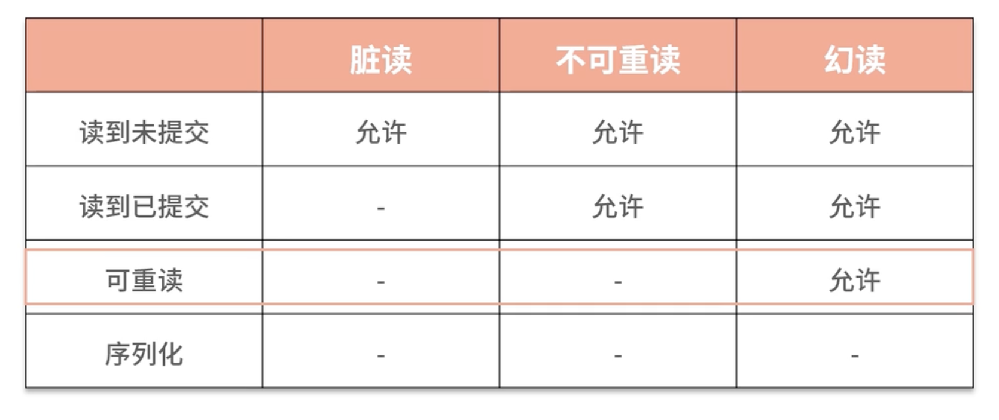

## 数据库中的DN和CN


| LOCALIZED('TXSQL')     | 下推 INSERT 到 DN 节点通过 DN 节点本地生成 ID                |
| ---------------------- | ------------------------------------------------------------ |
| LOCALIZED('SQLENGINE') | 通过 CN 节点本地生存 ID，节点之间可能重复(进阶可以设置不同 offset 和步长) |
| CENTRALIZED('TXSQL')   | 通过 DN 节中的发号表生成 ID                                  |


值得是？还未了解


## 1. 2.0 与 2.5 语法兼容

[2.0 mtr 迁移常见问题解决 - 腾讯iWiki (woa.com)](https://iwiki.woa.com/p/4010728898#3.2-2.0-和-2.5-语法自动转换规则)

[TDSQL2.5分布式表方案设计 - 腾讯iWiki (woa.com)](https://iwiki.woa.com/p/4008870749)


table_options 中去查看具体的分片键细节


### 解决分布式表insert数据必须指定字段问题：

使用GPT提取sql建表语句中的字段，然后插入到insert语句


## 2. 数据库分片操作与验证

ref ：[私有云文档中心 - 腾讯云 (tencent.com)](https://cloud.tencent.com/privatecloud/document?solution=腾讯云数据库 TDSQL MySQL版&version=V10.3.21.x.x&folder_id=78770071966609408&dir=开发)

### 申请的TDSQL配置


### 建立分片表

```
CREATE TABLE `t1` ( `a` int NOT NULL, `b` int DEFAULT NULL, PRIMARY KEY (`a`) ) ENGINE=InnoDB DEFAULT CHARSET=utf8mb3 TDSQL_DISTRIBUTED BY RANGE(a) (s1 values less than ('100'),s2 values less than ('200'))
```

### 插入数据

```
INSERT INTO t1(a,b) values(122,344);
INSERT INTO t1(a,b) values(12,34);
```

分片表的插入必须指定字段

### 查询

```
MySQL [chengde]> /*sets:allsets */ select count(*) from t1;
+----------+------------------+
| count(*) | info             |
+----------+------------------+
|        1 | set_1719391827_3 |
|        1 | set_1719391745_1 |
+----------+------------------+
2 rows in set (0.03 sec)

MySQL [chengde]> /*sets:set_1719391827_3*/ select * from t1;
+-----+------+------------------+
| a   | b    | info             |
+-----+------+------------------+
| 122 |  334 | set_1719391827_3 |
+-----+------+------------------+

MySQL [chengde]> /*proxy*/ show status;
+-----------------------------+--------------------------------------------------------------------+
| status_name                 | value                                                              |
+-----------------------------+--------------------------------------------------------------------+
| cluster                     | group_1719391636_6624519                                           |
| set_1719391745_1:ip         | 11.10.178.136:4010;s1@11.63.17.80:4010@1@IDC_4_49_3109_M3104-N15@0 |
| set_1719391745_1:alias      | s1                                                                 |
| set_1719391745_1:hash_range | 0---31                                                             |
| set_1719391827_3:ip         | 11.63.17.80:4389;s1@11.63.23.202:4389@1@IDC_4_49_3109_M3104-R16@0  |
| set_1719391827_3:alias      | s2                                                                 |
| set_1719391827_3:hash_range | 32---63                                                            |
| set                         | set_1719391745_1,set_1719391827_3                                  |
+-----------------------------+--------------------------------------------------------------------+
8 rows in set (0.03 sec)
```


```

/*sets:set_1723048646_5*/ select * from t1;
```


## 3. 非主键索引在分布式数据库中的挑战

非主键索引不直接存储数据，而是存储主键，再通过主键去找到数据，示意图如下

**面对分布式数据库数据物理分区的挑战，二级索引（非主键索引）间接指向的数据可能并不在同一个物理分片上，应该怎么办？**

在数据表创建时，同时创建二级索引，用二级索引的结果（即主键）来分散索引数据


## 4. 查看binlog

ref：[mysql查看binlog日志 - 沧海一滴 - 博客园 (cnblogs.com)](https://www.cnblogs.com/softidea/p/12624778.html)

1. 确认我们的日志是否打开与日志的记录模式--关乎我们的查看参数

```
MySQL [lukatai_jinzheng]> show variables like 'log_bin'; 
+---------------+-------+
| Variable_name | Value |
+---------------+-------+
| log_bin       | ON    |
+---------------+-------+
1 row in set (0.00 sec)

MySQL [lukatai_jinzheng]> SHOW VARIABLES LIKE 'binlog_format';
+---------------+-------+
| Variable_name | Value |
+---------------+-------+
| binlog_format | ROW   |
+---------------+-------+
1 row in set (0.00 sec)
```

2. 查看log日志文件

```
mysql> show binlog events;   #只查看第一个binlog文件的内容
mysql> show binlog events in 'mysql-bin.000002';#查看指定binlog文件的内容
mysql> show binary logs;  #获取binlog文件列表
mysql> show master status； #查看当前正在写入的binlog文件
```


```
MySQL [lukatai_jinzheng]> show master status\G
*************************** 1. row ***************************
             File: binlog.002091
         Position: 120774562
     Binlog_Do_DB: 
 Binlog_Ignore_DB: 
Executed_Gtid_Set: b0d143f0-b9b8-11ee-ac25-30b037f922f2:1-287,
c2dbb2fd-b9b8-11ee-a9da-30b037f92376:1-36424288
1 row in set (0.00 sec)
```


binlog.002091为文件名


3. 因为我们是分布式系统，存在db机器与proxy机器，binlog是存在db机器上的。登录到db机器上


4. 通过mysqlbinlog查看binlog

`binlog`本身是一类二进制文件。二进制文件更省空间，写入速度更快，是无法直接打开来查看的。
因此mysql提供了命令`mysqlbinlog`进行查看。
一般的`statement`格式的二进制文件，用下面命令就可以

```
mysqlbinlog mysql-bin.000001
```

如果是`row`格式，加上`-v`或者`-vv`参数就行，如

```
mysqlbinlog -vv mysql-bin.000001 
```

亲测vv有效，v还会有二进制乱码

> 只连接了一个db，不是正在读写的binlog，凑合读一下

5. binlog解释

```
###   @1=836 /* LONGINT meta=0 nullable=0 is_null=0 */
###   @2=12 /* INT meta=0 nullable=0 is_null=0 */
###   @3='9.40.49.5' /* VARSTRING(240) meta=240 nullable=0 is_null=0 */
###   @4='' /* VARSTRING(240) meta=240 nullable=0 is_null=0 */
###   @5='isolate_port' /* VARSTRING(240) meta=240 nullable=0 is_null=0 */
###   @6='' /* VARSTRING(768) meta=768 nullable=0 is_null=0 */
###   @7=1703145440 /* TIMESTAMP(0) meta=0 nullable=0 is_null=0 */
###   @8=1720773727 /* TIMESTAMP(0) meta=0 nullable=0 is_null=0 */
### UPDATE `tdsqlpcloud_monitor`.`m_data_cur`
### WHERE
###   @1=837 /* LONGINT meta=0 nullable=0 is_null=0 */
###   @2=12 /* INT meta=0 nullable=0 is_null=0 */
###   @3='9.40.42.71' /* VARSTRING(240) meta=240 nullable=0 is_null=0 */
###   @4='' /* VARSTRING(240) meta=240 nullable=0 is_null=0 */
###   @5='reserve_log_disk' /* VARSTRING(240) meta=240 nullable=0 is_null=0 */
###   @6='140000' /* VARSTRING(768) meta=768 nullable=0 is_null=0 */
###   @7=1703145440 /* TIMESTAMP(0) meta=0 nullable=0 is_null=0 */
###   @8=1720773667 /* TIMESTAMP(0) meta=0 nullable=0 is_null=0 */
```


```
@<index>=<value>：表示列的索引和值。
/* <type> meta=<meta> nullable=<nullable> is_null=<is_null> */：注释部分，描述了列的数据类型、元数据、是否可为空等信息。

这个binlog片段记录了一次对表tdsqlpcloud_monitor.m_data_cur的UPDATE操作：

更新后的新值由SET部分描述。
更新条件由WHERE部分描述。

具体来说，这次UPDATE操作将表中满足以下条件的行：

id（第1列）为837
type（第2列）为12
ip（第3列）为'9.40.42.71'
port（第4列）为空字符串
name（第5列）为'reserve_log_disk'
value（第6列）为'140000'
created_at（第7列）为1703145440
updated_at（第8列）为1720773667
更新为：

id（第1列）为836
type（第2列）为12
ip（第3列）为'9.40.49.5'
port（第4列）为空字符串
name（第5列）为'isolate_port'
value（第6列）为空字符串
created_at（第7列）为1703145440
updated_at（第8列）为1720773727
```


## 5. 如何控制并发事务之隔离级别的理解




#### 幻读：

幻读是指在一个事务内，相同的查询条件返回了不同的行集合，即在事务处理的过程中，有新的行插入到数据库中，导致在事务的不同阶段执行相同的查询时，返回的结果集不一致。

假设有一个银行转账的场景，两个账户A和B，初始余额分别为1000和2000。现在有两个事务T1和T2，分别执行以下操作：

- 事务T1：读取账户A的余额。
- 事务T2：向账户A转账100元。
- 事务T1：再次读取账户A的余额。

如果事务T1和T2并发执行，且事务隔离级别为可重复读，那么事务T1在第二次读取账户A的余额时可能会读到**事务T2新插入的记录**（即转账后的余额），从而产生幻读现象。

#### 不可重读：

不可重复读是指在一个事务内，多次读取同一数据时，得到的结果不一致。


不可重复读和幻读的主要区别在于，不可重复读关注的是同一数据行的内容变化，而幻读关注的是数据行数量的变化，为什么这两者进行隔离级别的划分？因为**“保证同一条数据不变的难度远远低于多条”**

#### 脏读：

可以读到其他事务未提交的数据


#### 新增：快照隔离：

可以理解为可重读级别，但是不允许不可重读，可以解决丢失更新问题

其实就是遇到不可重读的情况，会立即中止当前事务，也就是在多并发场景下，只会有一个成立


查看隔离级别

```
MySQL [lukatai_jinzheng]> SHOW VARIABLES LIKE 'transaction_isolation';
+-----------------------+----------------+
| Variable_name         | Value          |
+-----------------------+----------------+
| transaction_isolation | READ-COMMITTED |
+-----------------------+----------------+
1 row in set (0.00 sec)
```


## 6. 如何复现一个幻读，不可重读，脏读场景？

### 幻读--未能复现？方法问题吗？


```
-- 准备数据
CREATE TABLE test_table2 (
    id INT PRIMARY KEY,
    value VARCHAR(100)
);

INSERT INTO test_table2 (id, value) VALUES (1, 'initial value');

-- 会话1
SET SESSION TRANSACTION ISOLATION LEVEL REPEATABLE READ;
START TRANSACTION;
SELECT * FROM test_table2;

-- 会话2
SET SESSION TRANSACTION ISOLATION LEVEL REPEATABLE READ;
START TRANSACTION;
INSERT INTO test_table2 (id, value) VALUES (2, 'new value');
COMMIT;

-- 会话1
SELECT * FROM test_table2;
COMMIT;
```


### 不可重读

已经设置  SET SESSION TRANSACTION ISOLATION LEVEL READ COMMITTED;


```
-- 准备数据
CREATE TABLE test_table (
    id INT PRIMARY KEY,
    value VARCHAR(100)
);

INSERT INTO test_table (id, value) VALUES (1, 'initial value');

-- 会话1
SET SESSION TRANSACTION ISOLATION LEVEL READ COMMITTED;
START TRANSACTION;
SELECT value FROM test_table WHERE id = 1;

-- 会话2
SET SESSION TRANSACTION ISOLATION LEVEL READ COMMITTED;
START TRANSACTION;
UPDATE test_table SET value = 'updated value' WHERE id = 1;
COMMIT;

-- 会话1
SELECT value FROM test_table WHERE id = 1;
COMMIT;
```


### 脏读


```
-- 准备数据
CREATE TABLE test_table1 (
    id INT PRIMARY KEY,
    value VARCHAR(100)
);

INSERT INTO test_table1 (id, value) VALUES (1, 'initial value');

-- 会话1
SET SESSION TRANSACTION ISOLATION LEVEL READ UNCOMMITTED;
START TRANSACTION;
UPDATE test_table1 SET value = 'updated value' WHERE id = 1;

-- 会话2
SET SESSION TRANSACTION ISOLATION LEVEL READ UNCOMMITTED;
START TRANSACTION;
SELECT value FROM test_table1 WHERE id = 1;

-- 会话1
ROLLBACK;
```


