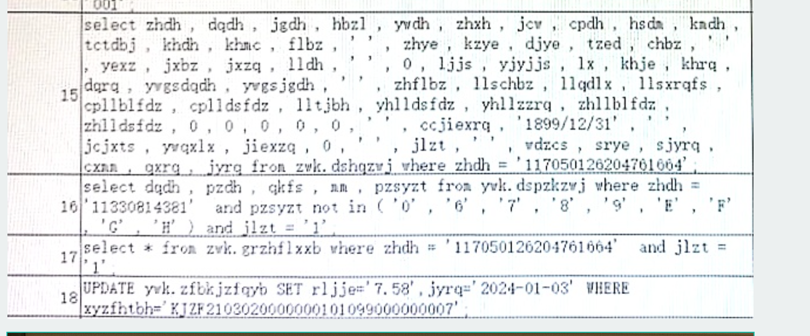

# 关于图像中的sql文本识别

## 使用在线网站

[Free Online OCR - Image to text and PDF to Doc converter](https://www.onlineocr.net/)

存在信息安全问题

且效果一般


## pytesseract


适用于表结构语句

识别之后，做一些易错项目转换

```
import os
import re
from PIL import Image
import pytesseract

# 定义要保留的字符集，包括换行符
allowed_chars = re.compile(r'[a-zA-Z0-9(),;.@\n _=®{}]')

# 定义图片文件夹路径
image_folder = 'xingye'
result_folder = 'xingye/result'
trans_folder = 'xingye/trans'

# 创建文件夹
os.makedirs(result_folder, exist_ok=True)
os.makedirs(trans_folder, exist_ok=True)


# 遍历文件夹中的所有图片文件
for filename in os.listdir(image_folder):
    if filename.lower().endswith(('.png', '.jpg', '.jpeg', '.bmp', '.png')):
        # 构建图片文件的完整路径
        image_path = os.path.join(image_folder, filename)

        # 使用 pytesseract 读取图片中的文本内容
        image = Image.open(image_path)
        content = pytesseract.image_to_string(image)


        # 过滤掉不需要的字符
        filtered_content = ''.join(filter(allowed_chars.match, content))

        # 将 @ 符号转换为 0
        filtered_content = filtered_content.replace('@', '0')

        filtered_content = filtered_content.replace('®', '0')


        # 去掉下划线前后的空格
        filtered_content = re.sub(r'\s*_\s*', '_', filtered_content)
        filtered_content = filtered_content.replace('{', '(')
        filtered_content = filtered_content.replace('}', ')')
        # 将 InnoD8 转换为 InnoDB
        filtered_content = re.sub(r'InnoD8', 'InnoDB', filtered_content)

        # 构建输出文本文件的路径
        output_filename = os.path.splitext(filename)[0] + '.txt'
        output_path = os.path.join(result_folder, output_filename)

        # 过程结果写入输出文件
        trans_path = os.path.join(trans_folder, output_filename)
        with open(trans_path, 'w', encoding='utf-8') as file:
            file.write(content)


        # 将结果写入输出文件
        with open(output_path, 'w', encoding='utf-8') as file:
            file.write(filtered_content)

        print(f"处理完成，结果已写入 {output_path} 文件。")
```


## surga--多模态模型

https://github.com/VikParuchuri/surya 

适用于sql语句，因为sql语句中的 '',* 等符号不可忽略，使用该模型较好


 


## PaddleOCR--模型

https://github.com/PaddlePaddle/PaddleOCR


## 扫描全能王在线

https://www.camscanner.com/file/recent


识别建表语句优秀，但是涉及数据安全问题

-- 有无开源版本？


## 文本处理

模仿扫描全能王的处理模式


```
import cv2
import numpy as np

# 读取图片
image = cv2.imread('image_path.jpg', cv2.IMREAD_COLOR)

# 转换为灰度图像
gray = cv2.cvtColor(image, cv2.COLOR_BGR2GRAY)

# 应用高斯模糊
blurred = cv2.GaussianBlur(gray, (5, 5), 0)

# 使用自适应阈值
thresh = cv2.adaptiveThreshold(blurred, 255, cv2.ADAPTIVE_THRESH_GAUSSIAN_C, cv2.THRESH_BINARY, 11, 2)

# 保存结果
cv2.imwrite('enhanced_image.jpg', thresh)
```


```
from PIL import Image, ImageEnhance, ImageFilter

# 打开图片
image = Image.open('image_path.jpg')

# 增强对比度
enhancer = ImageEnhance.Contrast(image)
image = enhancer.enhance(2)

# 增强锐度
enhancer = ImageEnhance.Sharpness(image)
image = enhancer.enhance(2)

# 保存结果
image.save('enhanced_image.jpg')
```


### 目前一个可行的方案

1. 切分目标图案

   -- 边界文字识别能力很差，需要人工处理图片

   需要将图中的表格单个截取出来

   

2. 图片处理

   锐化，图像增强

3. 文本识别

   surga--符号识别能力强，但是下划线识别能力很差

   pytesseract--英文符号识别能力强

4. 文本校对

   结合表结构和业务SQL来对比识别的数据


# sysbench多线程造数

银河证券的数据量在390W级别，表数量在10个，单线程造数太慢，参考sysbench源码进行多线程造数探索

```
function cmd_prepare()
   local drv = sysbench.sql.driver()
   local con = drv:connect()

   for i = sysbench.tid % sysbench.opt.threads + 1, sysbench.opt.tables,
   sysbench.opt.threads do
     create_table(drv, con, i)
   end
end
```


sysbench思路在于为每个table提前分配好thread，一个thread负责一个table


参照common脚本，将create_table函数中循环构造数据


# sysbench的prepare_point_selects和select_random_points的区别

prepare_point_selects 为点差，访问范围为多表多数据.  "SELECT c FROM sbtest%u WHERE id=?",

select_random_points为单表某个数据范围

```
SELECT id, k, c, pad
          FROM sbtest1
          WHERE k IN (%s)
```


## 造数方法

借用AI识别字段，提供生成各种字段的函数generate_random_string，generate_random_datetime，让AI按照字段使用合适的生成函数

```
for i = 1, 3600000 do
         query = string.format([[
        INSERT INTO stk_trdacct_bak (
         cust_code, CUACCT_bak_code, int_org, market, board, trdacct, trdacct_type,
         trdacct_excls, trdacct_name, trdacct_status, treg_status, credit_flag,
         stkpbu, open_date, close_date, update_time
        ) VALUES ('%s', '%s', %d, '%s', '%s', '%s', '%s', '%s', '%s', '%s', '%s', '%s', '%s', %d, %d, NOW())
        ]], generate_random_string(20), generate_random_string(20), math.random(1, 99999), generate_random_string(1),
             generate_random_string(2), generate_random_string(20), generate_random_string(1), generate_random_string(1),
             generate_random_string(32), generate_random_string(1), generate_random_string(1), generate_random_string(1),
             generate_random_string(8), math.random(20000101, 20230101), math.random(20000101, 20230101)
         )
         con:query(query)
    end
```


