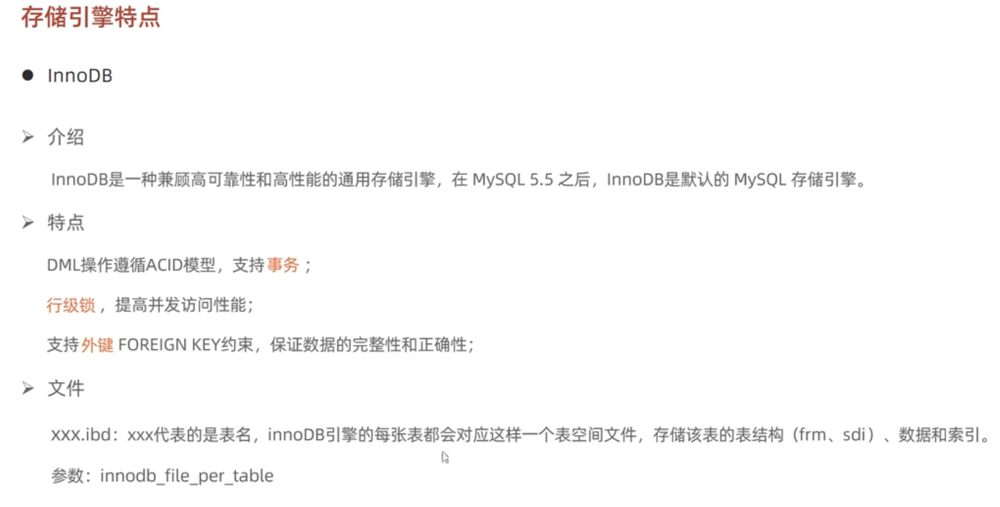
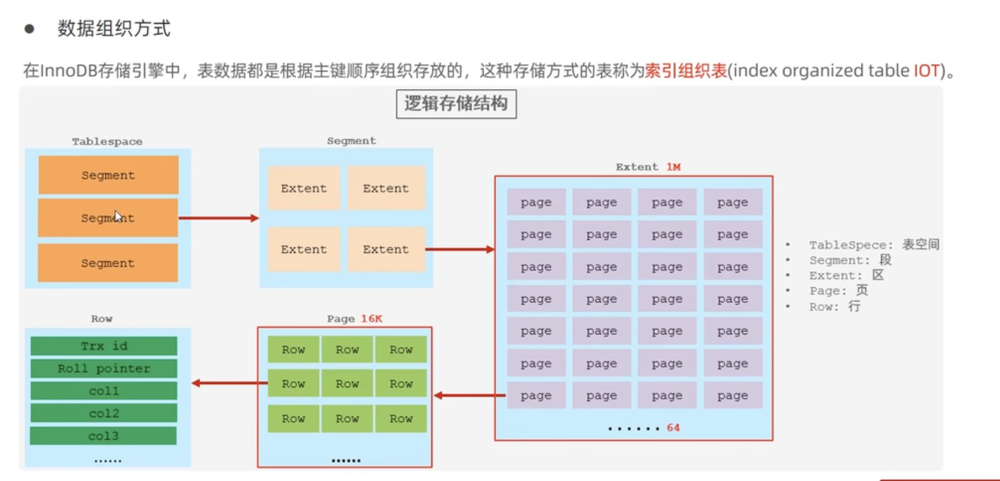
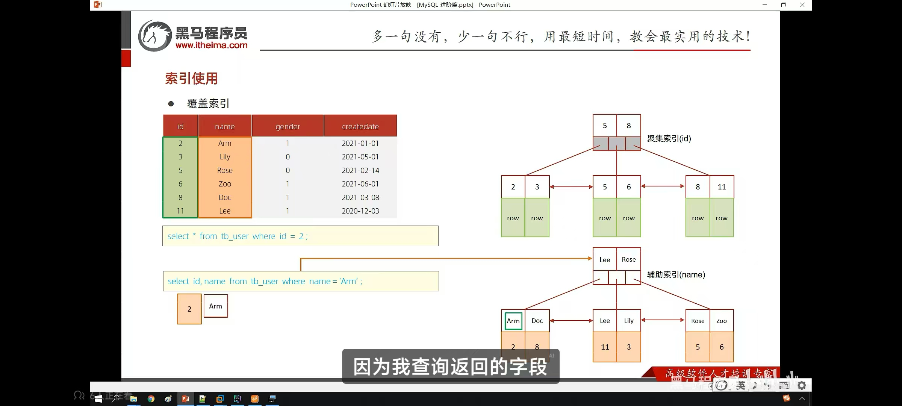
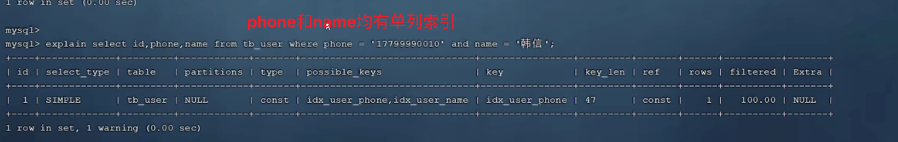
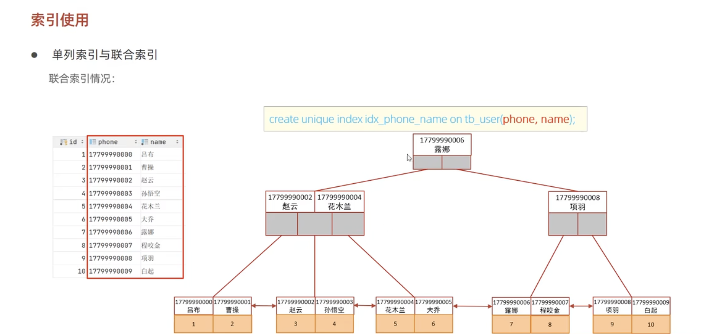
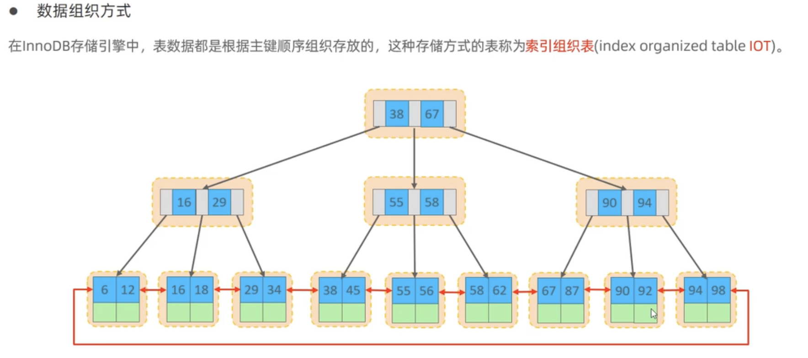

  幻读的表现形式


## 存储引擎

ref笔记

https://jimhackking.github.io/%E8%BF%90%E7%BB%B4/MySQL%E5%AD%A6%E4%B9%A0%E7%AC%94%E8%AE%B0/#%E8%BF%9B%E9%98%B6%E7%AF%87


### COLLATE

https://www.cnblogs.com/qcloud1001/p/10033364.html

`COLLATE`通常是和数据编码（`CHARSET`）相关的，一般来说每种`CHARSET`都有多种它所支持的`COLLATE`，并且每种`CHARSET`都指定一种`COLLATE`为默认值。例如`Latin1`编码的默认`COLLATE`为`latin1_swedish_ci`，`GBK`编码的默认`COLLATE`为`gbk_chinese_ci`，`utf8mb4`编码的默认值为`utf8mb4_general_ci`。

这里顺便讲个题外话，mysql中有`utf8`和`utf8mb4`两种编码，**在mysql中请大家忘记**`**utf8**`**，永远使用**`**utf8mb4**`。这是mysql的一个遗留问题，mysql中的`utf8`最多只能支持3bytes长度的字符编码，对于一些需要占据4bytes的文字，mysql的`utf8`就不支持了，要使用`utf8mb4`才行。

很多`COLLATE`都带有`_ci`字样，这是Case Insensitive的缩写，即大小写无关，也就是说"A"和"a"在排序和比较的时候是一视同仁的。`selection * from table1 where field1="a"`同样可以把field1为"A"的值选出来。与此同时，对于那些`_cs`后缀的`COLLATE`，则是Case Sensitive，即大小写敏感的。


在国内比较常用的是`utf8mb4_general_ci`（默认）、`utf8mb4_unicode_ci`、`utf8mb4_bin`这三个。我们来探究一下这三个的区别：

首先`utf8mb4_bin`的比较方法其实就是直接将所有字符看作二进制串，然后从最高位往最低位比对。所以很显然它是区分大小写的。

而`utf8mb4_unicode_ci`和`utf8mb4_general_ci`对于中文和英文来说，其实是没有任何区别的。对于我们开发的国内使用的系统来说，随便选哪个都行。只是对于某些西方国家的字母来说，`utf8mb4_unicode_ci`会比`utf8mb4_general_ci`更符合他们的语言习惯一些，`general`是mysql一个比较老的标准了。例如，德语字母`“ß”`，在`utf8mb4_unicode_ci`中是等价于`"ss"`两个字母的（这是符合德国人习惯的做法），而在`utf8mb4_general_ci`中，它却和字母`“s”`等价。不过，这两种编码的那些微小的区别，对于正常的开发来说，很难感知到。本身我们也很少直接用文字字段去排序，退一步说，即使这个字母排错了一两个，真的能给系统带来灾难性后果么？从网上找的各种帖子讨论来说，更多人推荐使用`utf8mb4_unicode_ci`，但是对于使用了默认值的系统，也并没有非常排斥，并不认为有什么大问题。结论：推荐使用`utf8mb4_unicode_ci`，对于已经用了`utf8mb4_general_ci`的系统，也没有必要花时间改造。


### innodb

####  ？ 行级锁




索引是帮助 MySQL **高效获取数据**的**数据结构（有序）**。在数据之外，数据库系统还维护着满足特定查找算法的数据结构，这些数据结构以某种方式引用（指向）数据，这样就可以在这些数据结构上实现高级查询算法，这种数据结构就是索引。

优缺点：

优点：

- 提高数据检索效率，降低数据库的IO成本
- 通过索引列对数据进行排序，降低数据排序的成本，降低CPU的消耗

缺点：

- 索引列也是要占用空间的
- 索引大大提高了查询效率，但降低了更新的速度，比如 INSERT、UPDATE、DELETE

## 索引

### 索引结构

| 索引结构            | 描述                                                         |
| ------------------- | ------------------------------------------------------------ |
| B+Tree              | 最常见的索引类型，大部分引擎都支持B+树索引                   |
| Hash                | 底层数据结构是用哈希表实现，只有精确匹配索引列的查询才有效，不支持范围查询 |
| R-Tree(空间索引)    | 空间索引是 MyISAM 引擎的一个特殊索引类型，主要用于地理空间数据类型，通常使用较少 |
| Full-Text(全文索引) | 是一种通过建立倒排索引，快速匹配文档的方式，类似于 Lucene, Solr, ES |

| 索引       | InnoDB        | MyISAM | Memory |
| ---------- | ------------- | ------ | ------ |
| B+Tree索引 | 支持          | 支持   | 支持   |
| Hash索引   | 不支持        | 不支持 | 支持   |
| R-Tree索引 | 不支持        | 支持   | 不支持 |
| Full-text  | 5.6版本后支持 | 支持   | 不支持 |

#### B-Tree

为了解决上述问题，可以使用 B-Tree 结构。
B-Tree (多路平衡查找树) 以一棵最大度数（max-degree，指一个节点的子节点个数）为5（5阶）的 b-tree 为例（每个节点最多存储4个key，5个指针）


当达到5个key的时候，中间元素向上分裂


B-Tree 的数据插入过程动画参照：https://www.bilibili.com/video/BV1Kr4y1i7ru?p=68

演示地址：https://www.cs.usfca.edu/~galles/visualization/BTree.html

#### B+Tree


与 B-Tree 的区别：

- 所有的数据都会出现在叶子节点
- 叶子节点形成一个单向链表


MySQL 索引数据结构对经典的 B+Tree 进行了优化。在原 B+Tree 的基础上，增加一个指向相邻叶子节点的链表指针，就形成了带有顺序指针的 B+Tree，提高区间访问的性能。





1. 为什么 InnoDB 存储引擎选择使用 B+Tree 索引结构？

- 相对于二叉树，层级更少，搜索效率高
- 对于 B-Tree，无论是叶子节点还是非叶子节点，都会保存数据，这样导致一页中存储的键值减少，指针也跟着减少，要同样保存大量数据，只能增加树的高度，导致性能降低
- 相对于 Hash 索引，B+Tree 支持范围匹配及排序操作

### 索引分类

#### 聚集索引与二级索引（回表查询）

在 InnoDB 存储引擎中，根据索引的存储形式，又可以分为以下两种：

| 分类                      | 含义                                                       | 特点                 |
| ------------------------- | ---------------------------------------------------------- | -------------------- |
| 聚集索引(Clustered Index) | 将数据存储与索引放一块，索引结构的叶子节点保存了行数据     | 必须有，而且只有一个 |
| 二级索引(Secondary Index) | 将数据与索引分开存储，索引结构的叶子节点关联的是对应的主键 | 可以存在多个         |

聚集索引选取规则：

- 如果存在主键，主键索引就是聚集索引
- 如果不存在主键，将使用第一个唯一(UNIQUE)索引作为聚集索引
- 如果表没有主键或没有合适的唯一索引，则 InnoDB 会自动生成一个 rowid 作为隐藏的聚集索引


## 索引性能分析


### 执行频次

 show global status like "com_______";

```
MySQL [rcce1db]> show global status like "com_______";
+---------------+------------+
| Variable_name | Value      |
+---------------+------------+
| Com_binlog    | 0          |
| Com_commit    | 1          |
| Com_delete    | 25475972   |
| Com_import    | 0          |
| Com_insert    | 609474978  |
| Com_repair    | 0          |
| Com_revoke    | 0          |
| Com_select    | 1220178783 |
| Com_signal    | 0          |
| Com_update    | 532680881  |
| Com_xa_end    | 1074452457 |
+---------------+------------+
11 rows in set (0.003 sec)
```


### show profile

show profile 能在做SQL优化时帮我们了解时间都耗费在哪里。通过 have_profiling 参数，能看到当前 MySQL 是否支持 profile 操作：
`SELECT @@have_profiling;`
profiling 默认关闭，可以通过set语句在session/global级别开启 profiling：
`SET profiling = 1;`
查看所有语句的耗时：
`show profiles;`
查看指定query_id的SQL语句各个阶段的耗时：
`show profile for query query_id;`
查看指定query_id的SQL语句CPU的使用情况
`show profile cpu for query query_id;`

```
MySQL [test]> show profiles;
+----------+------------+-------------------+
| Query_ID | Duration   | Query             |
+----------+------------+-------------------+
|        1 | 0.00014500 | SELECT DATABASE() |
|        2 | 0.00074025 | show databases    |
|        3 | 0.00086650 | show tables       |
|        4 | 0.00089700 | show tables       |
|        5 | 0.00008600 | sleep (1)         |
|        6 | 1.00037325 | select sleep(1)   |
+----------+------------+-------------------+
6 rows in set, 1 warning (0.029 sec)
```

### 慢查询日志

### explain

EXPLAIN 各字段含义：

- id：select 查询的序列号，表示查询中执行 select 子句或者操作表的顺序（id相同，执行顺序从上到下；id不同，值越大越先执行）
- select_type：表示 SELECT 的类型，常见取值有 SIMPLE（简单表，即不适用表连接或者子查询）、PRIMARY（主查询，即外层的查询）、UNION（UNION中的第二个或者后面的查询语句）、SUBQUERY（SELECT/WHERE之后包含了子查询）等
- **type**：表示连接类型，性能由好到差的连接类型为 NULL、system、const、eq_ref、ref、range、index、all
  - 根据pk和unique index访问，一般是const
  - 非唯一性索引--ref
  - 虽然使用了索引，但是会对索引树进行整体扫描--index
  - 全表扫描--all
- possible_key：可能应用在这张表上的索引，一个或多个
- Key：实际使用的索引，如果为 NULL，则没有使用索引
- Key_len：表示索引中使用的字节数，该值为索引字段最大可能长度，并非实际使用长度，在不损失精确性的前提下，长度越短越好
- rows：MySQL认为必须要执行的行数，在InnoDB引擎的表中，是一个估计值，可能并不总是准确的
- filtered：表示返回结果的行数占需读取行数的百分比，filtered的值越大越好 
- ref：？？


## 索引的使用

### 最左前缀法则

如果索引关联了多列（联合索引），要遵守最左前缀法则，最左前缀法则指的是查询从索引的最左列开始，并且不跳过索引中的列。
如果跳跃某一列，索引将部分失效（后面的字段索引失效）。

**联合索引中，出现范围查询（<, >），范围查询右侧的列索引失效。可以用>=或者<=来规避索引失效问题。**

> 为什么可以用>=或者<=来规避？ 不一定正确 ？？？待验证


#### 索引失效情况

1. 在索引列上进行运算操作，索引将失效。如：`explain select * from tb_user where substring(phone, 10, 2) = '15';`
2. **字符串类型字段使用时，不加引号，索引将失效。**如：`explain select * from tb_user where phone = 17799990015;`，此处phone的值没有加引号【非常重要】
3. 模糊查询中，如果仅仅是尾部模糊匹配，索引不会是失效；如果是头部模糊匹配，索引失效。如：`explain select * from tb_user where profession like '%工程';`，前后都有 % 也会失效。
4. **用 or 分割开的条件，如果 or 其中一个条件的列没有索引，那么涉及的索引都不会被用到。**
5. 如果 MySQL 评估使用索引比全表更慢，则不使用索引。（涉及数据分布，如果索引字段的条件会把大部分数据查回来，则会走all）


> 解释
>
> 现在你有一个查询：
>
> ```
> sql复制SELECT * FROM users WHERE name = 'John' OR email = 'john@example.com';
> ```
>
> 在这个查询中，`name` 列有索引，而 `email` 列没有索引。数据库优化器在处理这个查询时，会评估使用索引的成本和收益。如果 `OR` 运算符连接的条件中有一个条件的列没有索引，优化器可能会选择不使用任何索引，而是进行全表扫描。这是因为：
>
> 1. **索引的局限性**：索引通常用于快速定位满足特定条件的行。如果一个查询条件中的列没有索引，数据库必须扫描整个表来查找满足该条件的行。
> 2. **查询计划的复杂性**：当使用 `OR` 运算符时，数据库需要合并多个条件的结果集。如果其中一个条件没有索引，合并结果集的成本可能会很高。
> 3. **优化器的选择**：数据库优化器会选择一个整体成本最低的查询计划。如果使用索引的成本高于全表扫描的成本，优化器可能会选择全表扫描。


#### SQL 提示

是优化数据库的一个重要手段，简单来说，就是在SQL语句中加入一些人为的提示来达到优化操作的目的。

例如，使用索引：
`explain select * from tb_user use index(idx_user_pro) where profession="软件工程";`
不使用哪个索引：
`explain select * from tb_user ignore index(idx_user_pro) where profession="软件工程";`
必须使用哪个索引：
`explain select * from tb_user force index(idx_user_pro) where profession="软件工程";`

use 是建议，实际使用哪个索引 MySQL 还会自己权衡运行速度去更改，force就是无论如何都强制使用该索引。


#### 覆盖索引&回表查询

尽量使用覆盖索引（查询使用了索引，并且需要返回的列，在该索引中已经全部能找到），减少 select *。

explain 中 extra 字段含义：
`using index condition`：查找使用了索引，但是需要回表查询数据
`using where; using index;`：查找使用了索引，但是需要的数据都在索引列中能找到，所以不需要回表查询

如果在聚集索引中直接能找到对应的行，则直接返回行数据，只需要一次查询，哪怕是select *；如果在辅助索引中找聚集索引，如`select id, name from xxx where name='xxx';`，也只需要通过辅助索引(name)查找到对应的id，返回name和name索引对应的id即可，只需要一次查询；如果是通过辅助索引查找其他字段，则需要回表查询，如`select id, name, gender from xxx where name='xxx';`

所以尽量不要用`select *`，容易出现回表查询，降低效率，除非有联合索引包含了所有字段

面试题：一张表，有四个字段（id, username, password, status），由于数据量大，需要对以下SQL语句进行优化，该如何进行才是最优方案：
`select id, username, password from tb_user where username='itcast';`

解：给username和password字段建立联合索引，则不需要回表查询，直接覆盖索引





#### 前缀索引

当字段类型为字符串（varchar, text等）时，有时候需要索引很长的字符串，这会让索引变得很大，查询时，浪费大量的磁盘IO，影响查询效率，此时可以只降字符串的一部分前缀，建立索引，这样可以大大节约索引空间，从而提高索引效率。

语法：`create index idx_xxxx on table_name(columnn(n));`
前缀长度：可以根据索引的选择性来决定，而选择性是指不重复的索引值（基数）和数据表的记录总数的比值，索引选择性越高则查询效率越高，唯一索引的选择性是1，这是最好的索引选择性，性能也是最好的。
求选择性公式：

```
select count(distinct email) / count(*) from tb_user;
select count(distinct substring(email, 1, 5)) / count(*) from tb_user;
```

show index 里面的sub_part可以看到接取的长度


单列索引




这样子查询name数据会导致回表查询


##### 注意事项

- 多条件联合查询时，MySQL优化器会评估哪个字段的索引效率更高，会选择该索引完成本次查询


联合索引的b树结构

  

  


### 设计原则

1. 针对于数据量较大（100w），且查询比较频繁的表建立索引
2. 针对于常作为查询条件（where）、排序（order by）、分组（group by）操作的字段建立索引
3. 尽量选择区分度高的列作为索引，尽量建立唯一索引，区分度越高，使用索引的效率越高
4. 如果是字符串类型的字段，字段长度较长，可以针对于字段的特点，建立前缀索引
5. 尽量使用联合索引，减少单列索引，查询时，联合索引很多时候可以覆盖索引，节省存储空间，避免回表，提高查询效率
6. 要控制索引的数量，索引并不是多多益善，索引越多，维护索引结构的代价就越大，会影响增删改的效率
7. **如果索引列不能存储NULL值，请在创建表时使用NOT NULL约束它。当优化器知道每列是否包含NULL值时，它可以更好地确定哪个索引最有效地用于查询**


## SQL优化


### 大批量插入 load

```
# 客户端连接服务端时，加上参数 --local-infile（这一行在bash/cmd界面输入）
mysql --local-infile -u root -p
# 设置全局参数local_infile为1，开启从本地加载文件导入数据的开关
set global local_infile = 1;
select @@local_infile;
# 执行load指令将准备好的数据，加载到表结构中
load data local infile '/root/sql1.log' into table 'tb_user' fields terminated by ',' lines terminated by '\n';
```

### 主键优化

数据组织方式：在InnoDB存储引擎中，表数据都是根据主键顺序组织存放的，这种存储方式的表称为索引组织表（Index organized table, IOT）




页分裂：页可以为空，也可以填充一般，也可以填充100%，每个页包含了2-N行数据（如果一行数据过大，会行溢出），根据主键排列。
页合并：当删除一行记录时，实际上记录并没有被物理删除，只是记录被标记（flaged）为删除并且它的空间变得允许被其他记录声明使用。当页中删除的记录到达 MERGE_THRESHOLD（默认为页的50%），InnoDB会开始寻找最靠近的页（前后）看看是否可以将这两个页合并以优化空间使用。

MERGE_THRESHOLD：合并页的阈值，可以自己设置，在创建表或创建索引时指定

> 文字说明不够清晰明了，具体可以看视频里的PPT演示过程：https://www.bilibili.com/video/BV1Kr4y1i7ru?p=90

主键设计原则：

- 满足业务需求的情况下，尽量降低主键的长度

- 插入数据时，尽量选择顺序插入，选择使用 AUTO_INCREMENT 自增主键

- 尽量不要使用 UUID 做主键或者是其他的自然主键，如身份证号 ，

  **通用唯一识别码**（英语：**U**niversally **U**nique **Id**entifier，缩写：**UUID**）是用于[计算机](https://zh.wikipedia.org/wiki/电子计算机)体系中以识别信息的一个128位标识符。

- 业务操作时，避免对主键的修改


### order by优化

1. Using filesort：通过表的索引或全表扫描，读取满足条件的数据行，然后在排序缓冲区 sort buffer 中完成排序操作，所有不是通过索引直接返回排序结果的排序都叫 FileSort 排序
2. Using index：通过有序索引顺序扫描直接返回有序数据，这种情况即为 using index，不需要额外排序，操作效率高

如果order by字段全部使用升序排序或者降序排序，则都会走索引，但是如果一个字段升序排序，另一个字段降序排序，则不会走索引，explain的extra信息显示的是`Using index, Using filesort`，如果要优化掉Using filesort，则需要另外再创建一个索引，如：`create index idx_user_age_phone_ad on tb_user(age asc, phone desc);`，此时使用`select id, age, phone from tb_user order by age asc, phone desc;`会全部走索引

总结：

- 根据排序字段建立合适的索引，多字段排序时，也遵循最左前缀法则
- 尽量使用覆盖索引
- 多字段排序，一个升序一个降序，此时需要注意联合索引在创建时的规则（ASC/DESC）
- 如果不可避免出现filesort，大数据量排序时，可以适当增大排序缓冲区大小 sort_buffer_size（默认256k）


### group by优化

using temporary 性能低于using index  

- 在分组操作时，可以通过索引来提高效率
- 分组操作时，索引的使用也是满足最左前缀法则的

**如索引为`idx_user_pro_age_stat`，则句式可以是`select ... where profession order by age`，这样也符合最左前缀法则**


### limit优化

核心就是覆盖索引+子查询优化 

常见的问题如`limit 2000000, 10`，此时需要 MySQL 排序前2000000条记录，但仅仅返回2000000 - 2000010的记录，其他记录丢弃，查询排序的代价非常大。
优化方案：一般分页查询时，通过创建覆盖索引能够比较好地提高性能，可以通过覆盖索引加子查询形式进行优化

例如：

```
-- 此语句耗时很长
select * from tb_sku limit 9000000, 10;
-- 通过覆盖索引加快速度，直接通过主键索引进行排序及查询
select id from tb_sku order by id limit 9000000, 10;
-- 下面的语句是错误的，因为 MySQL 不支持 in 里面使用 limit
-- select * from tb_sku where id in (select id from tb_sku order by id limit 9000000, 10);
-- 通过连表查询即可实现第一句的效果，并且能达到第二句的速度
select * from tb_sku as s, (select id from tb_sku order by id limit 9000000, 10) as a where s.id = a.id;
```

### count优化

MyISAM 引擎把一个表的总行数存在了磁盘上，因此执行 count(*) 的时候会直接返回这个数，效率很高（前提是不适用where）；
InnoDB 在执行 count(*) 时，需要把数据一行一行地从引擎里面读出来，然后累计计数。
优化方案：自己计数，如创建key-value表存储在内存或硬盘，或者是用redis

```
count的几种用法：

- 如果count函数的参数（count里面写的那个字段）不是NULL（字段值不为NULL），累计值就加一，最后返回累计值
- 用法：count(*)、count(主键)、count(字段)、count(1)
- count(主键)跟count(*)一样，因为主键不能为空；count(字段)只计算字段值不为NULL的行；count(1)引擎会为每行添加一个1，然后就count这个1，返回结果也跟count(*)一样；count(null)返回0

各种用法的性能： 

- count(主键)：InnoDB引擎会遍历整张表，把每行的主键id值都取出来，返回给服务层，服务层拿到主键后，直接按行进行累加（主键不可能为空）
- count(字段)：没有not null约束的话，InnoDB引擎会遍历整张表把每一行的字段值都取出来，返回给服务层，服务层判断是否为null，不为null，计数累加；有not null约束的话，InnoDB引擎会遍历整张表把每一行的字段值都取出来，返回给服务层，直接按行进行累加
- count(1)：InnoDB 引擎遍历整张表，但不取值。服务层对于返回的每一层，放一个数字 1 进去，直接按行进行累加
- count(*)：InnoDB 引擎并不会把全部字段取出来，而是专门做了优化，不取值，服务层直接按行进行累加
按效率排序：count(字段) < count(主键) < count(1) < count(*)，所以尽量使用 count(*)
```


## 锁

### 全局锁：

全局锁就是对整个数据库实例加锁，加锁后整个实例就处于只读状态，后续的DML的写语句，DDL语句，已经更新操作的事务提交语句都将被阻塞。
其典型的使用场景是做全库的逻辑备份，对所有的表进行锁定，从而获取一致性视图，保证数据的完整性。


### 表锁：

表级锁，每次操作锁住整张表。锁定粒度大，发生锁冲突的概率最高，并发度最低。应用在MyISAM、InnoDB、BDB等存储引擎中。

对于表级锁，主要分为以下三类：

1. 表锁：对于表锁，分为两类：1.表共享读锁（read lock）所有的事物都只能读（当前加锁的客户端也只能读，不能写），不能写 2.表独占写锁（write lock），对当前加锁的客户端，可读可写，对于其他的客户端，不可读也不可写。
   读锁不会阻塞其他客户端的读，但是会阻塞写。写锁既会阻塞其他客户端的读，又会阻塞其他客户端的写。
2. 元数据锁（meta data lock，MDL），MDL加锁过程是系统自动控制，无需显式使用，在访问一张表的时候会自动加上。MDL锁主要作用是维护表元数据的数据一致性，在表上有活动事务的时候，不可以对元数据进行写入操作。在MySQL5.5中引入了MDL，当对一张表进行增删改查的时候，加MDL读锁（共享）;当对表结构进行变更操作的时候，加MDL写锁（排他）。
3. 意向锁: 为了避免DML在执行时，加的行锁与表锁的冲突，在InnoDB中引入了意向锁，使得表锁不用检查每行数据是否加锁，使用意向锁来减少表锁的检查。
   一个客户端对某一行加上了行锁，那么系统也会对其加上一个意向锁，当别的客户端来想要对其加上表锁时，便会检查意向锁是否兼容，若是不兼容，便会阻塞直到意向锁释放。

意向锁兼容性：

1. 意向共享锁（IS）：与表锁共享锁（read）兼容，与表锁排它锁（write）互斥。
2. 意向排他锁（lX）：与表锁共享锁（read）及排它锁（write）都互斥。意向锁之间不会互斥。

### 行锁：

行级锁，每次操作锁住对应的行数据。锁定粒度最小，发生锁冲突的概率最低，并发度最高。应用在InnoDB存储引擎中。
InnoDB的数据是基于索引组织的，行锁是通过对索引上的索引项加锁来实现的，而不是对记录加的锁。对于行级锁，主要分为以下三类：

1. 行锁（Record Lock）：锁定单个行记录的锁，防止其他事务对此行进行update和delete。在RC（read commit ）、RR（repeat read）隔离级别下都支持。
2. 间隙锁（GapLock）：锁定索引记录间隙（不含该记录），确保索引记录间隙不变，防止其他事务在这个间隙进行insert，产生幻读。在RR隔离级别下都支持。比如说 两个临近叶子节点为 15 23，那么间隙就是指 [15 , 23],锁的是这个间隙。
3. 临键锁（Next-Key Lock）：行锁和间隙锁组合，同时锁住数据，并锁住数据前面的间隙Gap。在RR隔离级别下支持。

InnoDB实现了以下两种类型的行锁：

1. 共享锁（S）：允许一个事务去读一行，阻止其他事务获得相同数据集的排它锁。
2. 排他锁（X）：允许获取排他锁的事务更新数据，阻止其他事务获得相同数据集的共享锁和排他锁。

| SQL                          | 行锁类型   | 说明                                     |
| ---------------------------- | ---------- | ---------------------------------------- |
| insert                       | 排他锁     | 自动加锁                                 |
| update                       | 排他锁     | 自动加锁                                 |
| delete                       | 排他锁     | 自动加锁                                 |
| select                       | 不加任何锁 |                                          |
| select　lock　in　share mode | 排他锁     | 需要手动在SELECT之后加LOCK IN SHARE MODE |
| select　for　update          | 排他锁     | 需要手动在SELECT之后加FOR UPDATE         |

行锁 - 演示

默认情况下，InnoDB在REPEATABLE READ事务隔离级别运行，InnoDB使用next-key 锁进行搜索和索引扫描，以防止幻读。

1. 针对唯一索引进行检索时，对已存在的记录进行等值匹配时，将会自动优化为行锁。
2. InnoDB的行锁是针对于索引加的锁，不通过索引条件检索数据，那么InnoDB将对表中的所有记录加锁，此时就会升级为表锁。

间隙锁/临键锁-演示

默认情况下，InnoDB在REPEATABLE READ事务隔离级别运行，InnoDB使用next-key 锁进行搜索和索引扫描，以防止幻读。

1. 索引上的等值查询（唯一索引），给不存在的记录加锁时，优化为间隙锁。
2. 索引上的等值查询（普通索引），向右遍历时最后一个值不满足查询需求时，next-key lock 退化为间隙锁。
3. 索引上的范围查询（唯一索引）--会访问到不满足条件的第一个值为止。

注意：间隙锁唯一目的是防止其他事务插入间隙。间隙锁可以共存，一个事务采用的间隙锁不会阻止另一个事务在同一间隙上采用间隙锁。


> 愿数据可以简单任务是表结构，当表中有事务未提交时，不可以修改表结构，作用时为了避免DML和DDL冲突

