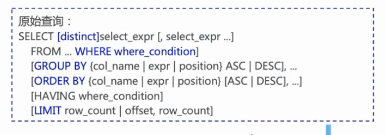

show variables like '%expire%';set global binlog_expire_logs_seconds = 7200;


原文链接：https://blog.csdn.net/PILIpilipala/article/details/113798383


select 列名 ----> 要查询的列名称
from 表名 ----> 要查询的表名称
where 条件 ----> 行条件
group by 分组列 ----> 对结果分组
having 分组条件 ----> 分组后的行条件
order by 排序列 ----> 对结果分组
limit 起始行, 行数 ----> 结果限定





3、**数据操作**（数据表）

新增数据：`insert into 表名 values`

查看数据：`select from 表名`

更新数据：`update 表名 set`

删除数据：`delete from 表名`


SELECT @@session.tx_isolation;

SELECT @@session.transaction_isolation;


### 索引创建

```
-- 创建单列索引
CREATE INDEX idx_name ON employees (name);

-- 创建多列索引
CREATE INDEX idx_name_dept ON employees (name, department);

-- 创建唯一索引
CREATE UNIQUE INDEX idx_unique_id ON employees (id);

-- 删除索引
DROP INDEX idx_name ON employees;
```


## linux导入导出sql文件

使用

```
create database Demo;
use Demo;
source /path/to/file.sql;
show tables;
```

导出

```
mysql -h9.40.33.197 -P15016 -ulukatai -pRoot@@@123 -c

mysqldump -h9.40.33.197 -P15016 -ulukatai -pRoot@@@123 v7pro > v7pro_td20.sql

mysqldump -h9.40.33.197 -P15012 -ulukatai -pRoot@@@123 --complete-insert  zhaoshangxinnuo > zhaoshangxinnuo.sql

mysqldump -h9.192.169.254 -P15003 -ulukatai -pRoot@@@123 rcce_mem --complete-insert > rcce_mem.sql

sed -i 's/tbl_wl_jnl_a_10001_03/tbl_wl_jnl_c_242_10001_00/g' aaa.sql
```

--complete-insert 
--all-databases
--no-create-info

导入

```
mysql -h9.40.30.196 -P15012 -ulukatai -pRoot@@@123 -Dyinhe < tbl.sql

mysql -h9.192.169.254 -P15003 -ulukatai -pRoot@@@123 rcce2db < aa.sql
```

这样子导入，报错会停止


## 系统变量

### @@会话级别系统变量

`@@` 符号在 MySQL 中用于引用系统变量的值。因此，当你使用 `@@character_set_client` 时，你实际上是在获取当前会话的 `character_set_client` 系统变量的值。

### 设置全局级别的系统变量

要设置全局级别的系统变量，你需要使用 `SET GLOBAL` 语句。以下是一些示例：

#### 

1. **设置全局字符集**

```
sql复制SET GLOBAL character_set_server = 'utf8mb4';
```

这将把服务器的默认字符集设置为 `utf8mb4`，并影响所有新建的会话。

**设置全局最大连接数**

```
sql复制SET GLOBAL max_connections = 200;
```

这将把服务器的最大连接数设置为 200。

**查看**

`SHOW GLOBAL VARIABLES LIKE 'character_set_server';`

如果你希望这些设置在服务器重启后仍然有效，你需要将它们写入 MySQL 配置文件。


## 安装提示

```
==> mysql@5.7
We've installed your MySQL database without a root password. To secure it run:
    mysql_secure_installation

MySQL is configured to only allow connections from localhost by default

To connect run:
    mysql -uroot

mysql@5.7 is keg-only, which means it was not symlinked into /opt/homebrew,
because this is an alternate version of another formula.

If you need to have mysql@5.7 first in your PATH, run:
  echo 'export PATH="/opt/homebrew/opt/mysql@5.7/bin:$PATH"' >> ~/.zshrc

For compilers to find mysql@5.7 you may need to set:
  export LDFLAGS="-L/opt/homebrew/opt/mysql@5.7/lib"
  export CPPFLAGS="-I/opt/homebrew/opt/mysql@5.7/include"

To start mysql@5.7 now and restart at login:
  brew services start mysql@5.7
Or, if you don't want/need a background service you can just run:
  /opt/homebrew/opt/mysql@5.7/bin/mysqld_safe --datadir\=/opt/homebrew/var/mysql4
```


## Source *.sql 记录日志

tee 存储

```
MySQL [chengde]> tee daoshu.log
```

默认储存在root

2. 未使用，但感觉好用--没有用，加上输出后，登录不上了

[mysql source 输出日志_mob649e81593bda的技术博客_51CTO博客](https://blog.51cto.com/u_16175453/7918149)


rz 将文件导出


查看数据库中表数量

```
SELECT COUNT(*) FROM information_schema.tables WHERE table_schema = 'your_database_name';
```


## Mysql 登陆参数

-e 

```
[root@mac1 ~]# mysql -h9.134.254.214 -P3306 -utdsql_admin -pTYdXA*4679zYgn -e "select count(1) from lukatai.cuacct_bak"
+----------+
| count(1) |
+----------+
|     2027 |
+----------+
```

-c


-A


## 复制表

#### 方法一：使用 `CREATE TABLE ... SELECT`

这种方法可以复制表结构和数据。

```
sql复制CREATE TABLE new_table AS SELECT * FROM existing_table;
```

#### 方法二：使用 `CREATE TABLE ... LIKE` 和 `INSERT INTO ... SELECT`

这种方法可以分别复制表结构和数据。

```
sql复制-- 复制表结构
CREATE TABLE new_table LIKE existing_table;

-- 复制数据
INSERT INTO new_table SELECT * FROM existing_table;
```


### analyze


压缩


银行批处理

银行的批量处理（Batch Processing）是指在特定时间段内（通常是非工作时间，如晚上）集中处理大量交易和数据的过程。这种处理方式在银行业中非常常见，用于对账、结算、清算、生成报表等操作。以下是一个典型的银行批量处理流程及其相关注意事项。


## PAGER

在 Linux 或类 Unix 系统中，`PAGER` 环境变量通常用于指定用于分页显示长输出的程序。默认情况下，`PAGER` 通常设置为 `less` 或 `more`，以便用户可以逐页查看输出。

如果你将 `PAGER` 设置为 `grep threads`，那么每当一个命令的输出被分页时，`grep` 将被用来过滤输出，只显示包含 "threads" 的行。这可能不是你想要的行为，因为 `grep` 不是一个分页程序，它只是一个过滤工具。


### 获取表字段

[SQL 获取数据库中的表和每个表的字段列表|极客教程 (geek-docs.com)](https://geek-docs.com/sql/sql-ask-answer/438_sql_getting_list_of_tables_and_fields_in_each_in_a_database.html#:~:text=要获取每个表的字段列表，我们可以使用以下SQL语句： SELECT column_name%2C data_type FROM information_schema.columns WHERE,table_schema %3D 'your_database_name' AND table_name %3D 'your_table_name'%3B 请将上述语句中的”your_database_name”替换为数据库名称，”your_table_name”替换为要获取字段列表的表名。)

```
SELECT column_name, data_type, character_maximum_length, is_nullable
FROM information_schema.columns
WHERE table_schema = 'your_database_name'
AND table_name = 'your_table_name';
```


```
SELECT table_name
FROM information_schema.tables
WHERE table_schema = 'your_database_name';

```


只写 `COMMIT` 而不写 `BEGIN` 通常不会导致错误，但显式地管理事务的开始和结束可以使你的代码更加清晰和可读。


### show processlist;

当信息被截断，可以使用下面

```
SELECT * FROM INFORMATION_SCHEMA.PROCESSLIST;
```

