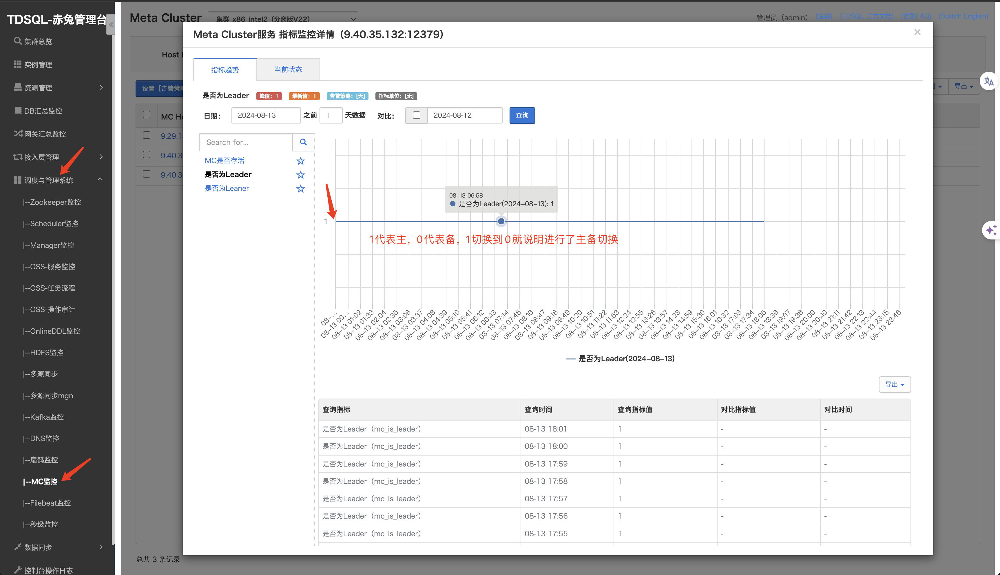

@所有人

如果出现 mc_request_timecost 超过1s的场景（检查到我会推送出来@环境负责人），环境负责人可以先做下述步骤检查：
0、记录当前正在执行的用例
1、判断MC是否发生主备切换，如果发生了切换，就是正常现象；如果没有发生切换，就算属于异常现象，需要进一步排查。
2、排查MC和Proxy所在的机器是否有资源使用紧张
3、排除上述干扰后，再看看能不能复现。
4、若能稳定复现，再找开发排查。
核心关键点：能稳定复现 mc_request_timecost 时间超过1s的场景

附：MC主备切换查看方法：
赤兔-》调度与管理系统-》MC监控-》是否为leader：

