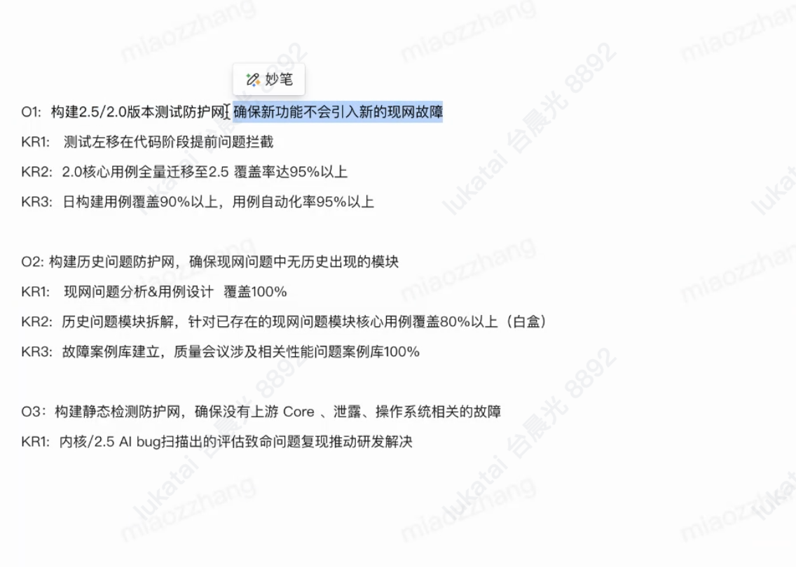

prompt完善

```
“我计划实现以下目标：[
## 我的数据库业务仿真细节object：

1. 收集银行方面的业务仿真信息：包括基础硬件，业务逻辑代码，业务sql，数据库结构，数据量，实例配置，容灾配置
2. 仿真数据模型建立：数据需要有合理的流入删除，进行合理，可以模拟高低峰值的造数，并且可以长期持续造数。
3. 仿真逻辑构建：增加业务覆盖率，仿真的数据要标齐客户要求，提前预警问题
4. 仿真效率增加：信息对齐，工具加速，AI赋能
5. 用例自动化100%覆盖（with 麦高远）：
6. 搭建仿真环境，验证线网变更，提前预知风险。
]。
请帮我系统分析在达成该目标的过程中可能遇到的核心挑战，并为每个挑战提供2-3条切实可行的解决策略。
```




O1:建行，招行以及后续银行核心业务覆盖率达到95%

KR1: 基于信息较全面的建行业务，建立银行抽象交易模型

KR2: 仿真业务下沉到版本迭代，用例自动化率100%。（with 佳惠验收自动化用例，with 麦高远快速实现自动化）

KR3: 使用AI搭建仿真脚本框架，人工调整，从0搭建仿真场景效率提高50%，并输出仿真SOP

KR4:拓展仿真工具库，拓展DTModel，db-sharp/template等工具能力与ODBC，JDBC代码能力。

O2:保证建行，招行以及后续银行业务切量的性能故障数为0

KR1: 响应前线验证线网变更需求，提前预知风险，提供可信验证报告， 前线需求解决率100%

KR2: 建立历史银行现网故障库，AI解读故障，用例覆盖率80%。（with部分用例可以找张苗合作）


## 我们的总object

1. 招行以及后面的银行仿真业务的核心业务仿真覆盖率90%
2. 仿真下沉到版本迭代，自动化率100%，with佳惠
3. 前线问题复现率，解决率100% -- ？这里是不是不能否漏出问题？


## 我们的数据库业务仿真细节object：

1. 收集银行方面的业务仿真信息：包括基础硬件，业务逻辑代码，业务sql，数据库结构，数据量，实例配置，容灾配置
2. 仿真数据模型建立：数据需要有合理的流入删除，可以模拟高低峰值的造数，并且可以长期持续造数。
3. 仿真逻辑构建：增加业务覆盖率，仿真的数据要标齐客户要求，提前预警问题
4. 仿真效率增加：信息对齐，工具加速，AI赋能
5. 用例自动化100%覆盖（with 麦高远）：
6. 搭建仿真环境，验证线网变更，提前预知风险， 前线需求解决率100%


## 我们的任务挑战：

1.1 银行业务数据敏感、系统复杂度高，且可能涉及权限限制，比如招行缺少业务逻辑代码

1.2 部分银行仅可以通过拍照收集信息，需要做拍照图片信息提取（可能存在图片歪曲，姓名水印，拍摄不清晰等问题）

2.1 数据流入/删除逻辑设计复杂，高低峰值的动态模拟易失真，长期造数可能偏离实际业务规律。

3.1 从行方获取的所有业务逻辑，均需要覆盖，其中部分逻辑行方因为保密，只能给到大概，但仍需发散覆盖。

> 悬丝诊脉

3.2 仿真业务关注的指标很多，需要有快速检查能力。

4.1 与前线高效，全面的信息传递，快速获取从硬件，业务逻辑，到数据分布的整体信息，并且根据家中的有限条件，测试前合理剔除一些参数

> 我们不把已知的事情作为信息---ds哲学化改写：“已知的事物在彻底内化为存在基底时，其信息属性便悄然消逝，转而成为认知边界上自我遮蔽的沉默之墙。” 

4.2 目前比较依赖jmeter工具，其核心依赖JDBC Request组件，部分银行业务使用odbc或其他，需开拓其他工具，满足不同银行依赖的数据库连接接口

5.1 jemter的自动化刚刚接入，脚本需要做大量修改才能适配自动化

6.1 仿真模型要足够细致，可以在此基础上，模拟线网变更，提供可信的变更报告。

## 我们的KR：

1.1 我们已经有建行仿真经验与业务逻辑信息，银行交易模型总有相近之处，我们可以给建行，抽象交易业务，然后反哺缺失信息的银行模型，基于后续银行又丰富抽象交易模型，产出抽象交易模型

1.2 借助ima与其他模型，帮助图片信息提取，产出经验文档与提取步骤。

2.1 --？？造数逻辑脚本？试一下ai解决脚本错误问题。

3.1 行方的所有业务，仿真覆盖率90%。产出用例。

3.2 建立性能指标check list，方便人工校验，仿真场景稳定后，将指标定下来，自动化或者AI检测check list

4.1 探索出一套与前线沟通的信息收集模版，在不增加前线信息收集难度，尽可能全面收集信息，产出信息收集模版

4.2 拓展DTModel，db-sharp/template等工具能力，当工具不能满足时，可以在AI协助下，借助odbc or jdbc直接写业务逻辑。 

5.1 关于jemter的自动化，与工具人员协调，定下撰写jmeter脚本标准，满足自动化快速部署。


把ds当作一个工作台，给需求，生脚本，执行脚本，把jemter脚本让他执行？，出报告？--大胆尝试一下。


review：

直接写okr。